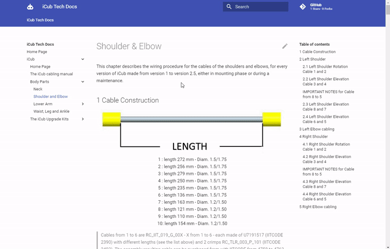

Contributing to iCub Tech Docs                                             {#contributing}
==============================

We accept contributions via [forks and pull-requests](https://guides.github.com/activities/forking).

**Working on your first Pull Request?** You can learn how from this *free* series [How to Contribute to an Open Source Project on GitHub](https://kcd.im/pull-request)

👉 A very quick way to propose fixes is by clicking on the **✏ symbol** available in the upper-right corner of each page (see below).

