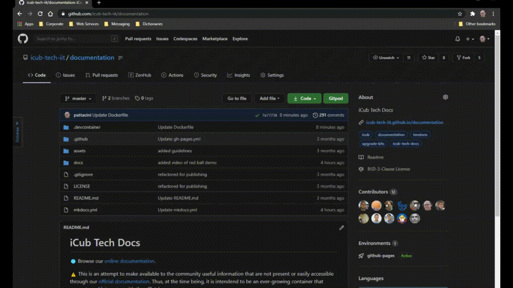

iCub Tech Docs
==============

[](https://github.com/icub-tech-iit/documentation/actions/workflows/gh-pages.yml)
[](https://github.com/icub-tech-iit/documentation/actions/workflows/check-links.yml)
[](http://makeapullrequest.com)

- 🌐 Browse our [online documentation](https://icub-tech-iit.github.io/documentation).
- 📝 Importantly, you can contribute to these docs by fixing typos and proposing new additions (see below).

# Contributing
Check out our [CONTRIBUTING guidelines](./.github/CONTRIBUTING.md).

### 👨🏻‍💻 Maintainers
This repository is maintained by:

| | |
|:---:|:---:|
| [](https://github.com/pattacini) | [@pattacini](https://github.com/pattacini) |

# ☁ Cloud Workflow
You can leverage on the following Cloud IDE's to quickly get a testing platform where to try out how the documentation is rendered.

## 🔘 [GitHub Codespaces](https://github.com/features/codespaces)

| Click to enlarge |
| :---: |
|  |

## 🔘 [GitHub Pages](https://pages.github.com) on Forks
> [!Warning]
When forking the repository, remember to copy out all the branches. Then, work on the default branch.

Follow the steps below where you have to correctly fill up the signature `your-fork`:
- Browse to https://github.com/your-fork/documentation/actions and enable the actions if they got disabled.
- Browse to https://github.com/your-fork/documentation/actions/workflows/gh-pages.yml and click on the <kbd>Run workflow</kbd> button.
- Browse to https://github.com/your-fork/documentation/settings/pages, select <kbd>Deploy from a branch</kbd> button and then the couple `gh-pages` branch and `/root`; finally, wait until the GitHub Pages link becomes green to click on!

# 🔽 Local Workflow

## 💻 Install the environment yourself
If you prefer to work on the documentation on your own computer without using Cloud IDEs as described in the previous section,
you need to install [**`zensical`**](https://zensical.org/) first.

Once installed, just clone this repo, navigate to it and serve the content:
```console
git clone https://github.com/icub-tech-iit/documentation.git
cd documentation
pip install zensical
zensical serve
```

## 📦 Rely on package managers
In the next sections, we will describe in detail how to install the required dependencies using different package managers.

### 🐍 conda
You can use the [conda-forge](https://conda-forge.org/) distribution to install the required dependencies on Linux, macOS or Windows.
First of all you need a conda distribution, for example [Miniforge3](https://github.com/conda-forge/miniforge).

If you already have a conda distribution, just create a new [environment](https://docs.conda.io/projects/conda/en/latest/user-guide/tasks/manage-environments.html) (for example called `zensical-env`) and install in it the required dependencies:
```console
git clone https://github.com/icub-tech-iit/documentation.git
cd documentation
conda create -n zensical-env
conda activate zensical-env
pip install zensical
```

After the installation, whenever you need to test the website just activate the `zensical-env` environment and call `zensical serve` in the `documentation` directory:
```console
cd documentation
conda activate zensical-env
zensical serve
```
