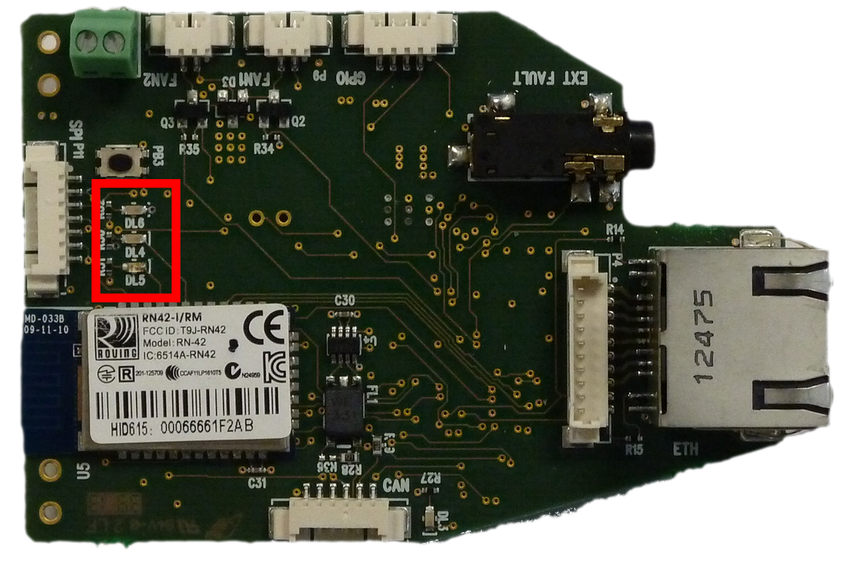
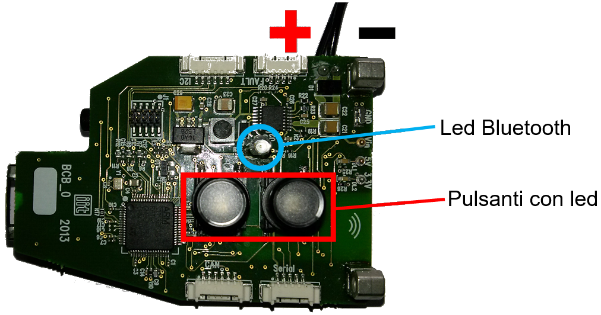

# BCB Bluethoot Protocol

## Introduction
This page describes the Bluetooth communication protocol for the control and diagnostics of the iCub battery backpack system.
The iCub backpack communicates via the `BCB` electronic board, which embeds a Bluetooth module. To pair with it, no special passwords or codes are needed; the electronic board is always visible from any other device, it is called _RNBT-F29x_, and must be considered as a SLAVE.

After turned on, when pairing has not yet taken place:
- the blue LED _DL5_ will blink
- the green LED _DL4_ will be on and fixed

both LEDs are next to the Bluetooth module as shown in the following figure:

After pairing, the blue LED turns on steadily and the green LED turns off.
If there is data transfer in transmission or reception, the orange LED _DL6_ will flash.

### Communication characteristics
Baud rate 115200, 8 data bits, parity none, stop-bit one.

### Types of data in transmission and reception
The data transferred through Bluetooth concern the parameters of the iCub battery, system status feedback, sending of commands.

## List of commands

### Write data
The following table shows the bytes that can be sent and the corresponding function.

| Command | Description |
|:---:|:---|
| 0x00 | Disable data transfer |
| 0x01 | Enable data transfer |
| 0x10 | PC104 power on |
| 0x11 | PC104 shutdown |
| 0x20 | Motors power on |
| 0x21 | Motors shutdown |
| 0xFF | Firmware version of the `BCB` board |

If data transfer is enabled, the blue led on the card will blink.

Note: in the event of a fault on the PC104 and/or motors (overcurrent anomaly), the corresponding power supply must be reset using the buttons on the backpack by pressing the flashing red LED button for a few seconds. In any case, investigate or report the problem.

### Read data

If data transmission is enabled, the `BCB` board continuously sends the battery status information (voltage, current, charge), the status of the DC/DC converters (ON, OFF, fault), and the status of the Hot Swap Manager (power good, fault). It also signals a possible restart following a fault.
The string sent is made up of 10 bytes:

| RX[0] | RX[1] | RX[2] | RX[3] | RX[4] | RX[5] | RX[6] | RX[7] | RX[8] | RX[9] |
|:---:|:---:|:---:|:---:|:---:|:---:|:---:|:---:|:---:|:---:|
| 0x00 | Battery Voltage (MSB) | Battery Voltage (LSB) | Battery current (MSB) | Battery current (LSB) | Battery Charge (MSB) | Battery Charge (LSB) | Backpack Status | \r | \n |

The values of the parameters are obtained as follows:

- $\text{Battery voltage} = RX[1] \cdot 256 + RX[2] \; \text{expressed in mV}$
- $\text{Battery current} = RX[3] \cdot 256 + RX[4] \; \text{expressed in mA}$
- $\text{Battery charge} = RX[5] \cdot 256 + RX[6] \; \text{expressed in %}$

The status byte RX[7] is divided as follows:

| RX[7] (bit 7..0) | Description |
|:---:|:---|
| Bit 7 | 1-> PC104 on, 0-> PC104 off |
| Bit 6 | 1-> PC104 fault , 0-> PC104 ok |
| Bit 5 | 1-> Motors on, 0-> Motors off |
| Bit 4 | 1-> Motors fault , 0-> Motors ok |
| Bit 3 | 1-> HSM on, 0-> HSM off |
| Bit 2 | 1-> HSM running, 0-> HSM not ready yet |
| Bit 1 | 1-> HSM fault, 0-> HSM ok |
| Bit 0 | 1-> restarting after a fault, 0-> normal operation |
