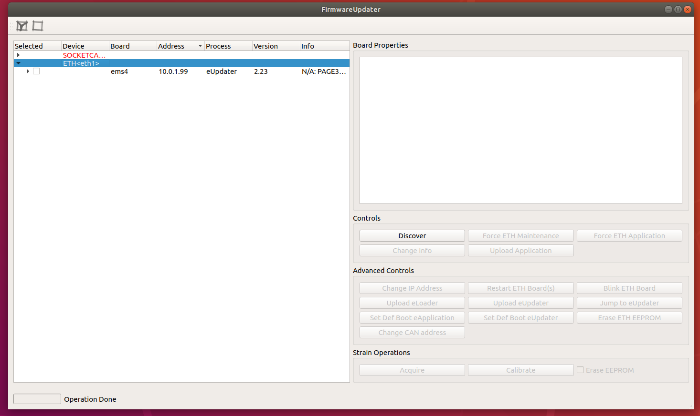

# Configure a static IP
This documentation describes how to setup a laptop/workstation network interface in order to communicate with an `ETH` board (i.e. `mc4plus`, `mc2plus` or `ems`)


In the image above the `ETH` interface used is an `USB/ETH` adapter but a physical network interface can be used as well.

## Requirements
To let the setup working we need:

-  A laptop/worksttion with a network interface available (both physical or an `USB/ETH` adapter)
-  The [`robotology-superbuild`](https://github.com/robotology/robotology-superbuild) installed

## Ubuntu
In order to communicate wit an `ETH` board we need to assign a `static IP` to the network interface used.

To do that :

1. Open `Settings` -> `Network`
2. Open settings of the network interface to be used (in this example `AXIS Ethernet`)
3. Go to `IPV4` tab
4. Select `Manual` in the `IPV4 Method`
5. Set `10.0.1.104` and `255.255.255.0` in the `Address` and `Netmask` fileds respectively
6. Click on `Apply` and the restart the network interface


!!!note
    It's also possible to define the static IP address by editing the `/etc/network/interfaces` as follows:
    ```xml
        # The primary network interface
            auto eth0
            allow-hotplug eth0
            iface eth0 inet static
            address 10.0.1.104
            netmask 255.255.255.0
            network 10.0.1.0
            broadcast 10.0.1.255
    ```

## Windows
In order to communicate with an `ETH` board, we need to assign a `static IP` to the network interface used.

In this example, a `USB/ETH` adapter is used (but a physical network interface can be used as well) to communicate with an `EMS` board.

Follow the steps below:

1. In `Control Panel` got to `Network and Internet`


2. Select `Network and Sharing Center` 


3. Select `Change adapter settings` 


4. Right click on the desired network interface then select `Properties`


5. Select `Internet Protocol Version 4 (TCP/IPv4)` then click on `Properties`


6. Select `Use the following IP address` and input the values as in figure below, then click `OK`


## Verify the setup
In order to check if the above operations went ok:

1. Power on the board
2. Run `FirmwareUpdater`
3. Select the `ETH` interface
4. Click on `Discover`

Now you should see the board listed:


