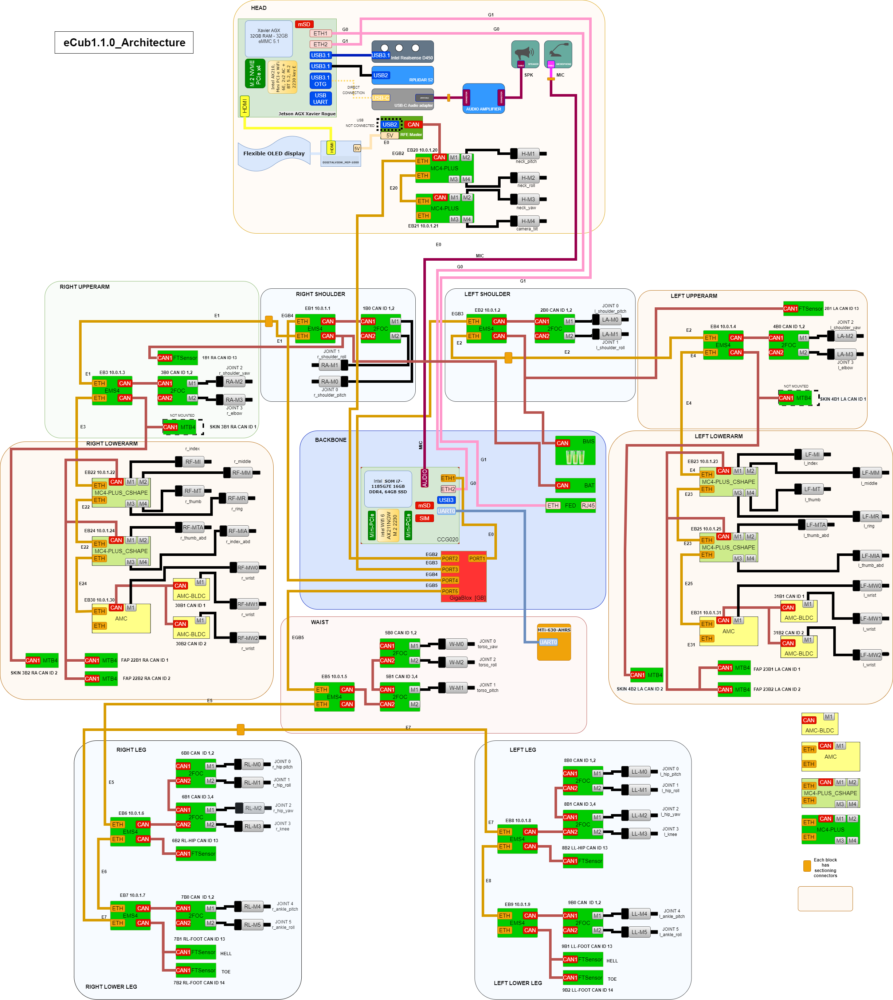

## ergoCub 1.1 Wiring 
The system architecture of ergoCub1.1 is depicted in the following image:

        

### Logic and Harness ergoCub 1.1 Full Robot 

- [ergoCub1.1 S/N:001 Logic_1.1.0](https://github.com/icub-tech-iit/electronics-wiring-public/blob/master/ergocub1/ergocub1.1/pdf/ergoCub1.1_Logic_17256_1.1.0.pdf)
- [ergoCub1.1 S/N:001 Harness_1.1.0](https://github.com/icub-tech-iit/electronics-wiring-public/blob/master/ergocub1/ergocub1.1/pdf/ergoCub1.1_Harness_17257_1.1.0.pdf)

### Motor & Board Placement ergoCub 1.1 

- [ergoCub1.1 S/N:001 rev1.1.0](https://github.com/icub-tech-iit/electronics-wiring-public/blob/master/ergocub1/ergocub1.1/pdf/ergoCub1_1_0_M%26B_placement.pdf)

