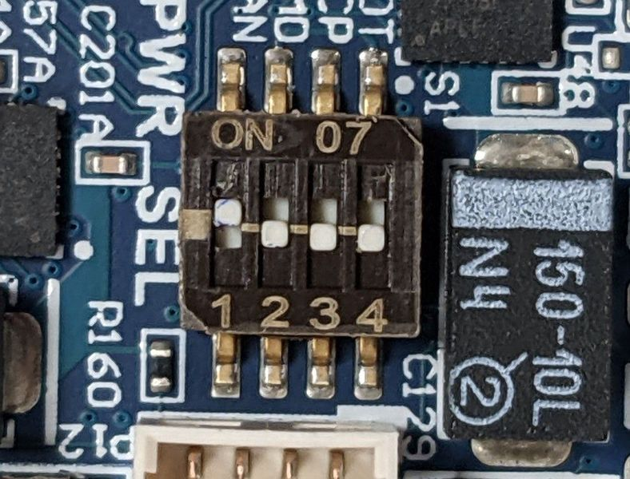
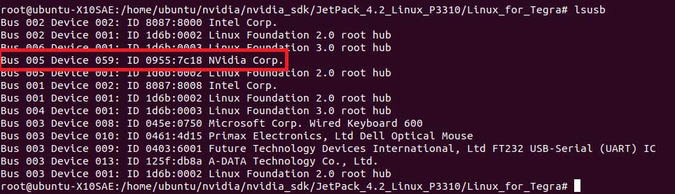

# NVIDIA Jetson Xavier AGX installation guide

This guide is intended for a developer that wants to flash and setup the NVIDIA Jetson Xavier AGX board for the `ergocub-head`.

The unit uses a [ConnectTech carrier board](https://connecttech.com/product/rogue-carrier-nvidia-jetson-agx-xavier/), so the preliminary instructions will be focused on that specific hardware.

# Requirements

## Hardware
- x86 PC/laptop for downloading Jetpack and flashing the OS
- USB-C to USB-A (or USB-C to USB-C) cable to connect the PC to the ConnectTech carrier
- Power supply cable
- Bench/System/ATE programmable DC power supply, capable of supplying 20V / 2A
- (optional) Ethernet cable to connect the Xavier to access it with SSH

To use the Xavier directly without SSHing into it:
- HDMI cable to connect to an external display
- USB mouse and keyboard

## Software
On the developer's host PC:

- Ubuntu 18.04-20.04 (depending on the version of the JetPack)
- Nvidia JetPack installed through SDK Manager (instructions below)
- Xavier AGX [ConnectTech BSP](https://connecttech.com/product/rogue-carrier-nvidia-jetson-agx-xavier/). 

!!! note
    Select the correct BSP based on the JetPack version installed on your machine.

# Intructions

## Carrier hardware configuration
Make sure that the switches on the carrier are set like in the picture below so that the unit can boot manually when pressing the power (PWR) button. DO NOT power on the unit until instructed.



## Hardware connection
1. Connect the carrier to the power supply through the provided cable, and set the power supply to 16V / 2A.
2. Keep the power supply OFF.
3. Connect the HDMI cable, and the mouse/keyboard to the carrier.
4. Use the USB-C cable to connect the PC to the OTG USB port on the carrier.


## Flash a new image from scratch

If you need to install a new JetPack image from scratch please follow the following steps.


### Jetpack setup on the host
1. Download the Nvidia SDK manager from the [official website](https://developer.nvidia.com/embedded/jetpack) by clicking *Download Nvidia SDK Manager*

2. Run SDKManager and login with developer.nvidia.com credentials, and follow these steps:
   1. Set the following options:
      - Target Hardware: Jetson Xavier AGX
      - Target operating system: *Linux Jetpack `jetpack_ver`*.
   2. Check that everything is selected and continue
   3. The SDKManager will ask the user password to download all the components and it will install them into a local folder on the host (~12Gb of free space required); Remember, this is the password of the local Ubuntu host, not the Jetson Xavier.
   4. After the installation, the SDK Manager will be ready to flash the OS image on the Xavier; **Do not preceed further!** Press SKIP to abort the operation and quit from the SDK Manager
3. Download the ConnectTech board support package from the [official website](https://connecttech.com/product/rogue-carrier-nvidia-jetson-agx-xavier/): under Downloads click on the BSP you need, it will be downloaded as `.tgz` archive.
4. At this point the `SDK Manager` should have created a folder tree in `~/nvidia` containing all the files needed for the flash. Copy the `.tgz` package downloaded from Connectech website into `~/nvidia/nvidia_sdk/JetPack_<jetpack_ver>_Linux_AGX/Linux_for_Tegra/`
5. Extract the BSP: `tar -xzf CTI-<*>.tgz`

Before flashing the image, we need first to put the board in recovery mode.


### Booting the Xavier in Recovery mode

1. Press the Force Recovery (FR) button on the carrier and keep it pressed
2. Turn on the power supply (16V)
3. Wait for several seconds, keeping the FR button pressed
4. Press the power (PWR) button for at least one second. Wait for several seconds
5. Release the FR button. Now the board is recovery mode

In order to check that the board went in recovery mode, run on a terminal in the host

```bash
watch lsusb
```

The board is in recovery mode if it appears something like this:


### Flash the image

At this point we are ready to flash, in the host:

1. Change into the CTI-L4T directory: `cd ./CTI-L4T`
2. Run the install script (as root or sudo) to automatically install the BSP files to the correct locations: `sudo ./install.sh`

[Here](https://connecttech.com/resource-center/kdb373/) you can find the tutorial about the procedure by ConnectTech.


### Verify the installation
After the reboot process, you should be greeted with the OS configuration wizard.
After configuring the system, the Xavier AGX should boot normally and be ready to use.

### Post-flashing operations

#### Complete the OEM installation
After booting into the OS, follow the OEM installation with the following options:

1. Accept the license agreement
2. Select English language
3. Select the English (US) keyboard layout
4. Select the preferred time zone
5. User the user name `ergocub` with the hostname `ergocub-head`
6. Allow login without password
7. Let the installation process finish

After rebooting into the graphical OS, run the following commands in a terminal to update the system:

```bash
sudo apt install -f
sudo apt update && sudo apt upgrade
```