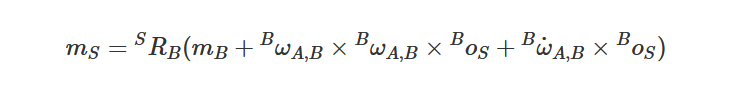

# F/T Sensors on-board IMU
The F/T Sensors have an onboard IMU unit mounted on the STRAIN2 (the signal conditioning electronic board). 
The data from the IMU can be streamed in the CAN bus with dedicated messages to complement the information from F/T sensor.

The used device is the BNO055 9-axis IMU with fusion algorhithms, datasheet can be found [here](https://www.bosch-sensortec.com/media/boschsensortec/downloads/datasheets/bst-bno055-ds000.pdf). 
The basic configuration allows the user to directly read the raw data and apply externally reconstruction algorhithms.

## Measurement frame specifications
----

*Figure 1: the FT reference frame as can be defined while using the device*
The F/T sensor reference frame and the IMU default reference frame are solidal each other. The two frames are rotated with respect to each other. Definitions are in the following.

The F/T reference frame can be determined by looking at the device:
- the connection cable exits the sensor in the $-x$ direction 
- the thick sensor cover indicates the $+z$ direction
- the $y$ axis is determined accordingly in a right-handed convention.

This reference frame is the one used to determine and transmit the forces and torques. 

The IMU reference frame is defined by its positioning on the Strain2 PCB (see figure 2). It's oriented by with the following alignment w.r.t. the F/T frame:
| IMU | F/T |
|--|--|
| $x_{IMU}$ | $y_{FT}$  |
| $y_{IMU}$ | $-x_{FT}$ |
| $z_{IMU}$ | $z_{FT}$  |

*Figure 2. The Strain2 simplified board layout with highlighted the reference frames, magenta for the IMU and green for the F/T sensor; in magenta it is also highlighted the footprint of the IMU component*

By acting on the firmware the two reference frames can be made parallel but to perform a precise acceleration transformation we have in general to deal with **non-inertial term** as explained in the following.

The IMU origin in the F/T frame coordinates are (7.5, -8.6) mm.

## Acceleration transformation with non-inertial terms

We have two reference frames rotated w.r.t. each other but rigidly connected, i.e. F/T and IMU reference frames.
We measure accelerations with the IMU in its proper reference frame *B*, and the mathematical proble is to transform the accelerations in the FT reference frame *S*.

Given the two relevant quantities
- origin displacement of FT reference frame in IMU reference frame ${}^B_o_S = (8.6, 7.5, 0)$
- rotation matrix between the two reference frames ${}^SR_B$; 

we can identify the transformation law as 

where the last two terms in the right-hand member are the non-inertial terms that appears in the reference frame transformation. The suffix *A* means that the quantity is calculated w.r.t. the 
inertial *absolute* reference frame. 

### Measurement of non-inertial terms in realistic scenarios

To assess the required level of precision in transforming the acceleration between the two dragged reference frames we performed a few test in a real world case, i.e. 
the iCub performing the **Yoga Demo**. In this demo the left foot is held on the ground and the robot balances over it moving the right leg. 
We logged both gyroscope and accelerometer data from all the F/T sensors and evaluated the non-inertial term from the formula above.

As a test we compared the transformed acceleration with and without the non-inertial components calculated according to equation above and the results are reported in the plot below.

 As a first approximation in our use case we can neglect the effect of the drag non-inertial forces in the remapping of the accelerometer data. 
 However we choose an algorhithm approach to keep this possibility open in a next step.

## Firmware implementation

In the Firmware we can either directly remap the axis with a suitable method from the BNO055 library, or define a macro to calculate explicitly the transformation. 
We choose this last mode which it does not require initializing the corresponding register overwritting the default. The benefit is we can have full control over the algorhithm and insert
higher order corrections. 
+

