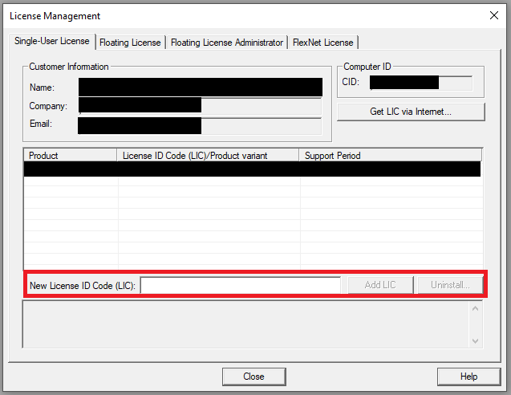

# Configuring Firmware Toolchain

This page will describe the steps necessary to install the MDK-ARM Keil software for 
compiling the firmware, and the necessary steps to configure your firmware repository

## Installing Keil

Here we will guide you through the installation of Keil. This installation requires
Marco Accame to configure your license, so contact him in advance before proceeding
with the installation!

### Download Keil

You can download Keil at the following address: 
[https://www.keil.com/demo/eval/arm.htm](https://www.keil.com/demo/eval/arm.htm). 
This will require a registration, after which you will be provided with the download
link:

### Installing Keil

Run the installer that you downloaded on the previous step. During the installation
you will be asked to input your data again, but instead of using your own email
write Marco Accame's email: marco.accame@iit.it

**Important Note:** At this point it is fundamental that Marco knows you are 
installing Keil, and is expecting the email to arrive in his account, in order to
speed up the process!

### Configuring your license

Now that you have Keil installed, you need to configure your license. 

Open Keil, and navigate to the `File->License Management` menu:

This will open the license management box, where you can manage all your licenses.
To proceed with the configuration of your license, press the 
`Get LIC via Internet...` button.

In this form you will be asked to insert the name of your computer, and the PSN
key. For the name of the computer, we strongly recommend you use your initials
so it is easier to manage the licenses in the future. Marco Accame will provide you
with the PSN key to complete the form.

Once this form is completed you may request the license, which will be sent to
Marco Accame, who will then forward to you. Once you have the key you can write 
on the `New License ID Code (LIC)` box and add it to your licenses:

This completes the Installation and license configuration for Keil!

## Configuring iCub-firmware

Now that Keil is installed and running, you need to setup the firmware
and its shared repositories, which can be cloned from the follow link: 

[https://github.com/robotology/icub-firmware](https://github.com/robotology/icub-firmware)

[https://github.com/robotology/icub-firmware-shared](https://github.com/robotology/icub-firmware-shared)

You can clone these repositories anywhere in your computer as long as they 
are both in the same directory. Once you clone the two repositories, you 
will need an extra library that will be provided upon request to either 
Marco Accame, Nicolo Genesio or Alexandre Antunes.

Unzip this new library file into the following path (replace `${YOUR_DIRECTORY}`
with the path where you cloned the two repositories): 
~~~
${YOUR_DIRECTORY}\icub-firmware\emBODY\eBcode\arch-arm\libs\highlevel\abslayer\ipal\
~~~

To properly configure this library, open Keil, go to the `Project->Open Project` 
menu, navigate to the path above and select the `ipal.uvprojx` project file.
Now you should be able to visualize all the files from this project on the left 
workspace of Keil:

The final step to configure the library is to press the `Build` button highlighted
by the red box on the image. 

## Testing your toolchain

Congratulations! You just built your first project using Keil!

In order to verify that everything is configured properly, you can try building the
project for the mc4 board located in the following path:

~~~
${YOUR_DIRECTORY}\icub-firmware\emBODY\eBcode\arch-arm\board\mc4plus\appl\v2\proj\
~~~

Select the `mc4plus.diagnostic2ready.uvprojx` project, and press the `Build` button
just like for the `ipal` library. You should see on the output workspace (bottom
of Keil window) a similar output (with 0 errors):

