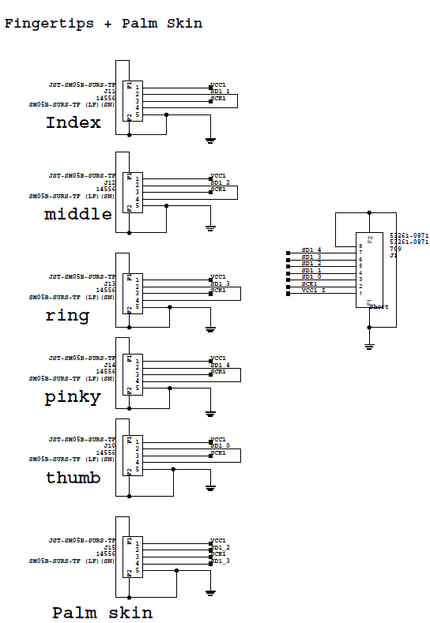

## Hand Sensors

### Finger sensors

Tactile sensors are deployed on the fingertip. 
The fingertip comprises a 3DMID piece with the patterned taxels and a conventional PCB (the **FT3D**) reading the capacitances and hosting an IMU. 

The taxel mapping is represented in Fig. 1 

Fig.1 - Taxel mapping

### FT3D board configuration - rev. 2 

The AD7147 hosted on the FT3D has configurable **I2C address**  to allow for multiple devices. 

The congfiguration is made through the jumpers **AD0** and **AD1** reported in fig. 2 by simply solder the desired connection on the dedicated jumper.

 

Fig.2 - Address configuration: the board represented has Address bits (AD0, AD1) = (0, 0)

Since the **IMU** is not equipped with similar configurable address pins, we need to remove all the IMUs from unwanted boards before installing. This will be fixed in rev. 3 of the FT3D

The complete configuration set is as follow:

| finger |  AD0 | AD1 | IMU | I2C dataline | 
|:--:|:--:|:--:|:--:|:--:|
|thumb   | 0    | 0   | yes | 0            |
|index   | 0    | 0   | yes | 1            |
|middle  | 1    | 0   | no  | 1            |
|ring    | 0    | 1   | no  | 1            |
|pink    | 1    | 0   | no  | 0            |

I2C dataline is decided at the MMA level through the connector assignment

### Encoders

The finger position (closing and adduction angles) are read out by a set of FAP cards (Finger Absolute Position) each one coupled with a small magnet solidal with the interested joint.
Each FAP has the same I2C address thus **one I2C data line is needed for one FAP**. This is implemented at the PCB level. 

## MMA Connection scheme

Three Molex 8-Pin connectors are the input for three dedicated MTB cards
- one MTB for tactile reading
- two MTBs for FAP reading: max. 8 FAPs can be connected (4x MTB)

The power suppy and signals are then routed to the connectors towards the FAPs and Fingertips:
- **JST SURS** 5 contacts for the fingertips
- **JST XRS** 4 contacts for the FAPs

The family of connectors on the same device are identified with the REF DES, 
i.e. Picoblade **J1** goes to connectors **J1**1, **J1**2 and so on, Picoblade **J2** goes to **J2**1 etc. 
Details are summarized in the table below:

| connector | description | sensor | 
|--|--|--|
|**J1** | Molex 8-Pin | conventional MTB |
|**J2** | Molex 8-Pin | MTB-FAP  |
|**J3** | Molex 8-Pin | MTB-FAP  |
| J10-J15 | JST SURS  | fingertips and palm - corresponding to **J1** |
| J20-J23 | JST XRS | encoders - corresponding to **J2** |
| J30-J33 | JST XRS | encoders - corresponding to **J3** |

The encoders are connected with the following logic:
- finger position encoders are to be routed to one MTB-FAP
- adduction encoders are to be routed to the other MTB-FAP

The choice of the MTB-FAP can be made allowing for the simplest layout.

The schematic of the MMA reporting the 

### Tactile sensors

 

Fig.3 - Skin connections. The fingers belonging to the same Data Line can be swapped)

The tactile sensors are connected to the MMA like in fig. 3. The fingers (index, middle, ring) can be swapped to account for easier cabling, with no effect in mapping of the signals. Also, Thumb and Pink can be swapped the same way.

### Encoder connection

The encoders are connected as reported in the table above and in the schematic snapshot in fig. 4.

Fig.4 - FAPs connections. The FAP mapping should be reported in the configuration files for proper working of the joints. )

## Software items

To use correctly the data from the sensors we need to have the following information embedded in the configuration files.

### Signal wrapping in configuration files 

For the configuration of the **Wrapper file** in the robots-configuration tree, for streaming through the **YARP** 
services and signal visualization, the mapping of the signals is reported in the table below

| Finger | Source Index | Destination Index |
|-- |--|--|
| Thumb  | 48-59  |  0-11   |
| Index  | 0-11   |  12-23  |
| Middle | 12-23  |  24-35  |
| Ring   | 24-35  |  36-47  |
| Pink   | 60-71  |  48-59  |
| Palm   | 96-191 |  96-191 |

### AD7147 configuration

The values for the mk2 fingertip are reported here, to be implemented in **.xml files** with the proper labeling

| Parameter |  Value | 
|--|--|
| Bitshift | 2 |
| CDC offset | 0x0000 | 
| No load value | see[^1] |

[^1]: the No load value can be choosen to be lower than 0xF0 (240) to allow for some room for opposite polarity signals to be recorded. In this case the set level must be forwarded to 
high level tools such as SkinGUI etc. for a proper managing of events. A nice choice could be a value of about 0xC0 (192) to have ~60 ADC counts of headroom for oppposite sign forces 
i.e. shear forces to be measured with the lateral taxels or elastic effects for non-touched taxels to improve force measurement

### Encoders mapping in the configuration files

TO BE FILLED AFTER FW WORK DONE.

