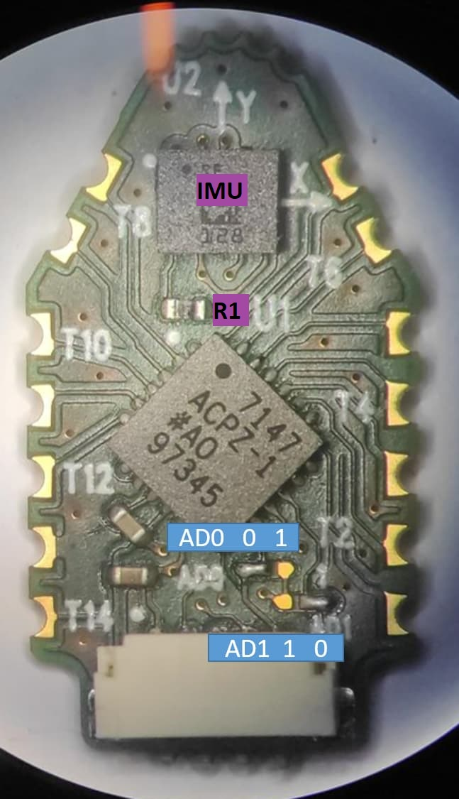
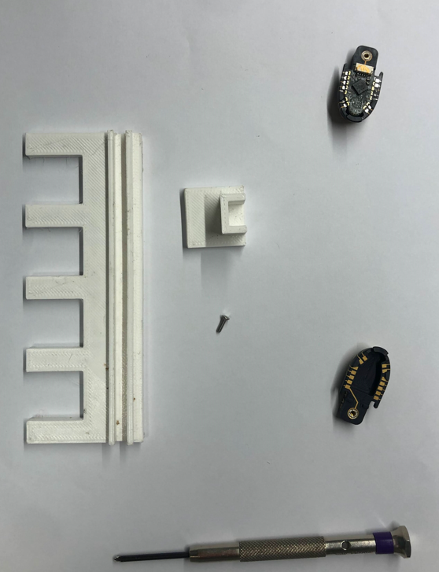
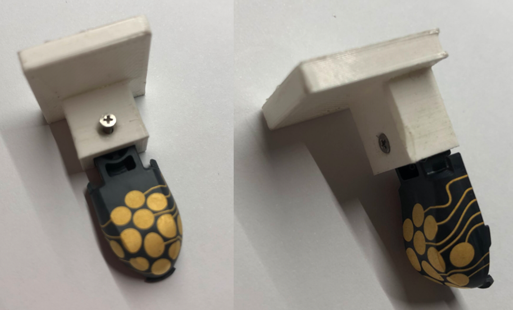
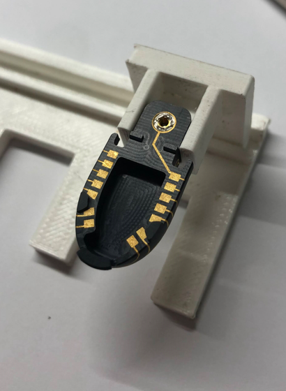
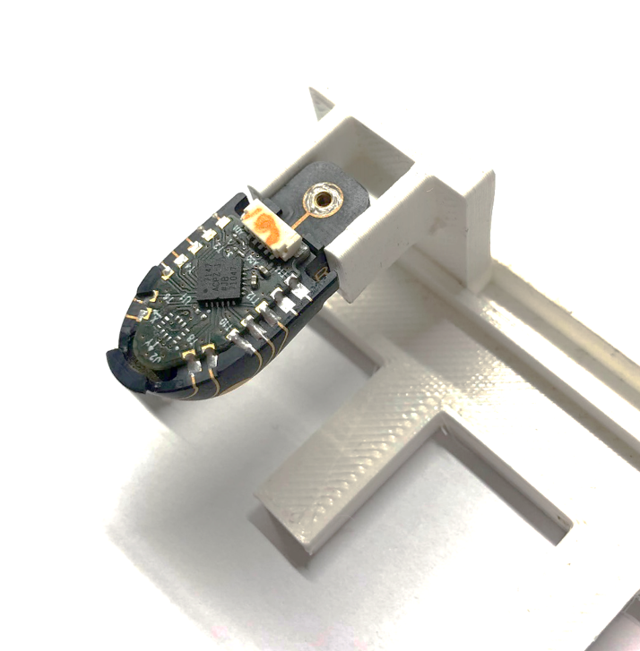
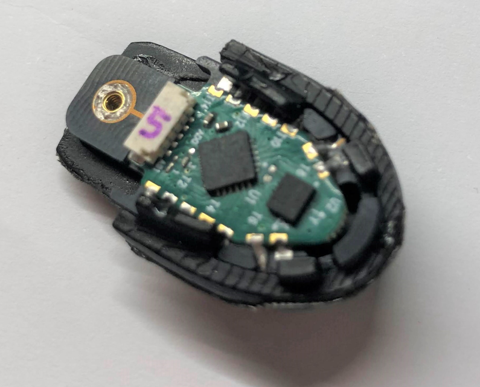
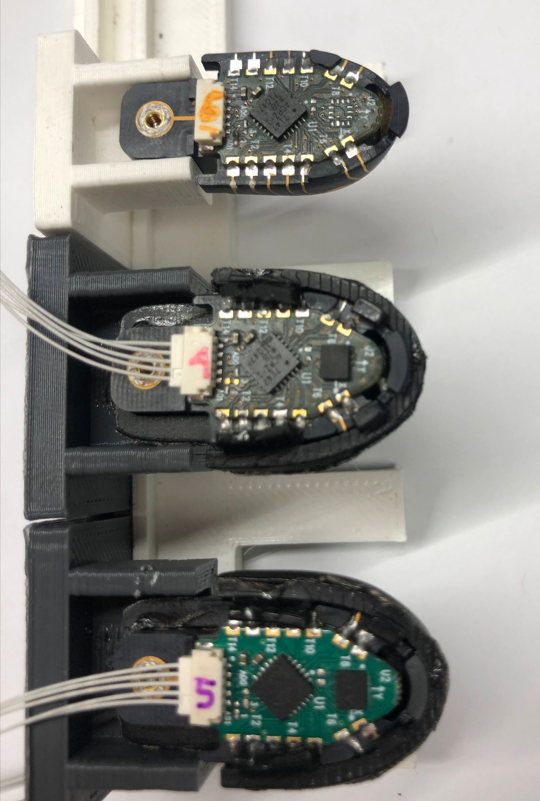
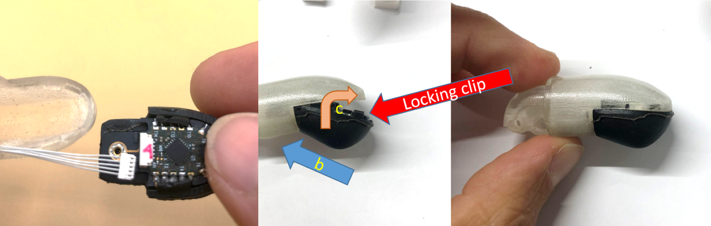

## Hand Sensors

### Finger sensors
Tactile sensors are deployed on the fingertip. 
The fingertip comprises a 3DMID piece with the patterned taxels and a conventional PCB (the **FT3D**) reading the capacitances and hosting an IMU. 

The taxel mapping is represented in Fig. 1.

    

    Fig.1 – Taxel mapping.

### FT3D board configuration - rev. 2 
The AD7147 hosted on the FT3D has configurable **I2C address**  to allow for multiple devices. 

The congfiguration is made through the jumpers **AD0** and **AD1** reported in Fig. 2 by simply soldering the desired connection on the dedicated jumper.

    

    Fig.2 – Address configuration: the board represented has Address bits (AD0, AD1) = (0, 0).

Since the **IMU** is not equipped with similar configurable address pins, we need to remove all the IMUs from unwanted boards before the installation. This will be fixed in rev. 3 of the FT3D.

The complete configuration set is as follow:

#### ergoCub SN000

| finger |  AD0 | AD1 | IMU | I2C dataline | IIT code | 
|:--:|:--:|:--:|:--:|:--:|:--:|
|thumb   | 0    | 0   | LSM6DSLTR | 0            | 17544 | 
|index   | 0    | 0   | LSM6DSLTR | 1            | 17544 |
|middle  | 1    | 0   | no  | 1            | 17545 |
|ring    | 0    | 1   | no  | 1            | 17546 |
|pink    | 1    | 0   | no  | 0            | 17545 |

#### ergoCub SN001

| finger |  AD0 | AD1 | IMU | I2C dataline |  IIT code |   
|:--:|:--:|:--:|:--:|:--:|:--:|
|thumb   | 0    | 0   |  IIM-42652 | 0     | 17544.A |   
|index   | 0    | 0   |  IIM-42652 | 1     | 17544.A |  
|middle  | 1    | 0   |  LSM6DSLTR | 1     | 17545.A | 
|ring    | 0    | 1   |  no        | 1     | 17546 |   
|pink    | 1    | 0   |  LSM6DSLTR | 0     | 17545.A | 

#### ergoCub equipped with MMA rev. B

I2C dataline is decided at the MMA level through the connector assignment.

### Mounting the 3DMID 

#### Needed material (for one hand):

|IITCODE | description | quantity |
|--|--|--|
| 17628 | support for soldering | 5 |
| 17627 | base for soldering support | 1 |
| 16619 | 3DMID shells| 5| 
| 15467 | FT3D board| 5 | 
| 17377 | rubber fingertip | 5 |
| | 1.6x6mm screws | 5 | 
| | 1.6x8mm screws | 5 | 

plus:
1. low temperature solder
2. dedicated tips for the soldering iron
3. dedicated flux for LTS
4. screwdriver

    

    Fig.3 – Some material needed to mount the fingertips.

#### Procedure

1. fix the 3DMID to the soldering support with 1.6x6mm screw

    

    Fig.4 - fixing the 3DMID to the soldering support.

2. plug the soldering support on the base

    

    Fig.5 – soldering support plugged into the base.

3. set the soldering iron to 250 C, apply flux and pre-tin the pads on the 3DMID
4. apply flux and pre-tin the castellated holes on FT3DB
5. configure the FT3DB jumpers (see section above)
5. place the FT3DB on the 3DMID aligning the soldering pads
6. apply some flux if needed and solder a couple of pads holding the FT3DB in position
7. go on and solder all the pads

    

    Fig.6 – soldered FT3DB on the 3DMID shell.

at this point the device is ready for testing, just connect it to the MMA with the dedicated cable. 
To fully mount the fingertip proceed with the next steps

9. put on the rubber fingertip cod. 17377 

    

    Fig.7 – adjusted rubber fingertip on 3DMID shell.

10. you can test the fingertip in this condition:

    

    Fig.8 – 3DMID fingertips with and without the rubber cap.

11. to mount on the finger distal phalanx (fig. 9):
  a. connect the cable (**not shown here**)
  b. slide the rear of the assembly into the bore with a small inclination
  c. push up and ahead to insert the locking clip into its slot

at this point the assembly should look sturdy and precisely fit. 
You can fix it with **1.6x8 mm screw**

    

    Fig.9 – 3DMID fingertip insertion procedure, right: 3DMID device inserted into the distal phalanx.

### Encoders
The finger position (closing and adduction angles) are read out by a set of FAP cards (Finger Absolute Position), each one coupled with a small magnet rigidly connected to the corresponding joint.
Each FAP has the same I2C address, thus **one I2C data line is needed for one FAP**. This is implemented at the PCB level. 

## MMA Connection scheme
Three Molex 8-Pin connectors are the inputs for three dedicated MTB cards:
- One MTB for tactile reading.
- Two MTBs for FAP reading: max. 8 FAPs can be connected (4x MTB).

The power suppy and signals are then routed to the connectors towards the FAPs and Fingertips:
- **JST SURS** 5 contacts for the fingertips.
- **JST XRS** 4 contacts for the FAPs.

The family of connectors on the same device are identified with the REF DES: i.e., Picoblade **J1** goes to connectors **J1**1, **J1**2 and so on; Picoblade **J2** goes to **J2**1 etc. 
Details are summarized in the table below:

| connector | description | sensor | 
|--|--|--|
|**J1** | Molex 8-Pin | conventional MTB |
|**J2** | Molex 8-Pin | MTB-FAP  |
|**J3** | Molex 8-Pin | MTB-FAP  |
| J10-J15 | JST SURS  | fingertips and palm - corresponding to **J1** |
| J20-J23 | JST XRS | encoders - corresponding to **J2** |
| J30-J33 | JST XRS | encoders - corresponding to **J3** |

The encoders are connected with the following logic:
- Finger position encoders are to be routed to one MTB-FAP.
- Adduction encoders are to be routed to the other MTB-FAP.

The choice of the MTB-FAP can be made allowing for the simplest layout.

The schematic of the MMA is shown below.

### Tactile sensors

    

    Fig.3 – Skin connections. The fingers belonging to the same Data Line can be swapped.

The tactile sensors are connected to the MMA as in Fig. 3. The fingers (index, middle, ring) can be swapped to account for easier cabling, with no effect in mapping of the signals. Also, Thumb and Pink can be swapped the similarly.

### Encoder connection
The encoders are connected as reported in the table above and in the schematic snapshot in Fig. 4.

    

    Fig.4 – FAPs connections. The FAP mapping should be reported in the configuration files for proper working of the joints.

## Software items
To use correctly the data from the sensors we need to have the following information embedded in the configuration files.

### Signal wrapping in configuration files 
For the configuration of the **Wrapper file** in the robots-configuration tree, for streaming through the **YARP** 
services and signal visualization, the mapping of the signals is reported in the table below:

#### ergoCub SN000 & SN001

| Finger | board nr. | Taxel Index | 
|-- |--|--|
| Thumb  | 4 | 48-59  | 
| Index  | 0 | 0-11   | 
| Middle | 1 | 12-23  | 
| Ring   | 2 | 24-35  | 
| Pink   | 5 | 60-71  | 
| Palm   | TBD |TBD |  

#### ergoCub SN000 & SN001

| Finger | board nr. | Taxel Index |
|-- |--|--|
| Thumb  | 0 | 0-11  | 
| Index  | 1 | 12-23 |
| Middle | 2 | 24-35 |
| Ring   | 3 | 36-47 |
| Pink   | 4 | 48-59 |
| Palm   | TBD | TBD |

### AD7147 configuration
The values for the mk2 fingertip are reported here, to be implemented in **.xml files** with the proper labeling:

| Parameter |  Value | 
|--|--|
| Bitshift | 2 |
| CDC offset | 0x0000 | 
| No load value | note[^1] |

[^1]: the No load value can be choosen to be lower than 0xF0 (240) to allow for some room for opposite polarity signals to be recorded. In this case the set level must be forwarded to 
high level tools such as SkinGUI etc. for a proper managing of events. A nice choice could be a value of about 0xC0 (192) to have ~60 ADC counts of headroom for oppposite sign forces 
i.e. shear forces to be measured with the lateral taxels or elastic effects for non-touched taxels to improve force measurement.

### Encoders mapping in the configuration files
TO BE FILLED AFTER FW WORK DONE.
