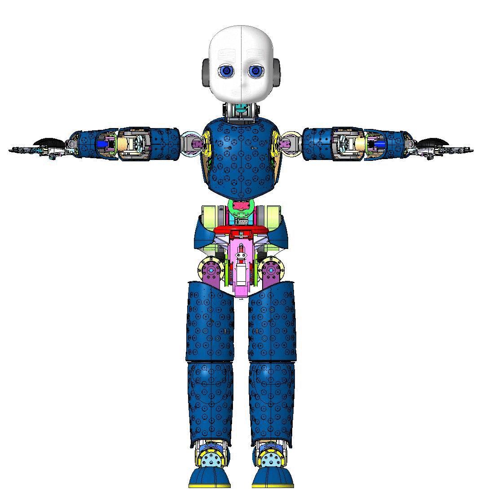

    

# iCub Documentation
First draft of iCub documentation.

## iCub Tendons
[iCub Tendons](./icub_tendons/index.md) contains a technical description of the tendons of the iCub, comprising how to assemble the steel cables and how to change broken parts. 

## The Upgrade Kits
The design of our robot evolves in time. We have been asking ourselves how to propagate the mechanical or hardare enhancements we design to older robots. Our solution is to define upgrade kits that can be applied to specific robots. 

An upgrade kit is a ... plastic bag with mechanical parts, hardware boards, screws, wires, tendons and whatever it is required to perform a physical upgrade of the robots. And surely the instructions.

Here are our first kits:

### iCub Upgrade Kit: hand
[iCub Hands Support UpKit](./upgrade_kits/hands/support.md) describes how to perform an upgrade to the hands of iCub. The upgrade consists of replacing the supports of the mais board and on a new cover.

### iCub Upgrade Kit: eyes support 
[iCub Eyes Support UpKit](./upgrade_kits/eyes/support.md) describes how to perform an upgrade to iCub so that the supports of the eyes make them more stable.

### iCub Upgrade Kit: torso capacitors 
[iCub Torso Capacitors UpKit](./upgrade_kits/eyes/support.md) describes how to perform an upgrade to iCub so that the capacitors placed in its back don't get loose.

### iCub Upgrade Kit: differential neck pulley 
[iCub Differential Neck Pulley UpKit](./upgrade_kits/eyes/support.md) describes how to perform an upgrade of the neck of iCub so that the tendon does not easily slip away.
