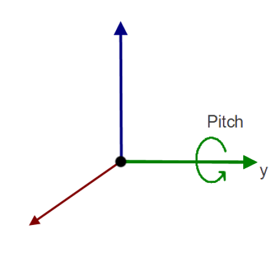

# iCub 3
Here's are described the elctrical and mechanical specifications for each joint

## Head Joints Specs

### Joints 0,1 - pitch and roll (coupled)
|   |   |
|---|---|
| | |
|Motor type|DC|
|Motor Encoder|512 ppr|
|First stage reduction|18/28|
|Harmonic drive|1/100|
|Last stage (cables and pulleys reduction)|30.5/31.7|
|Joint encoder|AEA|
|HW limits|pitch -30/+41 roll +/-40 (degrees)|

### Joint 2 - yaw
|   |   |
|---|---|
| | |
|Motor type|DC|
|Motor Encoder|512 ppr|
|First stage reduction|-|
|Harmonic drive|1/100|
|Last stage (cables and pulleys reduction)|-|
|Joint encoder|AEA|
|HW limits|+/-45 (degrees)|

### Joint 3 - eyes tilt
|   |   |
|---|---|
| | |
|Motor type|DC|
|Motor Encoder|512 ppr|
|First stage reduction|-|
|Harmonic drive|1/100|
|Last stage (cables and pulleys reduction)|-|
|Joint encoder|AEA|
|HW limits|+/-45 (degrees)|

### Joint 4,5 - eyes pan
|   |   |
|---|---|
| | |
|Motor type|DC|
|Motor Encoder|512 ppr|
|First stage reduction|-|
|Harmonic drive|1/50|
|Last stage (cables and pulleys reduction)|-|
|Joint encoder|-|
|HW limits|+/-30 (degrees)|

## Face Joints Specs

### Eyelids
|   |   |
|---|---|
| | |
|Motor type|DC|
|Motor Encoder|10 lpr|
|Integrated gearbox|1/16|
|Joint encoder|AEA|
|Last stage reduction|42/100|
|HW limits|0/-70 (degrees)|

### Yaw
|   |   |
|---|---|
| | |
|Motor type|DC|
|Motor Encoder|-|
|Integrated gearbox|1/84|
|Joint encoder|AEA|
|Last stage reduction|42/100|
|HW limits|0/-10 (degrees)|

### Lips
|   |   |
|---|---|
| | |
|Motor type|4 DC|
|Motor Encoder|400 ppr|
|Integrated gearbox|1/66|
|Joint encoder|-|
|Last stage reduction|-|
|HW limits|-|

## Upperbody Joints specs

### Joint 0 - yaw
|   |   |
|---|---|
| | |
|Motor type|Brushless C2900576 8 poles|
|Motor Encoder|Lcore optical encoder on motor shaft|
|Harmonic drive|1/100|
|Joint encoder|Magnetic target 64/63 & AMO board (MU7S_64-63N PWB 103839)|
|HW limits|-45/+45 (degrees)|

### Joint 1 - shoulder pitch
|   |   |
|---|---|
| | |
|Motor type|Brushless C2900576 8 poles|
|Motor Encoder|Lcore optical encoder on motor shaft|
|Harmonic drive|1/100|
|Joint encoder|Magnetic target 64/63 & AMO board (MU7S_64-63N PWB 103839)|
|HW limits|-5/+100 (degrees)|

### Joint 2 - shoulder roll
|   |   |
|---|---|
| | |
|Motor type|Brushless C2900576 8 poles|
|Motor Encoder|Lcore optical encoder on motor shaft|
|Harmonic drive|1/100|
|Joint encoder|Magnetic target 64/63 & AMO board (MU7S_64-63N PWB 103839)|
|HW limits|-15/+150 (degrees)|

### Joint 3 - upperarm yaw
|   |   |
|---|---|
| | |
|Motor type|Brushless C2900576 8 poles|
|Motor Encoder|Lcore optical encoder on motor shaft|
|Harmonic drive|1/100|
|Joint encoder|magnetic target 64/63 & AMO board (MU7S_64-63N PWB 103839)|
|HW limits|-52/+82 (degrees)|

### Joint 4 - elbow
|   |   |
|---|---|
| | |
|Motor type|Brushless C2900576 8 poles|
|Motor Encoder|Lcore optical encoder on motor shaft|
|Harmonic drive|1/100|
|Joint encoder|magnetic target MU7S_25-32N & AMO board (MU7S_64-63N PWB 103839)|
|HW limits|-5/+115 (degrees)|

## Forearm Joints specs

### Pronosupination
|   |   |
|---|---|
| | |
|Motor type|DC|
|Motor Encoder|512 ppr|
|Harmonic drive|1/100|
|Joint encoder|-|
|HW limits|-90/+90 (degrees)|

### Wrist yaw and pitch - coupled
|   |   |
|---|---|
| | |
|Motor type|DC|
|Motor Encoder|400 ppr|
|Integrated gearbox|1/159|
|Cables’pulleys reduction|14/18.8|
|Joint encoder|AEA (both joints)|
|HW limits|-45/+45 (degrees)|

### Thumb, index and middle proximals
|   |   |
|---|---|
| | |
|Motor type|DC|
|Motor Encoder|10 ppr|
|Integrated gearbox|1/256|
|Cables’pulleys reduction|-|
|Joint encoder|Hall effect sensor|

### Thumb distals - 2 joints 1 motor
|   |   |
|---|---|
| | |
|Motor type|DC|
|Motor Encoder|10 ppr|
|Integrated gearbox|1/256|
|Cables’pulleys reduction|-|
|Joint encoder|Hall effect sensor|

### Index distals - 2 joints 1 motor
|   |   |
|---|---|
| | |
|Motor type|DC|
|Motor Encoder|10 ppr|
|Integrated gearbox|1/256|
|Cables’pulleys reduction|-|
|Joint encoder|Hall effect sensor|

### Middle distals - 2 joints 1 motor
|   |   |
|---|---|
| | |
|Motor type|DC|
|Motor Encoder|10 ppr|
|Integrated gearbox|1/256|
|Cables’pulleys reduction|-|
|Joint encoder|Hall effect sensor|

### Ring and pinky distals - 4 joints 1 motor
|   |   |
|---|---|
| | |
|Motor type|DC|
|Motor Encoder|10 ppr|
|Integrated gearbox|1/256|
|Cables’pulleys reduction|-|
|Joint encoder|Hall effect sensor|

### Fingers abduction
|   |   |
|---|---|
| | |
|Motor type|DC|
|Motor Encoder|10 ppr|
|Integrated gearbox|1/256|
|Cables’pulleys reduction|-|
|Joint encoder|Hall effect sensor|

### Thumb abduction
|   |   |
|---|---|
| | |
|Motor type|DC|
|Motor Encoder|no|
|Integrated gearbox|1/256|
|Cables’pulleys reduction|-|
|Joint encoder|Hall effect sensor|

## Lowebody Joints specs

### Joint 5 - waist pitch
|   |   |
|---|---|
| | |
|Motor type|MOOG_C2900576 Moog BLDC motor, OD 49.2, ID 15.5, L 24.7 , W/O HALL SENSOR|
|Fast shaft sensor|Lcore 5 – optical disk 004|
|Slow shaft sensor drive|AMO board  - magnetic target 64/63  (MU7S_64-63N PWB 103839)|
|Harmonic drive|CSD-20-100-2UH_CS (1:100)|
|HW limits|+65/-25 front/rear (degrees)|
|SW limits|-|

### Joint 6 - waist roll
|   |   |
|---|---|
| | |
|Motor type|MOOG_C2900576 Moog BLDC motor, OD 49.2, ID 15.5, L 24.7 , W/O HALL SENSOR|
|Fast shaft sensor|Lcore 5 – optical disk 004|
|Slow shaft sensor drive|AMO board  - magnetic target 64/63  (MU7S_64-63N PWB 103839)|
|Harmonic drive|CSD-20-100-2UH_CS (1:100)|
|HW limits|+25/-25 (degrees)|
|SW limits|-|

### Joint 7, 13 - left, right hip pitch
|   |   |
|---|---|
| | |
|Motor type|MOOG_C2900580 Moog BLDC motor, OD 72.4, ID 15.5, L 27.5 , W/O HALL SENSOR|
|Fast shaft sensor|Lcore 5 – optical disk 004|
|Slow shaft sensor drive|AMO board  - magnetic target 64/63  (MU7S_64-63N PWB 103839)|
|Harmonic drive|CSD-20-100-2UH_CS (1:100)|
|HW limits|+130/-55 front/rear (degrees)|
|SW limits|+125/-40 proposal (degrees)|

### Joint 8, 14 - left, right hip roll
|   |   |
|---|---|
| | |
|Motor type|MOOG_C2900576 Moog BLDC motor, OD 49.2, ID 15.5, L 24.7 , W/O HALL SENSOR|
|Fast shaft sensor|Lcore 5 – optical disk 004|
|Slow shaft sensor drive|AMO board  - magnetic target 64/63  (MU7S_64-63N PWB 103839)|
|Harmonic drive|CSD-20-100-2UH_CS (1:100)|
|HW limits|-116/+20 front/rear (degrees)|
|SW limits|-|

### Joint 9, 15 - left, right yaw
|   |   |
|---|---|
| | |
|Motor type|MOOG_C2900576 Moog BLDC motor, OD 49.2, ID 15.5, L 24.7 , W/O HALL SENSOR|
|Fast shaft sensor|Lcore 5 – optical disk 004|
|Slow shaft sensor drive|AMO board  - magnetic target 64/63  (MU7S_64-63N PWB 103839)|
|Harmonic drive|CSD-20-100-2UH_CS (1:100)|
|HW limits|-67.5/+67.5 (degrees)|
|SW limits|-|

### Joint 10, 16 - left, right knee
|   |   |
|---|---|
| | |
|Motor type|MOOG_C2900580 Moog BLDC motor, OD 72.4, ID 15.5, L 27.5 , W/O HALL SENSOR|
|Fast shaft sensor|Lcore 5 – optical disk 004|
|Slow shaft sensor drive|AMO board  - magnetic target 64/63  (MU7S_64-63N PWB 103839)|
|Harmonic drive|CSD-25-100-2UH_CS (1:100)|
|HW limits|+105/-5 (degrees)|
|SW limits|-|

### Joint 11, 17 - left, right foot pitch
|   |   |
|---|---|
| | |
|Motor type|MOOG_C2900580 Moog BLDC motor, OD 72.4, ID 15.5, L 27.5 , W/O HALL SENSOR|
|Fast shaft sensor|Lcore 5 – optical disk 004|
|Slow shaft sensor drive|AMO board  - magnetic target 64/63  (MU7S_64-63N PWB 103839)|
|Harmonic drive|CSD-25-100-2UH_CS (1:100)|
|HW limits|+45/-45 (degrees)|
|SW limits|-|

### Joint 12, 18 - left, right foot roll
|   |   |
|---|---|
| | |
|Motor type|MOOG_C2900576 Moog BLDC motor, OD 49.2, ID 15.5, L 24.7 , W/O HALL SENSOR|
|Fast shaft sensor|Lcore 5 – optical disk 004|
|Slow shaft sensor drive|AMO board  - magnetic Encoder  (MU7S_25-32N)|
|Harmonic drive|CSD-17-100-2A (1:100)|
|HW limits|+25/-25 (degrees)|
|SW limits|-|

