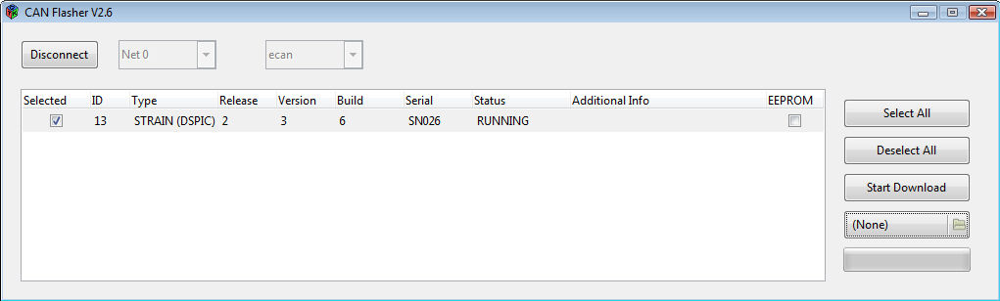

# CanLoader

!!! warning
     `Canloader` is deprecated since this [PR](https://github.com/robotology/icub-main/pull/659)

The canLoader application allows to flash the firmware of the dsp boards using the canbus interface.
It can be also used to determine which boards are up and running.
The canLoader allows to either use plx canbus boards or esd canbus boards (actually any device implementing an ICanBus interface in YARP).
Detailed [CANLoader protocol](./assets/RC_DIST_100_D_15_01_CANLOADER_PROTOCOL.pdf).

## Steps
- Determine the type of device you want to use. If you are on the pc104 this will probably be the cfw2 device.
- Make sure you have compiled the appropriate canbus device (pcan,cfw2 or ecan) (read Compilation on the pc104).
- Make sure the canLoader program has been compiled. In the main iCub project, this is done automatically if you have the gtk/gtkmm libraries.
- Run the canLoader program. If you ssh into the pc104 make sure you use the -X option to redirect the graphic output to your local machine.
- Select the device you use (cfw2/pcan/ecan) in the text box (for historical reason default is ecan).
- Select the can network you want to probe (0 to 9), and hit connect. See below for a list of the can networks.

You should see a list of boards that are available in the network you have selected, their id, the version of the firmware, the build number and a text description. If a card is listed here it means that it was able to reply to the broadcast message from the canLoader (a good start).

## Device Type
The device type is the software module that wraps the can bus device you are using.

- On the first version of iCub the pc104 has a plx can bus device, wrapped by the pcan software module.
- On iCub 1.1 the pc104 also mounts two esd can bus devices, which are wrapped by the ecan software module. In this case the device module you use depends on  - The can bus network (or body part) your want to access.
- On iCub 1.1.1 (and later) the pc104 mounts up to 9 can bus devices, which are wrapped by the cfw2 software module.

## Standard firmware update (DSP)
The firmware upgrade of the whole robot is performed using a script based on a command line version of the [CanLoader](../canLoader/canLoader.md) module. Before you try to use this script please check that this module is compiled on the pc104. You should also make sure that the hardware modules it needs (controlboard, canmotioncontrol, ecan/pcan/cfw2can) are compiled and liked correctly (this is usually the case on the robot pc104).

Please notice that the firmware upgrade is delicate procedure which changes one of the core parts of the iCub robot software (and therefore requires a corresponding update of the yarp and iCub modules). If you decide to perform a firmware upgrade, be aware that this might change the robot motor behaviour quite a lot. Nevertheless, a firmware upgrade is always recommended because it usually corresponds to improvements in the control board performances. Finally, remember to perform the firmware update with your robot in a 'clean' state (i.e. control boards have been just turned on, and iCubinterface has not run yet).

Here are the steps to perform the firmware update:

- Connect to the PC104.
- Go to the $ICUB_ROOT directory and update it (svn update or git pull, depending on your installation)
- Go to the $ICUB_DIR directoy and recompile the icub-main repository
- If the icub-firmware-build directory does not exists, create it with: git clone https://github.com/robotology/icub-firmware-build
- If it already exists, update it with git pull.
- Launch the firmware update script (icub-firmware-build/updateRobot.sh):

The script will automatically retrieve the robot configuration from the firmwareUpdate.txt file which is located in the robot configuration folder.

When the `updateRobot.sh` script terminates, a brief report about the firmware update operation is shown on the screen. If all the listed boards have the "ALL OK" tag, then the update was successful. If one or more boards show errors, you can use the [CanLoader](../canLoader/canLoader.md) application in order to check what went wrong, and retry to download the firmware on that particular boards. The CanLoader GUI allows you to check if all the boards have the updated firmware: simply compare the Build number with the most recent build number reported by the ChangeLog file (icub-firmware/motorControllerDsp56f807/2BLL/ChangeLog for the type=RM BLL(DSP) boards and icub-firmware/motorControllerDsp56f807/4DC/ChangeLog for the type=RM 4DC(DSP) boards).

Automatic update of the full robot with the FirmwareUpdater program will soon be possible. For some preliminary details see section (2) of document https://github.com/robotology/icub-firmware-build/blob/master/docs/FirmwareUpdater.readme.fulldetails.txt.

## Advanced firmware update (DSP)
Alternatively to the complete firmware upgrade procedure described above, you can also create your own custom script which update just a part of the robot, for example:

`icub@pc104:ICUB_ROOT/firmware/build$ ./updateRobot.sh updateLegs.txt`

The .txt file simply contains a list of board addresses and associated firmware files with the following structure:

`[canModule] [canDeviceNum] [boardId] [firmware]`

where:

- canModule can be either pcan (if you are using the PLX custom board) or ecan (if you are using the commercial usb to can interface produced by [ESD](http://www.esd-electronics.com/)) or cfw2can (if you are using the custom CFW2 board).
- canDeviceNum is the CAN line identifier (i.e: 0 for the head, 1 for the left arm, 2 for the right arm, etc..)
- boardID is the board address (0...14) on the selected CAN line.
- firmware is the firmware binary file (*.s for motorola-based boards, *.hex for DSPIC-based board)

#### Firmware update (Force/Torque Sensors)
In this section is described the procedure to update the firmware of the [F/T sensors](../../ft-sensors/ft-sensors.md). iCub (version >=1.1) is equipped with four [F/T sensors](../../ft-sensors/ft-sensors.md), one for each limb, connected to the CanBus. For a complete reference of the used CAN bus addresses please refer to: [list of the CAN bus addresses](../associated-firmware/associated-firmware.md)

## Procedure for updating the firmware of the F/T Sensors
The update of the [F/T sensors](../../ft-sensors/ft-sensors.md) firmware is performed using the [CanLoader](../canLoader/canLoader.md) module. The procedure is identical to the standard procedure used to update the firmware of a single DSP board:

- open the [CanLoader](../canLoader/canLoader.md) GUI.
- select the can bus number and the can bus device driver from the menus and click 'Connect'.
- select the F/T sensor (click on the checkbox on the left).
- select the firmware file from the file selector on the right (default location: iCub\src\firmware\build\strain.hex).
- click 'Start Download'.

Note: A command-line procedure is also provided. To update the firmware, run the following command:

canLoader20 --canDeviceType <t> --canDeviceNum <x> --boardId <y> --firmware <f>

where:

parameter <t> is the name of the CAN bus driver. It can be ecan or pcan or cfw2can
parameter <x> is the number of the CAN bus (0-9)
parameter <y> is the CAN address of the F/T sensor (0-15)
parameter <f> is the firmware binary file (e.g. strain.hex)

## Reset of the F/T Sensors
Note: This procedure completely erases both the flash and the eeprom of the F/T Sensor. You will have to download again the calibration data in the sensor after performing the reset of the F/T sensor. It's most likely that you DO NOT have to follow this procedure, unless some serious problem occurred. Even if you downloaded a wrong firmware file in the F/T sensors, only the standard procedure described above is needed to update it.

The procedure to reset a F/T Sensor is the following:

- open the [CanLoader](../canLoader/canLoader.md) GUI.
- select the can bus number and the can bus device driver from the menus and click 'Connect'.
- select the F/T sensor (click on the checkbox on the left).
- check the eeprom box on the right.
- select the firmware file from the file selector on the right (default location: iCub\src\firmware\build\strain.hex).
- click 'Start Download'.

After the completion of the firmware download:

- reboot the F/T sensor (remove the power supply, restart the sensor, reconnect the Can Loader GUI, waiting for the boot time (10 seconds).
- after the reset, the CAN address of the sensor will be changed to 15. Change it by clicking on the number in the Can Loader GUI. The new address is automatically saved in the sensor eeprom.
- download a the correspoding sensor calibration data.

Note: Remember: do not erase the F/T sensor eeprom, unless you are really sure what you are going to do or you were instructed to do so.

## Import of the calibration data
This procedure is used to download the calibration data in the F/T sensors eeprom. Since iCub mounts calibrated F/T sensors, you don't need to follow this procedure, unless you intentionally erased the sensor eeprom. (even if you flash a new firmware update, you do not need to redownload the calibration data because they are kept in eeprom memory)

The procedure to import the calibration data is identical to the standard firmware update, just select a calibration file (calibrationDataSN*.dat) instead of a firmware file (strain.hex).

- open the [CanLoader](../canLoader/canLoader.md) GUI.
- select the can bus number and the can bus device driver from the menus and click 'Connect'.
- select the F/T sensor (click on the checkbox on the left).
- select the calibration file from the file selector on the right (default location: iCub\app\<robot name>\conf\calibration\ftSensor\<robot part>\calibrationDataSN*.dat).
- click 'Start Download'. The software automatically distinguish a calibration data file from a firmware binary file. The calibration data are automatically saved in the eeprom.

Note: A command-line procedure is also provided. To update the firmware, run the following command:

`canLoader20 --canDeviceType <t> --canDeviceNum <x> --boardId <y> --calibration <f>`

where:

parameter <t> is the name of the CAN bus driver. It can be ecan or pcan or cfw2can
parameter <x> is the number of the CAN bus (0-9)
parameter <y> is the CAN address of the F/T sensor (0-15)
parameter <f> is the calibration data file (e.g calibrationDataSN020.dat)