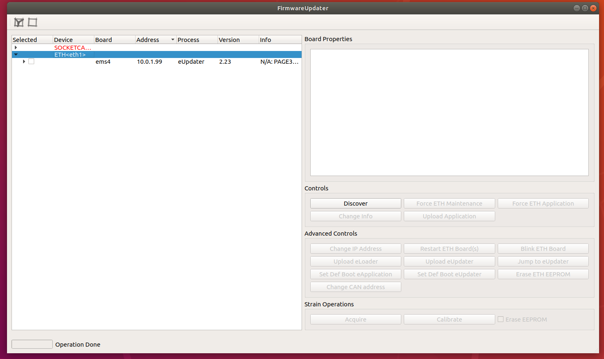

# Firmware Documentation
Here you can find informations about updating firmware, changing boards properties and firmware revisions in the various versions of the robot.


## FirmwareUpdater
With the `FirmwareUpdater` application it is possible to perform GUI-based FW update on both CAN- and ETH-based robots; the commonly used functionalities are:

- Upload `application` firmware both on `ETH` boards and `CAN` boards
- Change the `IP addrress` for ethernet based boards
- Change the `CAN ID` for the CAN based boards
- Update the `bootloader` (advanced option)
- Access to the `F/T` sensors calibration data of the `STTRAIN`/`STRAIN2`
  
  

## Firmware tools
 With the FirmwareUpdater application it is possible to perform GUI-based FW update on both CAN- and ETH-based robots. 

Here you can find [quick](https://github.com/robotology/icub-firmware-build/blob/master/docs/FirmwareUpdater.readme.quick.txt ) and [detailed](https://github.com/robotology/icub-firmware-build/blob/master/docs/FirmwareUpdater.readme.fulldetails.txt ) instructions.


### Operations on STRAIN with the FirmwareUpdater
The operations on the STRAIN boards described in the above sections can be performed also using the new FirmwareUpdater program.

With reference to Figure 2 inside this [document](https://github.com/robotology/icub-firmware-build/blob/master/docs/FirmwareUpdater.readme.fulldetails.txt) you can do as follows.

- Upload a new FW using the button `Upload Application`. See also section [6](https://github.com/robotology/icub-firmware-build/blob/master/docs/FirmwareUpdater.readme.quick.txt).
- Tick the button `Erase STRAIN EEPROM` and then upload the new FW if you also want to reset the F/T Sensors.
- Launch the STRAIN Calibration GUI with the button `Calibrate STRAIN` if you want to import a calibration data file.

### Firmware versions
A complete description of the different firmware versions used by the DSP boards which control the iCub robot can be found [here](../associated-firmware/associated-firmware.md)


### Automatic update of the robot
The user can also decide to perform the automatic update of the complete robot (or of some of its parts). Inside folder scripts of [repository](https://github.com/robotology/icub-firmware-build) there are some examples.

The user can:

- retrieve info with scripts/FirmwareUpdater.script.info.all.sh,
- query the robot with scripts/FirmwareUpdater.script.verify.all.sh. This command also gives an estimate of the time required to perform the firmware update of the boards with old versions.
- update the firmware of all boards with old versions with scripts/FirmwareUpdater.script.update.all.sh

### The topology of the robot
The robot network is described by the file network.{$YARP_ROBOT_NAME}.xml available for most robots in the [repository](https://github.com/robotology/robots-configuration). In case you cannot find this file, please ask for one [here](https://github.com/robotology/icub-support)

In its inside there is thelist of all boards with their name, drive, address and link relations.

You can view some of this information with:

- scripts/FirmwareUpdater.script.info.all.sh: it prints the list of all boards with all details
- scripts/FirmwareUpdater.script.topology.all.sh: it prints the list of all ETH boards in link order.

### Advanced operations
The user can also launch FirmwareUpdater in administration mode to perform advance (but also potentially destructive) operations:

- change IP or CAN address,
- change bootstrap mode of boards,
- upload special system processes which helps maintenance and execution of the application,
- management of strain and strain2 boards.
  
For how to operate in this mode please refer to [this](https://github.com/robotology/icub-firmware-build/tree/master/docs).

### Robot Versions and Firmware
Below you'll find a detailed description of the various robot versions, in particular for the `board` type-`id` or `ip address`-`firmware` associations. and the services offered by each board.

## Command Line Interface (CLI)
`FirmwareUpdater` provides a CLI with a set of options to do operations via the command line.

Running `FirmwareUpdater -h` you'll be prompted to the list of all available options : 


## CLI options to change CAN ID and IP address
Here's described the capability to change : 

- CAN board ID via `SOCKETCAN` device
- CAN board ID via `ETH` device  
- IP address of an ETH board

### Change CAN ID via SOCKETCAN
In this example, we change the `CAN ID` on an `mtb` board connected via `SOCKETCAN` from 1 to 2.
The syntax of the command is the following : 
```bash
FirmwareUpdater -g -e SOCKETCAN -i 0 -c 0 -n 1 -k 2
```
where : 
- `-g -e SOCKETCAN -i 0 -c 0` is need to use a `SOCKETCAN` device (i.e. `ESD CAN/USB`) with `ID=0` and `canline=0`
- `-n 1 -k 2` changes old id 1 (-n 1) to 2 (-k 2)


### Change CAN ID via ETH
In this example, we change the `CAN ID` on an `mtb` board connected via `ETH ` through an `ems4` board w/ `IP address = 10.0.1.1` from 1 to 2.
The syntax of the command is the following : 
```bash
FirmwareUpdater -g -e ETH -i eth1 -t 10.0.1.1 -c 1 -n 1 -k 2
```
where : 
- `-g -e ETH -i eth1 -t 10.0.1.1 -c 1` is need to use a `ETH` device (i.e. `ems4`) with `ip address = 10.0.1.1` and `canline=1`
- `-n 1 -k 2` changes old id 1 (-n 1) to 2 (-k 2)


### Change IP address of an ETH board
In this example, we change the `IP address on an `ems4` board from `10.0.1.1` to 110.0.1.21.
The syntax of the command is the following : 
```bash
 FirmwareUpdater -g -e ETH -i eth1 -t 10.0.1.1 -2 10.0.1.2
```
where : 
- ` -g -e ETH -i eth1` is need to use a `ETH` device (i.e. `ems4`) 
- `-t 10.0.1.1 -2 10.0.1.2` changes old i`IP address` 10.0.1.1 to 10.0.1.2


## How to use ETH boards with a different IP subnet
Here is the instruction about using ETH boards with a different subnet from the standard one (10.0.1.X)

### Change IP to the board
Assuming the board we are going to use have the `10.0.1.1` IP at the moment and want to move to `10.0.2.1`, follow the steps :

1. Run `FirmwareUpdater -a` 
2. Select the eth interface and then `Discover`
3. Select the board and then ` Force ETH Maintenance`
4. Select `Upload Application` and flash the new firmware (`icub-firmware-build` on branch `devel`)
4. Select `Change IP Address` and input `10.0.2.1`
 
### Configure the system
1. Change the IP address of your ETH interface to `10.0.2.104`
2. Change the `firmwareupdater.ini` file including this line
```xml
ETH "10.0.2.104:3333"
```
3. Reset the board and check if it is discoverable with the `FirmwareUpdater`
4. Change the following `xml` files : 

**/hardware/electronics/pc104.xml**
```xml
<?xml version="1.0" encoding="UTF-8" ?>
<!DOCTYPE params PUBLIC "-//YARP//DTD yarprobotinterface 3.0//EN" "http://www.yarp.it/DTD/yarprobotinterfaceV3.0.dtd">

<params xmlns:xi="http://www.w3.org/2001/XInclude" robot="single-ETH-2FOC-motor" build="1">

    <group name="PC104">
        <param name="PC104IpAddress">           10.0.2.104      </param>
        <param name="PC104IpPort">              12345           </param>
        <param name="PC104TXrate">              1               </param> 
        <param name="PC104RXrate">              5               </param>
    </group>

</params>
```

**hardware/electronics/knee-eb10-j0-eln.xml**
```xml
<?xml version="1.0" encoding="UTF-8" ?>
<!DOCTYPE params PUBLIC "-//YARP//DTD yarprobotinterface 3.0//EN" "http://www.yarp.it/DTD/yarprobotinterfaceV3.0.dtd">

<params xmlns:xi="http://www.w3.org/2001/XInclude" robot="single-ETH-2FOC-motor" build="1">

    <xi:include href="./pc104.xml" />
    
    <group name="ETH_BOARD">
   
        <group name="ETH_BOARD_PROPERTIES">
            <param name="IpAddress">                10.0.2.1              </param>
            <param name="IpPort">                   12345                   </param>
            <param name="Type">                     mc4plus                    </param>
            <param name="maxSizeRXpacket">          768                     </param>
            <param name="maxSizeROP">               384                     </param>
        </group>

        <group name="ETH_BOARD_SETTINGS">
            <param name="Name">                     "knee-eb10-j0"    </param> 
            <group name="RUNNINGMODE">
                <param name="period">                   1000                </param>
                <param name="maxTimeOfRXactivity">      400                 </param>
                <param name="maxTimeOfDOactivity">      300                 </param>   
                <param name="maxTimeOfTXactivity">      300                 </param>                
                <param name="TXrateOfRegularROPs">      5                   </param> 
            </group>              
        </group>                 
        
        <group name="ETH_BOARD_ACTIONS">
            <group name="MONITOR_ITS_PRESENCE">
                <param name="enabled">                  true                </param> 
                <param name="timeout">                  0.020               </param> 
                <param name="periodOfMissingReport">    60.0                </param> 
            </group>
        </group>

    </group>  
    
</params>
```

### Run yarprobotinterace
Finally, if all operations above went well you're able to run `yarprobotinterface` using the new subnet `10.0.2.X`

### Test
The software has been compiled also on the Linux machine running `yarprobotinterface` and it works.

Below an example of `yarprobotinterface` running with a gateway set to `10.0.2.104` connected to an `ems4` board with address `10.0.2.1` and an `F/T` sensor (`strain2`) connected to it


## Strain2 dedicated CLI Options

The `CLI` options implemented for the strain2 (F/T sensors) are : 

-   `-z` or `--load-dat-file` : Loads the calibration .dat file into  STRAIN2 eeprom (pass the file.dat with -l or --file option)
```
example : FirmwareUpdater -g -e ETH -i eth1 -t 10.0.1.1 -c 1 -n 13 -z -l calibrationDataSN003.dat
```
-   `-w` or `--set-strain-sn <sn>` : Sets the passed serialNumber (i.e. SN001) on STRAIN2
```
example : FirmwareUpdater -g -e ETH -i eth1 -t 10.0.1.1 -c 1 -n 13 -w SN001
```
- `-j` or ``--set-strain-gains`` :  Sets on STRAIN2 default gains to (8,24,24,10,10,24) , adjust the offset and check if some channel saturates
```
example : FirmwareUpdater -g -e ETH -i eth1 -t 10.0.1.1 -c 1 -n 13 -j
```
- `-b` or `--get-canboard-version <saveFile>` :  Gets Bootloader or Application version (<saveFile> must be y or n to save or        not a file containing fw info)
```
example : FirmwareUpdater -g -e ETH -i eth1 -t 10.0.1.1 -c 1 -n 13 -b y
```
- `-u` or `--save-dat-file` : Saves the calibration .dat file from STRAIN2 EEPROM
```
example : FirmwareUpdater -g -e ETH -i eth1 -t 10.0.1.1 -c 1 -n 13 -u
```

!!!info
    **All the example are running on a setup with an `EMS4` board with `IP=10.0.1.1` and a `STRAIN2` board attached to it in the `CAN1` line with `ID=13`**


## Usefull Resources
Below a list of usefull links :

- Low-level [boards programming](https://icub-tech-iit.github.io/procedures/tp-boards-programming/) (using degugger/programmer)
- Firmware [sources](https://github.com/robotology/icub-firmware)
- Firmware [binaries](https://github.com/robotology/icub-firmware-build)
- `FirmwareUpdater` [sources](https://github.com/robotology/icub-main/tree/master/src/tools/FirmwareUpdater) 

