# FirmwareUpdater Walkthrough
With the `FirmwareUpdater` application it is possible to perform GUI-based FW update on both CAN- and ETH-based robots; the commonly used functionalities are:

- Upload `application` firmware both on `ETH` boards and `CAN` boards
- Change the `IP address` for ethernet based boards
- Change the `CAN ID` for the CAN based boards
- Update the `eLoader` (advanced option)
- Update the `eUpdater` (advanced option)
- Change `bootstrap` mode
- Access to the `F/T` sensors calibration data of the `STTRAIN`/`STRAIN2`/`STRAIN2C`
  

To launch `FirmwareUpdater` GUI just open a terminal and type :

```sh
FrimwareUpdater
```

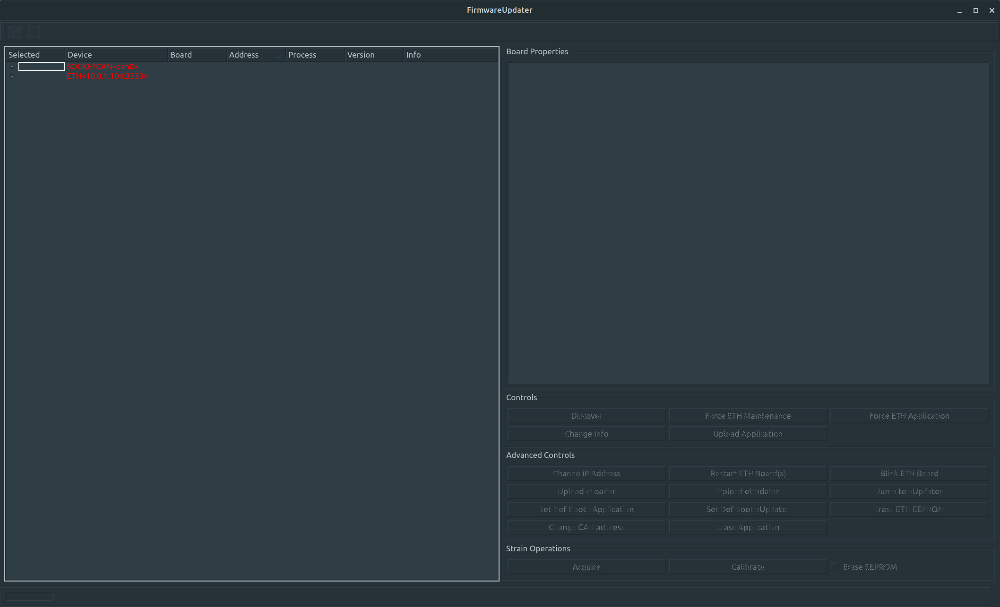

!!!info
    In order to have all possible drivers that `FirmwareUpdater` can use to communicate with the boards, make sure you have the [firmwareupdater.ini](https://github.com/robotology/icub-main/blob/master/src/tools/FirmwareUpdater/firmwareupdater.ini) file in the place where you launch the GUI 

## GUI interface
Here are described the main basic and advanced operations that the `FirmwareUpdater` GUI allows you to do.


### Operations on ETH boards
Here are the main operations on the ETH based boards.

#### Discover
This allow you to discover all `ETH` boards in the current `IP subnet` (titpically `10.0.1.X)

- In a terminal type `FirmwareUpdater`

- It opens the GUI, select the `ETH` driver in the devices list and click `Discover`
If any ETH boards are availabe they'll be listed prompting board info.
Detailed processesinfo of each board are available in the `Board Properties` box clicking on the board.

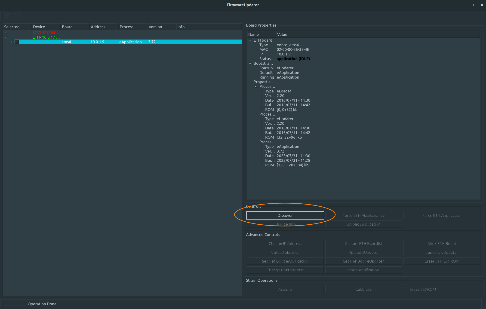

#### Force ETH Maintenance
This allow you tu force the board in maintenance mode and do operations such as upload FW, change IP, change bootstrap mode etc..

- In a terminal type `FirmwareUpdater -a` (or `FirmwareUpdater --admin`)
- Select the `ETH` driver in the devices list
- Click on `Discover`
- Select the board by checking its checkbox
- Click on `Force ETH Maintenance`

You should see the board running in the `eUpdater` process and related version.

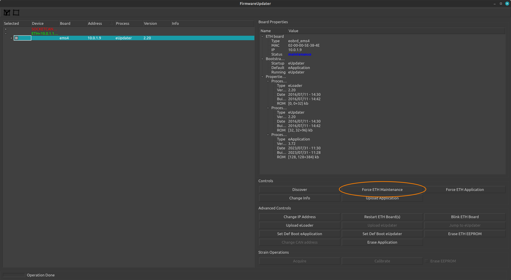

#### Force ETH Application
This allow you tu force the board in application mode.

- In a terminal type `FirmwareUpdater -a` (or `FirmwareUpdater --admin`)
- Select the `ETH` driver in the devices list
- Click on `Discover`
- Select the board by checking its checkbox
- Click on `Force ETH Application`

You should see the board running in the `eApplication` process and related version.

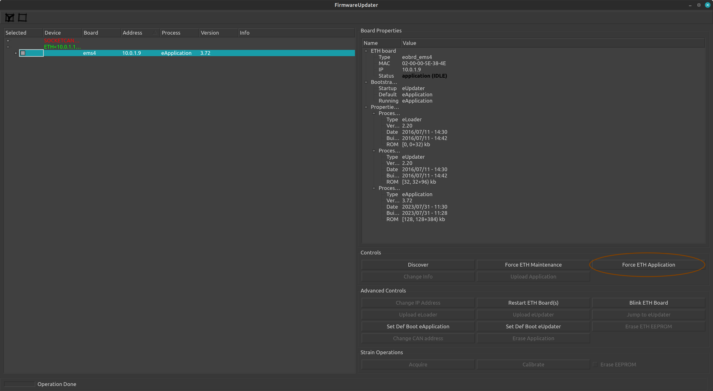

#### Set default boot process eUpdater
This allow you tu force the default boot process to eUpdater

- In a terminal type `FirmwareUpdater -a` (or `FirmwareUpdater --admin`)
- Select the `ETH` driver in the devices list
- Click on `Discover`
- Select the board by checking its checkbox
- Click on `Set Def Boot eUpdater`

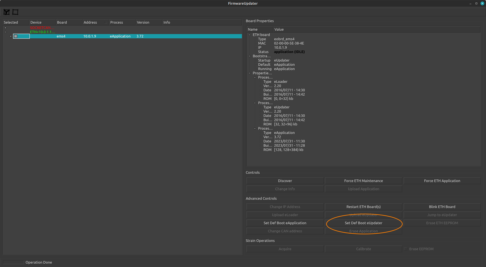

#### Set default boot process eApplication
This allow you tu force the default boot process to eApplication

- In a terminal type `FirmwareUpdater -a` (or `FirmwareUpdater --admin`)
- Select the `ETH` driver in the devices list
- Click on `Discover`
- Select the board by checking its checkbox
- Click on `Set Def Boot eApplication`

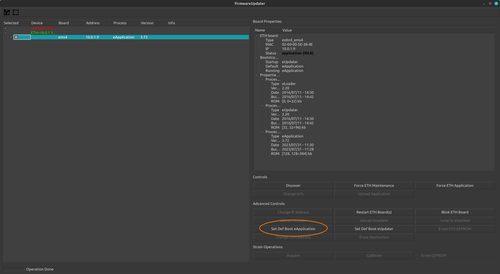

#### Change board IP address
This allow you to change the IP address of the board.

- In a terminal type `FirmwareUpdater -a` (or `FirmwareUpdater --admin`)
- Select the `ETH` driver in the devices list
- Click on `Discover`
- Select the board by checking its checkbox
- Click on `Force ETH Maintenance`
- Select the board by checking its checkbox
- Click on `Change IP Address` and insert the wanted new IP address in the dialog box.

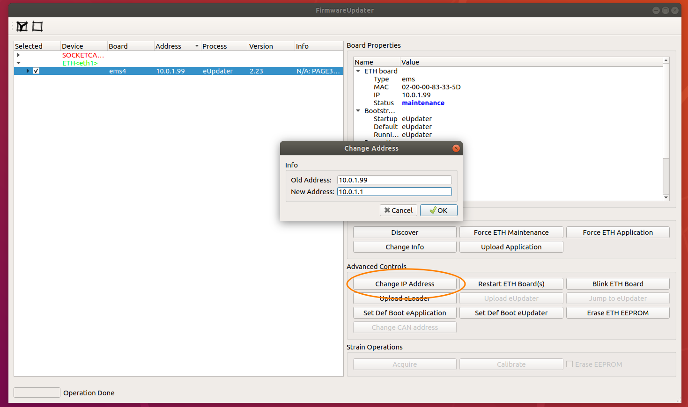

#### Upload Application
This allow you to upload a new application binary onto the board uP.

- In a terminal type `FirmwareUpdater -a` (or `FirmwareUpdater --admin`)
- Select the `ETH` driver in the devices list
- Click on `Discover`
- Select the board by checking its checkbox
- Click on `Force ETH Maintenance`
- Select the board by checking its checkbox
- Click on `Upload Application` and browse to the correct binary application file (official FW binaries are located at https://github.com/robotology/icub-firmware-build)
- Click on `Set Def Boot eApplication`

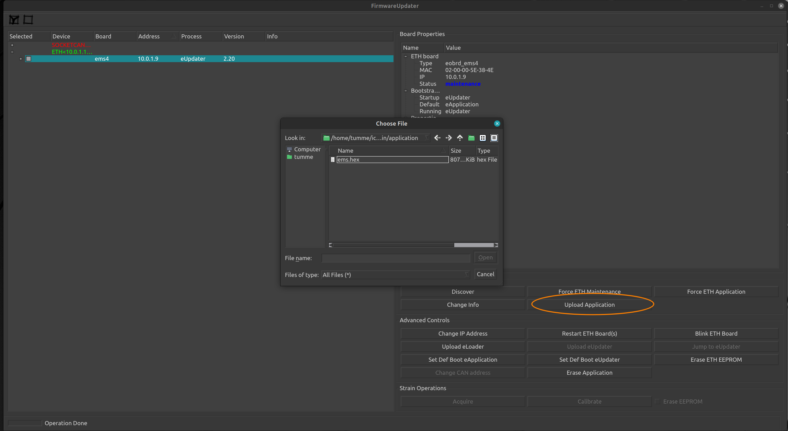

#### Update of the eLoader
This allow you to update the eLoader.

!!!warning
    This is a critical operation! Do this only if strictly necessary and pay attention to respect the steps described!
    If the procedure fails you'll have to flash the board using the debugger, this means that probably you'll have to unmount the board from the robot if not accessible.

- In a terminal type `FirmwareUpdater -a` (or `FirmwareUpdater --admin`)
- Select the `ETH` driver in the devices list
- Click on `Discover`
- Select the board by checking its checkbox 
  
!!!warning 
    select only a board at once!

- Click on `Force ETH Maintenance`
- Select the board by checking its checkbox
- Click on `Upload eLoader` and browse to the respective binary file (i.e. for a EMS select this [file](https://github.com/robotology/icub-firmware-build/blob/master/ETH/EMS/bin/environment/emsLoader.hex))
- Verify that the new eLoader has been flashed : 
    - Select the `ETH` driver in the devices list
    - Click on `Discover`
    - Check the version in the `Board Properties` panel 

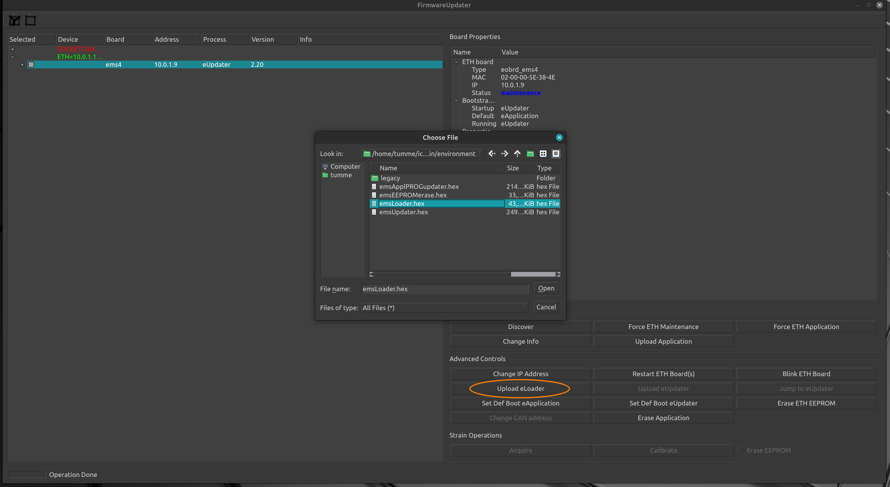

#### Update of the eUpdater
This allow you to update the eLoader.

- In a terminal type `FirmwareUpdater -a` (or `FirmwareUpdater --admin`)
- Select the `ETH` driver in the devices list
- Click on `Discover`
- Select the board by checking its checkbox

!!!warning 
    select only a board at once!


- Click on `Force ETH Maintenance`
- Select the board by checking its checkbox
- Click on `Upload Application` and browse to the binary file (i.e. for a EMS select this [file](https://github.com/robotology/icub-firmware-build/blob/master/ETH/EMS/bin/environment/emsApplPROGupdater.hex))
  
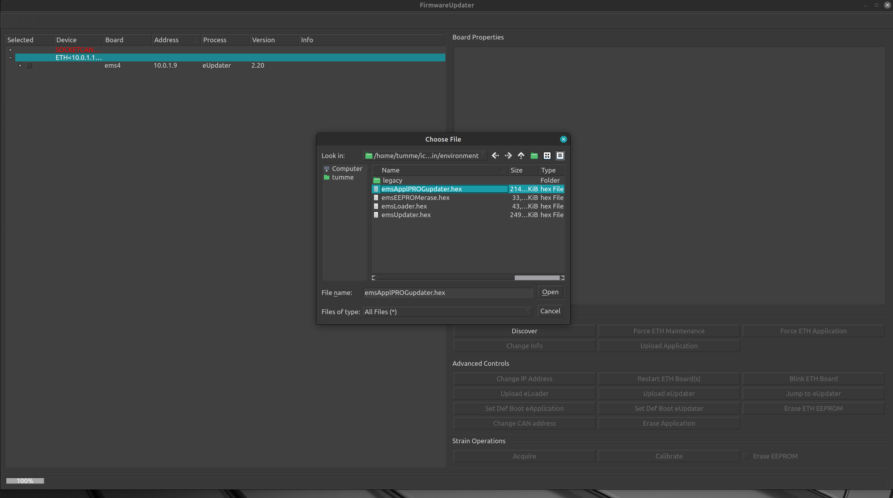

- Select the board by checking its checkbox
- Click on `Restart ETH Board(s)`
- wait at least 5 sec
- Select the `ETH` driver in the devices list
- Click on `Discover`
- The GUI will show that the executing process is `eApplPROGupdater`
- Select the board by checking its checkbox
- Click on `Upload eUpdater` and browse to the binary file (i.e. for a EMS select this [file](https://github.com/robotology/icub-firmware-build/blob/master/ETH/EMS/bin/environment/emsUpdater.hex))

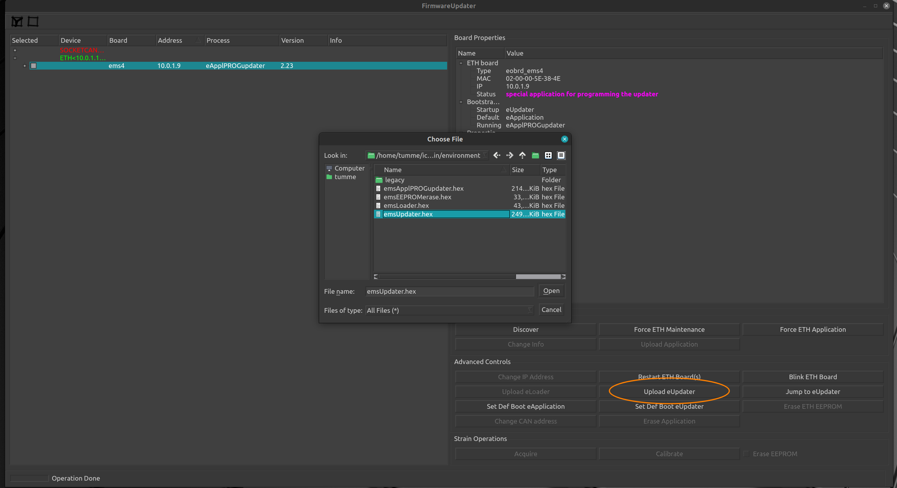

- Click on `Set Def Boot eUpdater`
- Click on `Restart ETH Board(s)`
- Select the `ETH` driver in the devices list
- Click on `Discover`
- The board has Startup, Default, and Running processed all set to value eUpdater (see the right panel called `Board Properties`,group `Bootstrap Processes`). 
- Select the board by checking its checkbox
- Click on `Upload Application` and browse to the correct binary application file (official FW binaries are located at https://github.com/robotology/icub-firmware-build)
- Click on `Set Def Boot eApplication`

### Operations on CAN boards
Here are the main operations on the CAN based boards connected to ETH boards.

#### Discover
This allow you to discover all `CAN` boards connected to a selected `ETH` board

- In a terminal type `FirmwareUpdater -a` (or `FirmwareUpdater --admin`)
- Select the `ETH` driver in the devices list
- Click on `Discover`
- Select the `ETH` board under which you want discover `CAN` boards by checking its checkbox
- Click on `Force ETH Maintenance`
- Select the `ETH` board under which you want discover `CAN` boards by checking its checkbox
- Click on `Discover`

You should see all `CAN` boards connected to the slected `ETH` board.

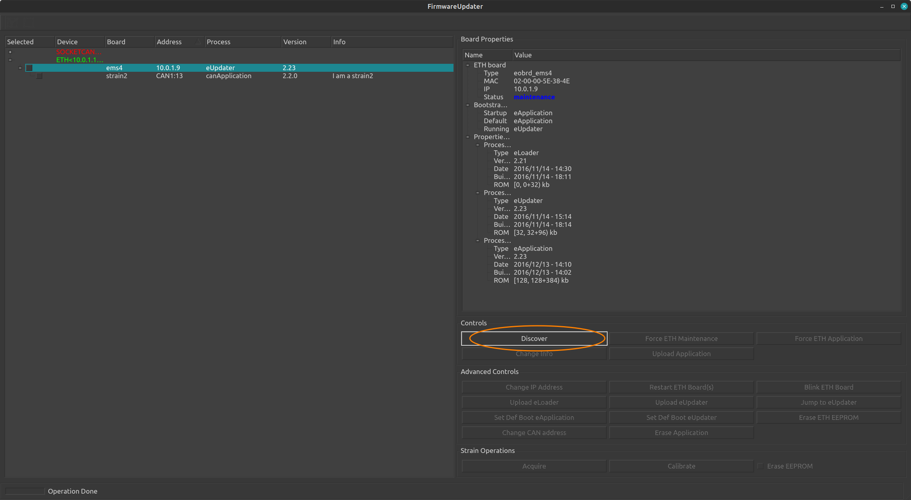

#### Change CAN ID
This allow you to change the ID to a `CAN` board connected to a selected `ETH` board

- In a terminal type `FirmwareUpdater -a` (or `FirmwareUpdater --admin`)
- Select the `ETH` driver in the devices list
- Click on `Discover`
- Select the `ETH` board under which you want discover `CAN` boards by checking its checkbox
- Click on `Force ETH Maintenance`
- Select the `ETH` board under which you want discover `CAN` boards by checking its checkbox
- Click on `Discover`
- Select the `CAM` board on which you want to change the ID
- Click on `Chanhe CAN address`
- Type the new ID (1-14) int the dialog box an hit OK
 
You should see the new board `CAN` ID set.

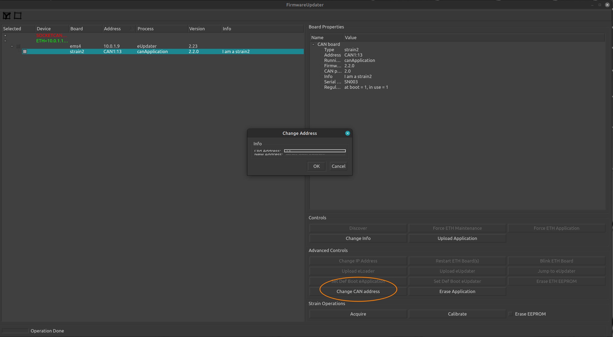

#### Upload CAN application
This allow you to upload a new application to a `CAN` board connected to a selected `ETH` board

- In a terminal type `FirmwareUpdater -a` (or `FirmwareUpdater --admin`)
- Select the `ETH` driver in the devices list
- Click on `Discover`
- Select the `ETH` board under which you want discover `CAN` boards by checking its checkbox
- Click on `Force ETH Maintenance`
- Select the `ETH` board under which you want discover `CAN` boards by checking its checkbox
- Click on `Discover`
- Select the `CAM` board on which you want to upload the new application
- Click on `Upload Application`
- Browse to the wanted binary file (i.e. for a `MTB4` board select this [file](https://github.com/robotology/icub-firmware-build/blob/master/CAN/mtb4/mtb4.hex))
 
You should see the new application version set.

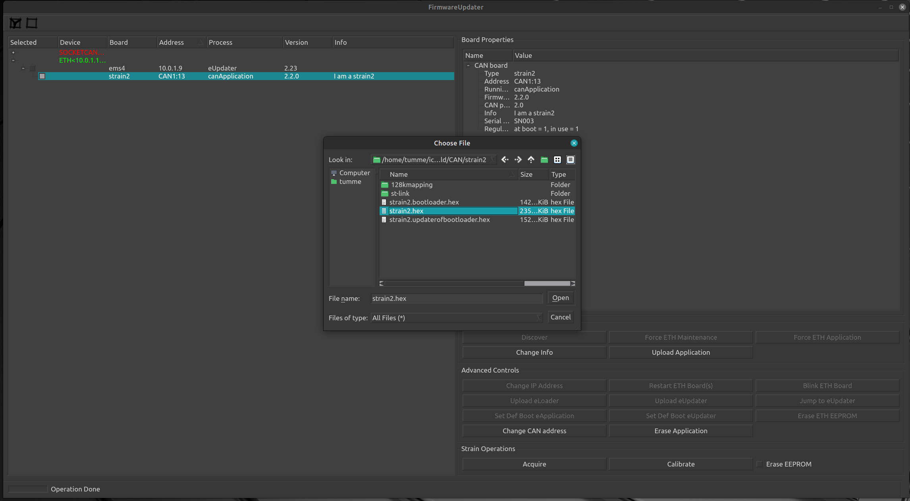

#### Discover hidden CAN boards
This section describes the procedure that you should use when you cannot discover a `CAN` board connected to a specific `ETH` board, even if the master `ETH` board is in `maintenance` mode and you checked that there are no hardware issues related to the cabling.
Here is the step-by-step procedure (also shown in the animated GIF at the end of the section):

- In a terminal, type `FirmwareUpdater -a` (or `FirmwareUpdater --admin`).
- Select the `ETH` driver in the devices list.
- Click on `Discover`.
- Select the `ETH` board under which you aim to discover the `CAN` board by ticking in its checkbox.
- If the `ETH` board `Status` is `application (IDLE)`, press the button `Force ETH Maintenance` and wait until the board `Status` has changed to `maintenance`.

!!! warning
    It is important that you run the following two points in a row quickly, just one after the other, without waiting more than `5 seconds` in between.

- Click on `Restart ETH Board(s)`. 
- Click on `Discover`.

!!! note
    These two steps are fundamental for sending the discovery signal while the `CAN` boards are booting. In the animated GIF below, the boards that are not discoverable (e.g., `strain2`) are in the status `canBootloader` and not `canApplication`. Forcing the restart of the `ETH` boards is crucial as it will power-cycle the `CAN` boards too. The discovery command should be then sent at that right moment, that is when the `CAN` board is in `canBootloader`.

- Update the `CAN` board as usual.


### Access Strain/Strain2/Strain2c calibration data
In order to acces the GUI containing the calibration data for F/T sensors do the following.

- In a terminal type `FirmwareUpdater -a` (or `FirmwareUpdater --admin`)
- Select the `ETH` driver in the devices list
- Click on `Discover`
- Select the `ETH` board under which the `Strain/Strain2/Strain2c` is attached by checking its checkbox
- Click on `Force ETH Maintenance`
- Select the `ETH` board under which you want discover `CAN` boards by checking its checkbox
- Click on `Discover`
- Select the `Strain/Strain2/Strain2c` board on which you want to visualize calibation data by checking its checkbox
- Click on `Calibrate`

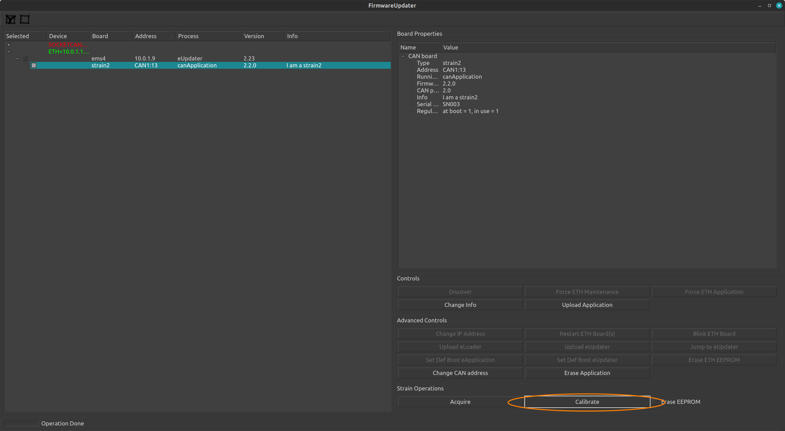
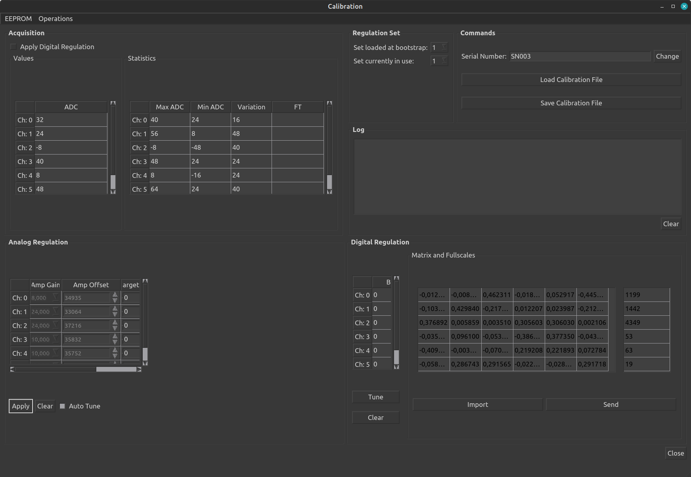

## Command Line Interface (CLI)
`FirmwareUpdater` provides a CLI with a set of options to do operations via the command line.

By running `FirmwareUpdater -h`, you'll be prompted with the list of all available options: 


### CLI options to change CAN ID and IP address
Here's below a summary of the CLI functionalities: 

- CAN board ID via `SOCKETCAN` device
- CAN board ID via `ETH` device  
- IP address of an ETH board

#### Change CAN ID via SOCKETCAN
In this example, we change the `CAN ID` on an `mtb` board connected via `SOCKETCAN` from 1 to 2.
The syntax of the command is the following : 
```bash
FirmwareUpdater -g -e SOCKETCAN -i 0 -c 0 -n 1 -k 2
```
where : 
- `-g -e SOCKETCAN -i 0 -c 0` is required to use a `SOCKETCAN` device (i.e. `ESD CAN/USB`) with `ID=0` and `canline=0`
- `-n 1 -k 2` changes old id 1 (-n 1) to 2 (-k 2)


#### Change CAN ID via ETH
In this example, we change the `CAN ID` on an `mtb` board connected via `ETH ` through an `ems4` board w/ `IP address = 10.0.1.1` from 1 to 2.
The syntax of the command is the following : 
```bash
FirmwareUpdater -g -e ETH -i eth1 -t 10.0.1.1 -c 1 -n 1 -k 2
```
where : 
- `-g -e ETH -i eth1 -t 10.0.1.1 -c 1` is required to use a `ETH` device (i.e. `ems4`) with `ip address = 10.0.1.1` and `canline=1`
- `-n 1 -k 2` changes old id 1 (-n 1) to 2 (-k 2)


#### Change IP address of an ETH board
In this example, we change the `IP address on an `ems4` board from `10.0.1.1` to 110.0.1.21.
The syntax of the command is the following : 
```bash
 FirmwareUpdater -g -e ETH -i eth1 -t 10.0.1.1 -2 10.0.1.2
```
where : 
- ` -g -e ETH -i eth1` is required to use a `ETH` device (i.e. `ems4`) 
- `-t 10.0.1.1 -2 10.0.1.2` changes old i`IP address` 10.0.1.1 to 10.0.1.2


## How to use ETH boards with a different IP subnet
We provide here the instructions to use ETH boards with a subnet different from the standard 10.0.1.X.

### Change IP to the board
Let's assume that the board we use has the `10.0.1.1` IP and that we aim to switch to `10.0.2.1`. You ought to follow these steps:

1. Run `FirmwareUpdater -a` 
2. Select the eth interface and then `Discover`
3. Select the board and then ` Force ETH Maintenance`
4. Select `Upload Application` and flash the new firmware (`icub-firmware-build` on branch `devel`)
4. Select `Change IP Address` and input `10.0.2.1`
 
### Configure the system
1. Change the IP address of your ETH interface to `10.0.2.104`
2. Change the `firmwareupdater.ini` file including this line
```xml
ETH "10.0.2.104:3333"
```
3. Reset the board and check if it is discoverable with the `FirmwareUpdater`
4. Change the following `xml` files : 

**/hardware/electronics/pc104.xml**
```xml
<?xml version="1.0" encoding="UTF-8" ?>
<!DOCTYPE params PUBLIC "-//YARP//DTD yarprobotinterface 3.0//EN" "http://www.yarp.it/DTD/yarprobotinterfaceV3.0.dtd">

<params xmlns:xi="http://www.w3.org/2001/XInclude" robot="single-ETH-2FOC-motor" build="1">

    <group name="PC104">
        <param name="PC104IpAddress">           10.0.2.104      </param>
        <param name="PC104IpPort">              12345           </param>
        <param name="PC104TXrate">              1               </param> 
        <param name="PC104RXrate">              5               </param>
    </group>

</params>
```

**hardware/electronics/knee-eb10-j0-eln.xml**
```xml
<?xml version="1.0" encoding="UTF-8" ?>
<!DOCTYPE params PUBLIC "-//YARP//DTD yarprobotinterface 3.0//EN" "http://www.yarp.it/DTD/yarprobotinterfaceV3.0.dtd">

<params xmlns:xi="http://www.w3.org/2001/XInclude" robot="single-ETH-2FOC-motor" build="1">

    <xi:include href="./pc104.xml" />
    
    <group name="ETH_BOARD">
   
        <group name="ETH_BOARD_PROPERTIES">
            <param name="IpAddress">                10.0.2.1              </param>
            <param name="IpPort">                   12345                   </param>
            <param name="Type">                     mc4plus                    </param>
            <param name="maxSizeRXpacket">          768                     </param>
            <param name="maxSizeROP">               384                     </param>
        </group>

        <group name="ETH_BOARD_SETTINGS">
            <param name="Name">                     "knee-eb10-j0"    </param> 
            <group name="RUNNINGMODE">
                <param name="period">                   1000                </param>
                <param name="maxTimeOfRXactivity">      400                 </param>
                <param name="maxTimeOfDOactivity">      300                 </param>   
                <param name="maxTimeOfTXactivity">      300                 </param>                
                <param name="TXrateOfRegularROPs">      5                   </param> 
            </group>              
        </group>                 
        
        <group name="ETH_BOARD_ACTIONS">
            <group name="MONITOR_ITS_PRESENCE">
                <param name="enabled">                  true                </param> 
                <param name="timeout">                  0.020               </param> 
                <param name="periodOfMissingReport">    60.0                </param> 
            </group>
        </group>

    </group>  
    
</params>
```

### Run yarprobotinterace
Finally, if all the operations above came off, you're then able to run `yarprobotinterface` using the new subnet `10.0.2.X`.

### Test
The software has been compiled also on the Linux machine running `yarprobotinterface` and it works.

See below an example of `yarprobotinterface` running with a gateway set to `10.0.2.104` connected to an `ems4` board with address `10.0.2.1` and an `F/T` sensor (`strain2`) connected to it.


### Strain2 dedicated CLI Options

The `CLI` options implemented for the strain2 (F/T sensors) are : 

-   `-z` or `--load-dat-file` : Loads the calibration .dat file into  STRAIN2 eeprom (pass the file.dat with -l or --file option)
```
example : FirmwareUpdater -g -e ETH -i eth1 -t 10.0.1.1 -c 1 -n 13 -z -l calibrationDataSN003.dat
```
-   `-w` or `--set-strain-sn <sn>` : Sets the passed serialNumber (i.e. SN001) on STRAIN2
```
example : FirmwareUpdater -g -e ETH -i eth1 -t 10.0.1.1 -c 1 -n 13 -w SN001
```
- `-j` or ``--set-strain-gains`` :  Sets on STRAIN2 default gains to (8,24,24,10,10,24) , adjust the offset and check if some channel saturates
```
example : FirmwareUpdater -g -e ETH -i eth1 -t 10.0.1.1 -c 1 -n 13 -j
```
- `-b` or `--get-canboard-version <saveFile>` :  Gets Bootloader or Application version (<saveFile> must be y or n to save or        not a file containing fw info)
```
example : FirmwareUpdater -g -e ETH -i eth1 -t 10.0.1.1 -c 1 -n 13 -b y
```
- `-u` or `--save-dat-file` : Saves the calibration .dat file from STRAIN2 EEPROM
```
example : FirmwareUpdater -g -e ETH -i eth1 -t 10.0.1.1 -c 1 -n 13 -u
```

!!!info
    **All the example are running on a setup with an `EMS4` board with `IP=10.0.1.1` and a `STRAIN2` board attached to it in the `CAN1` line with `ID=13`**


## Troubleshooting

### Loss of Application Firmware
The application update of several ETH boards launched simultaneously may sometimes give rise to errors that can lead to the loss of the application firmware.
This may happen either by using the GUI or via CLI by relying on scripted operations. 

Two error conditions are given:

1. The board stays in `eUpdater`.
2. The board "_disappears_", meaning it is no longer displayed in the `FirmwareUpdater` as it does not complete the bootloader part – which takes about 5÷10 seconds – and so it is not in either `eApplication` or `eUpdater`.

Here's below the steps to recover the board in both cases:

1. For Case 1:
    - Start `FirmwareUpdater -a`.
    - Reload the application firmware.
    - Select the board and click on [`Set Def Boot eApplication`](#set-default-boot-process-eupdater) and soon afterwards on [`Force ETH Application`](#force-eth-application).
2. For Case 2:
     - Start `FirmwareUpdater -a`.
     - Power-cycle the motors.
     - Run the `discover` of the ETH boards within 5÷10 seconds from the boot. You will see all the ETH boards in `eUpdater`, including those that disappeared.
     - Apply the steps above for Case 1 to reload the application firmware.
 
!!! note
    A similar procedure applies to `CAN` boards.

## Useful Resources
Below a list of useful links:

- Firmware [binaries docs](https://github.com/robotology/icub-firmware-build/tree/master/docs)
- Firmware [binaries](https://github.com/robotology/icub-firmware-build)
- Low-level [boards programming](https://icub-tech-iit.github.io/procedures/tp-boards-programming/) (using degugger/programmer)


