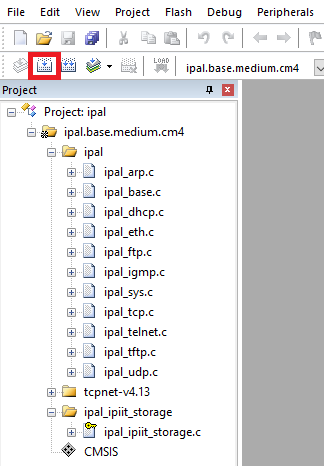

# Configuring Firmware Toolchain

This page will describe the steps necessary to install the MDK-ARM Keil software for 
compiling the firmware, and the necessary steps to configure your firmware repository

## Installing Keil

Here we will guide you through the installation of Keil. This installation requires
Marco Accame to configure your license, so contact him in advance before proceeding
with the installation!

### Download Keil

You can download Keil at the following address: 
[Keil MDK Community](https://www2.keil.com/mdk5/install). 
This will require a registration, after which you will be provided with the download
link:

### Installing Keil

Run the installer that you downloaded on the previous step. 

### Configuring your license

To be able to use MDK-Community, you need a valid license. Go to https://keil.arm.com/mdk-community to receive a product serial number and learn how to convert it into a license.

!!! note

    Use in commercial applications is not permitted

## Configuring iCub-firmware

Now that Keil is installed and running, you need to setup the firmware
and its shared repositories, which can be cloned from the follow link:

- [https://github.com/robotology/icub-firmware](https://github.com/robotology/icub-firmware)
- [https://github.com/robotology/icub-firmware-shared](https://github.com/robotology/icub-firmware-shared)

You can clone these repositories anywhere in your computer as long as they 
are both in the same directory. Once you clone the two repositories, you 
will need an extra library that is available on IITs intranet in the following
path:

~~~
\\storage05.icub.iit.local\repository\software\ipal-extra
~~~

Unzip this new library file into the following path (replace `${YOUR_DIRECTORY}`
with the path where you cloned the two repositories): 

~~~
${YOUR_DIRECTORY}\icub-firmware\emBODY\eBcode\arch-arm\libs\highlevel\abslayer\ipal\
~~~

To properly configure this library, open Keil, go to the `Project->Open Project` 
menu, navigate to the path above and select the `ipal.uvprojx` project file.
Now you should be able to visualize all the files from this project on the left 
workspace of Keil:

The final step to configure the library is to press the `Build` button highlighted
by the red box on the image. 

## Testing your toolchain

Congratulations! You just built your first project using Keil!

In order to verify that everything is configured properly, you can try building the
project for the mc4 board located in the following path:

~~~
${YOUR_DIRECTORY}\icub-firmware\emBODY\eBcode\arch-arm\board\mc4plus\appl\v2\proj\
~~~

Select the `mc4plus.diagnostic2ready.uvprojx` project, and press the `Build` button
just like for the `ipal` library. You should see on the output workspace (bottom
of Keil window) a similar output (with 0 errors):

