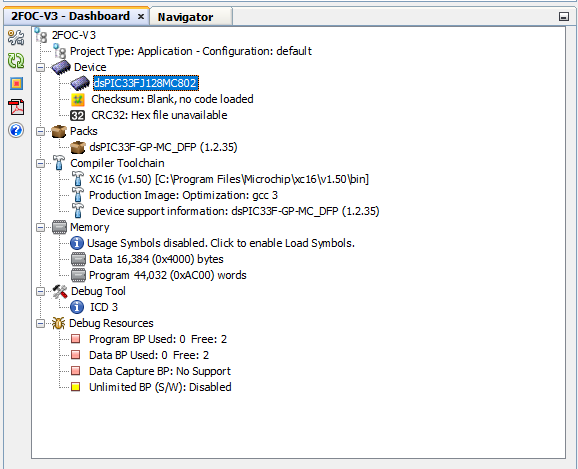
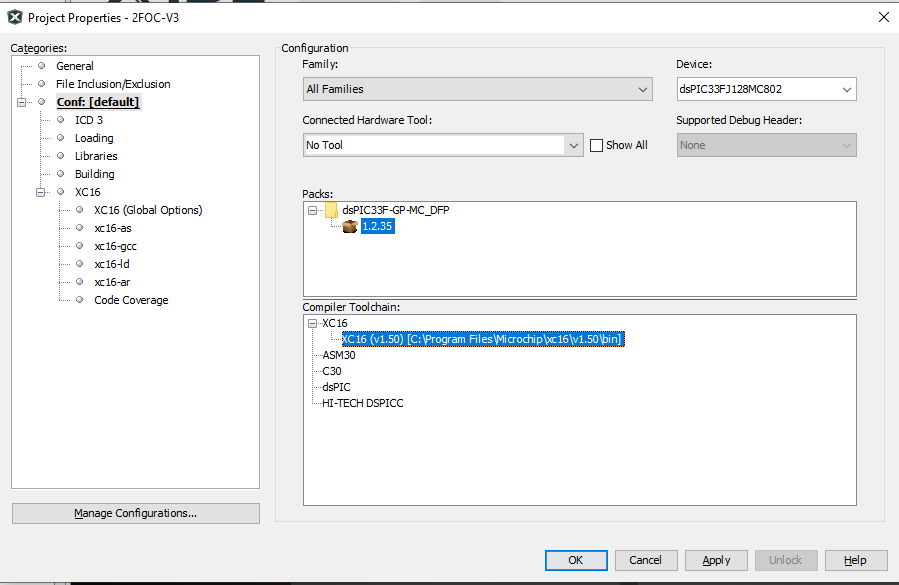
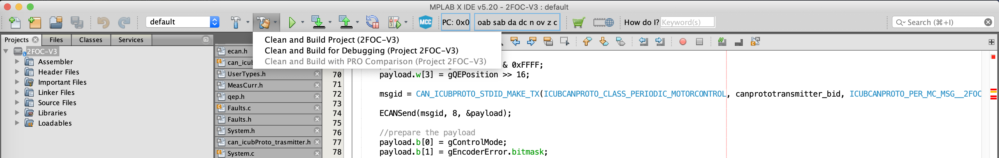

# Installing and configuring MPLAB

Here we will guide you through the installation and configuration steps necessary
to have MPLAB running on your machine

**Note:** This tutorial assumes you have already downloaded the repositories for
icub firmware, if you have not, please clone the following repositories into the 
under the same directory:
- [https://github.com/robotology/icub-firmware](https://github.com/robotology/icub-firmware)
- [https://github.com/robotology/icub-firmware-shared](https://github.com/robotology/icub-firmware-shared)


## Installing the MPLAB X IDE

- Goto https://www.microchip.com/mplab/mplab-x-ide and browse down to "Downloads" 
section and download the latest version of MPLAB® X IDE driver for Windows 
(currently v5.40).
- follow the instruction and default options

## Installing the MPLAB XC Compilers

All the compilers and related dependencies can be downloaded from 
https://www.microchip.com/mplab/compilers, in the last section, in the tab 
"Compiler Downloads".


- After the install of the MPLAB X IDE is complete, follow the suggestion to download
 the "MPLAB XC compiler 16 bits" for dsPICs, and download the "MPLAB XC16 Compiler 
 vX.XX" compiler for Windows, in "Compiler Downloads" tab (as shown above), 
 "Compilers" subsection.
- Launch the compiler installation: select the "free" option, and select the default 
options in the steps that follow.
- Download Install the "MPLAB XC16 Compiler Part-Support Patch vX.XX" from the 
subsection "Latest Part Support Patch Files". This is a priori for supporting new 
parts, but actually the dsPIC used in our setup, version **33FJ128MC802**, appears 
in the "supported parts in the update" secttion of the 
[release notes of the patch](https://ww1.microchip.com/downloads/en/DeviceDoc/XC16-v1.50-part-support-release-notes.html).
- Download Install the "Current Peripheral Libraries" -> "16-bit dsPIC33, PIC24E, 
PIC24H MCUs: Legacy Peripheral Libraries" from the subsection "Peripheral Libraries 
(PLIBS)" (latest version of "PIC24/dsPIC Peripheral Libraries v2.00 - Windows" 
[here](https://www.microchip.com/mymicrochip/filehandler.aspx?ddocname=en574967)).

### Note on the "MPLAB XC16 Compiler vX.XX" compiler

The compiler "MPLAB XC16 Compiler v1.50" alone is missing some dependencies like the include `<pwm12.h>`. If you build the project without the mentioned additonnal patches, you'll get the error:
```
CLEAN SUCCESSFUL (total time: 8ms)
make -f nbproject/Makefile-default.mk SUBPROJECTS= .build-conf
make[1]: Entering directory 'C:/Users/icub/git/icub-firmware/emBODY/eBcode/arch-dspic/board/2foc/appl/2FOC-V3/2FOC-V3.X'
make  -f nbproject/Makefile-default.mk dist/default/production/2FOC-V3.X.production.hex
make[2]: Entering directory 'C:/Users/icub/git/icub-firmware/emBODY/eBcode/arch-dspic/board/2foc/appl/2FOC-V3/2FOC-V3.X'
"C:\Program Files\Microchip\xc16\v1.50\bin\xc16-gcc.exe"   ../src/2FOC.c  -o build/default/production/_ext/1360937237/2FOC.o  -c -mcpu=33FJ128MC802  -MMD -MF "build/default/production/_ext/1360937237/2FOC.o.d"        -omf=elf -DXPRJ_default=default  -legacy-libc    -ffunction-sections -mlarge-data -O3 -I"../include" -msmart-io=1 -Wall -msfr-warn=off    -mdfp="C:/Program Files (x86)/Microchip/MPLABX/v5.40/packs/Microchip/dsPIC33F-GP-MC_DFP/1.2.35/xc16"
"C:\Program Files\Microchip\xc16\v1.50\bin\xc16-gcc.exe"   ../src/DHES.c  -o build/default/production/_ext/1360937237/DHES.o  -c -mcpu=33FJ128MC802  -MMD -MF "build/default/production/_ext/1360937237/DHES.o.d"        -omf=elf -DXPRJ_default=default  -legacy-libc    -ffunction-sections -mlarge-data -O3 -I"../include" -msmart-io=1 -Wall -msfr-warn=off    -mdfp="C:/Program Files (x86)/Microchip/MPLABX/v5.40/packs/Microchip/dsPIC33F-GP-MC_DFP/1.2.35/xc16"
"C:\Program Files\Microchip\xc16\v1.50\bin\xc16-gcc.exe"   ../asm/MeasCurr.s  -o build/default/production/_ext/1360919980/MeasCurr.o  -c -mcpu=33FJ128MC802  -omf=elf -DXPRJ_default=default  -legacy-libc  -I"../asm" -Wa,-MD,"build/default/production/_ext/1360919980/MeasCurr.o.d",--defsym=__MPLAB_BUILD=1,--no-relax  -mdfp="C:/Program Files (x86)/Microchip/MPLABX/v5.40/packs/Microchip/dsPIC33F-GP-MC_DFP/1.2.35/xc16"
"C:\Program Files\Microchip\xc16\v1.50\bin\xc16-gcc.exe"   ../src/Faults.c  -o build/default/production/_ext/1360937237/Faults.o  -c -mcpu=33FJ128MC802  -MMD -MF "build/default/production/_ext/1360937237/Faults.o.d"        -omf=elf -DXPRJ_default=default  -legacy-libc    -ffunction-sections -mlarge-data -O3 -I"../include" -msmart-io=1 -Wall -msfr-warn=off    -mdfp="C:/Program Files (x86)/Microchip/MPLABX/v5.40/packs/Microchip/dsPIC33F-GP-MC_DFP/1.2.35/xc16"
"C:\Program Files\Microchip\xc16\v1.50\bin\xc16-gcc.exe"   ../src/PWM.c  -o build/default/production/_ext/1360937237/PWM.o  -c -mcpu=33FJ128MC802  -MMD -MF "build/default/production/_ext/1360937237/PWM.o.d"        -omf=elf -DXPRJ_default=default  -legacy-libc    -ffunction-sections -mlarge-data -O3 -I"../include" -msmart-io=1 -Wall -msfr-warn=off    -mdfp="C:/Program Files (x86)/Microchip/MPLABX/v5.40/packs/Microchip/dsPIC33F-GP-MC_DFP/1.2.35/xc16"
"C:\Program Files\Microchip\xc16\v1.50\bin\xc16-gcc.exe"   ../src/ADC.c  -o build/default/production/_ext/1360937237/ADC.o  -c -mcpu=33FJ128MC802  -MMD -MF "build/default/production/_ext/1360937237/ADC.o.d"        -omf=elf -DXPRJ_default=default  -legacy-libc    -ffunction-sections -mlarge-data -O3 -I"../include" -msmart-io=1 -Wall -msfr-warn=off    -mdfp="C:/Program Files (x86)/Microchip/MPLABX/v5.40/packs/Microchip/dsPIC33F-GP-MC_DFP/1.2.35/xc16"
"C:\Program Files\Microchip\xc16\v1.50\bin\xc16-gcc.exe"   ../src/System.c  -o build/default/production/_ext/1360937237/System.o  -c -mcpu=33FJ128MC802  -MMD -MF "build/default/production/_ext/1360937237/System.o.d"        -omf=elf -DXPRJ_default=default  -legacy-libc    -ffunction-sections -mlarge-data -O3 -I"../include" -msmart-io=1 -Wall -msfr-warn=off    -mdfp="C:/Program Files (x86)/Microchip/MPLABX/v5.40/packs/Microchip/dsPIC33F-GP-MC_DFP/1.2.35/xc16"
"C:\Program Files\Microchip\xc16\v1.50\bin\xc16-gcc.exe"   ../src/DCLink.c  -o build/default/production/_ext/1360937237/DCLink.o  -c -mcpu=33FJ128MC802  -MMD -MF "build/default/production/_ext/1360937237/DCLink.o.d"        -omf=elf -DXPRJ_default=default  -legacy-libc    -ffunction-sections -mlarge-data -O3 -I"../include" -msmart-io=1 -Wall -msfr-warn=off    -mdfp="C:/Program Files (x86)/Microchip/MPLABX/v5.40/packs/Microchip/dsPIC33F-GP-MC_DFP/1.2.35/xc16"
"C:\Program Files\Microchip\xc16\v1.50\bin\xc16-gcc.exe"   ../src/can_icubProto.c  -o build/default/production/_ext/1360937237/can_icubProto.o  -c -mcpu=33FJ128MC802  -MMD -MF "build/default/production/_ext/1360937237/can_icubProto.o.d"        -omf=elf -DXPRJ_default=default  -legacy-libc    -ffunction-sections -mlarge-data -O3 -I"../include" -msmart-io=1 -Wall -msfr-warn=off    -mdfp="C:/Program Files (x86)/Microchip/MPLABX/v5.40/packs/Microchip/dsPIC33F-GP-MC_DFP/1.2.35/xc16"
Options have been disabled due to restricted license
Visit https://www.microchip.com/compilers to purchase a new key.
In file included from ../src/Faults.c:5:0:
../include/PWM.h:10:19: fatal error: pwm12.h: No such file or directory
compilation terminated.
```
This is a known issue with the latest drivers released after version **v1.24**. The fast workaround in the previous setup was to revert the driver back to version 1.24. That version should be available in https://www.microchip.com/development-tools/pic-and-dspic-downloads-archive, but does not clearly appear in section "MPLAB C Compiler for PIC24 and dsPIC DSCs" and seems to be available only as "Source Archives". The real cause of the issue is actually explained in the [v1.25 release notes](http://ww1.microchip.com/downloads/en/DeviceDoc/XC16-v-1.25%20release%20notes.html):
```
The peripheral libraries are no longer shipped with the compiler package. These may be downloaded separately from the MPLAB XC download page.
```
So, the proper fix is to download the additional Legacy Peripheral Libraries as explained int the previous section.

## Running the MPLAB X IDE [WIP]

- Run app MPLAB X IDE v5.40.
- Open the project [2FOC-V3.X](https://github.com/robotology/icub-firmware/tree/master/emBODY/eBcode/arch-dspic/board/2foc/appl/2FOC-V3/2FOC-V3.X) (shortcut CTRL+SHIFT+O on windows).
- you should see in the lower left pane:



The 2FOC device is the **dsPIC33FJ128MC802**.
- Then click on Packs - dsPIC33F-GP-...   You should see a popup window with the project properties



just click "OK".

- Clean and Build the project as shown below:


