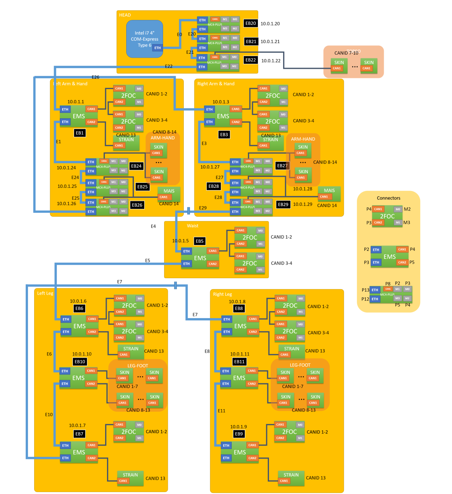

# Firmware Documentation
Here you can find informations about firmware in the various versions of the robot.

## CAN BASED ROBOTS
The following refers to "old" robots, with `CAN` based technology.

### iCub versions 1.10.0 or older
Refer to the following.

#### Firmware tools
Firmware upgrade is performed using the [CanLoader](https://wiki.icub.org/wiki/CanLoader) application.

It is also possible to use the new FirmwareUpdater application. With the FirmwareUpdater application it is possible to perform GUI-based FW update on both CAN- and ETH-based robots. The automatic FW update using bash scripts will soon be available.

For quick instructions read: 

-  https://github.com/robotology/icub-firmware-build/blob/master/docs/FirmwareUpdater.readme.quick.txt 

or for full details read:

-  https://github.com/robotology/icub-firmware-build/blob/master/docs/FirmwareUpdater.readme.fulldetails.txt 

#### Standard firmware update (DSP)
The firmware upgrade of the whole robot is performed using a script based on a command line version of the [CanLoader](https://wiki.icub.org/wiki/CanLoader) module. Before you try to use this script please check that this module is compiled on the pc104. You should also make sure that the hardware modules it needs (controlboard, canmotioncontrol, ecan/pcan/cfw2can) are compiled and liked correctly (this is usually the case on the robot pc104).

Please notice that the firmware upgrade is delicate procedure which changes one of the core parts of the iCub robot software (and therefore requires a corresponding update of the yarp and iCub modules). If you decide to perform a firmware upgrade, be aware that this might change the robot motor behaviour quite a lot. Nevertheless, a firmware upgrade is always recommended because it usually corresponds to improvements in the control board performances. Finally, remember to perform the firmware update with your robot in a 'clean' state (i.e. control boards have been just turned on, and iCubinterface has not run yet).

Here are the steps to perform the firmware update:

- Connect to the PC104.
- Go to the $ICUB_ROOT directory and update it (svn update or git pull, depending on your installation)
- Go to the $ICUB_DIR directoy and recompile the icub-main repository
- If the icub-firmware-build directory does not exists, create it with: git clone https://github.com/robotology/icub-firmware-build
- If it already exists, update it with git pull.
- Launch the firmware update script (icub-firmware-build/updateRobot.sh):

The script will automatically retrieve the robot configuration from the firmwareUpdate.txt file which is located in the robot configuration folder.

When the updateRobot.sh script terminates, a brief report about the firmware update operation is shown on the screen. If all the listed boards have the "ALL OK" tag, then the update was successful. If one or more boards show errors, you can use the [CanLoader](https://wiki.icub.org/wiki/CanLoader) application in order to check what went wrong, and retry to download the firmware on that particular boards. The CanLoader GUI allows you to check if all the boards have the updated firmware: simply compare the Build number with the most recent build number reported by the ChangeLog file (icub-firmware/motorControllerDsp56f807/2BLL/ChangeLog for the type=RM BLL(DSP) boards and icub-firmware/motorControllerDsp56f807/4DC/ChangeLog for the type=RM 4DC(DSP) boards).

For additional please write an email to: robotcub-hackers->lists.sourceforge.net

Automatic update of the full robot with the FirmwareUpdater program will soon be possible. For some preliminary details see section (2) of document https://github.com/robotology/icub-firmware-build/blob/master/docs/FirmwareUpdater.readme.fulldetails.txt.

#### Advanced firmware update (DSP)
Alternatively to the complete firmware upgrade procedure described above, you can also create your own custom script which update just a part of the robot, for example:

`icub@pc104:ICUB_ROOT/firmware/build$ ./updateRobot.sh updateLegs.txt`

The .txt file simply contains a list of board addresses and associated firmware files with the following structure:

`[canModule] [canDeviceNum] [boardId] [firmware]`

where:

- canModule can be either pcan (if you are using the PLX custom board) or ecan (if you are using the commercial usb to can interface produced by [ESD](http://www.esd-electronics.com/)) or cfw2can (if you are using the custom CFW2 board).
- canDeviceNum is the CAN line identifier (i.e: 0 for the head, 1 for the left arm, 2 for the right arm, etc..)
- boardID is the board address (0...14) on the selected CAN line.
- firmware is the firmware binary file (*.s for motorola-based boards, *.hex for DSPIC-based board)

#### Firmware update (Force/Torque Sensors)
In this section is described the procedure to update the firmware of the [F/T sensors](https://wiki.icub.org/wiki/FT_sensor). iCub (version >=1.1) is equipped with four [F/T sensors](https://wiki.icub.org/wiki/FT_sensor), one for each limb, connected to the CanBus. For a complete reference of the used CAN bus addresses please refer to: (list of the CAN bus addresses)[https://wiki.icub.org/wiki/Can_addresses_and_associated_firmware]

##### Procedure for updating the firmware of the F/T Sensors
The update of the [F/T sensors](https://wiki.icub.org/wiki/FT_sensor) firmware is performed using the [CanLoader](https://wiki.icub.org/wiki/CanLoader) module. The procedure is identical to the standard procedure used to update the firmware of a single DSP board:

- open the [CanLoader](https://wiki.icub.org/wiki/CanLoader) GUI.
- select the can bus number and the can bus device driver from the menus and click 'Connect'.
- select the F/T sensor (click on the checkbox on the left).
- select the firmware file from the file selector on the right (default location: iCub\src\firmware\build\strain.hex).
- click 'Start Download'.

Note: A command-line procedure is also provided. To update the firmware, run the following command:

canLoader20 --canDeviceType <t> --canDeviceNum <x> --boardId <y> --firmware <f>

where:

parameter <t> is the name of the CAN bus driver. It can be ecan or pcan or cfw2can
parameter <x> is the number of the CAN bus (0-9)
parameter <y> is the CAN address of the F/T sensor (0-15)
parameter <f> is the firmware binary file (e.g. strain.hex)

##### Reset of the F/T Sensors
Note: This procedure completely erases both the flash and the eeprom of the F/T Sensor. You will have to download again the calibration data in the sensor after performing the reset of the F/T sensor. It's most likely that you DO NOT have to follow this procedure, unless some serious problem occurred. Even if you downloaded a wrong firmware file in the F/T sensors, only the standard procedure described above is needed to update it.

The procedure to reset a F/T Sensor is the following:

- open the [CanLoader](https://wiki.icub.org/wiki/CanLoader) GUI.
- select the can bus number and the can bus device driver from the menus and click 'Connect'.
- select the F/T sensor (click on the checkbox on the left).
- check the eeprom box on the right.
- select the firmware file from the file selector on the right (default location: iCub\src\firmware\build\strain.hex).
- click 'Start Download'.

After the completion of the firmware download:

- reboot the F/T sensor (remove the power supply, restart the sensor, reconnect the Can Loader GUI, waiting for the boot time (10 seconds).
- after the reset, the CAN address of the sensor will be changed to 15. Change it by clicking on the number in the Can Loader GUI. The new address is automatically saved in the sensor eeprom.
- download a the correspoding sensor calibration data.

Note: Remember: do not erase the F/T sensor eeprom, unless you are really sure what you are going to do or you were instructed to do so.

##### Import of the calibration data
This procedure is used to download the calibration data in the F/T sensors eeprom. Since iCub mounts calibrated F/T sensors, you don't need to follow this procedure, unless you intentionally erased the sensor eeprom. (even if you flash a new firmware update, you do not need to redownload the calibration data because they are kept in eeprom memory)

The procedure to import the calibration data is identical to the standard firmware update, just select a calibration file (calibrationDataSN*.dat) instead of a firmware file (strain.hex).

- open the [CanLoader](https://wiki.icub.org/wiki/CanLoader) GUI.
- select the can bus number and the can bus device driver from the menus and click 'Connect'.
- select the F/T sensor (click on the checkbox on the left).
- select the calibration file from the file selector on the right (default location: iCub\app\<robot name>\conf\calibration\ftSensor\<robot part>\calibrationDataSN*.dat).
- click 'Start Download'. The software automatically distinguish a calibration data file from a firmware binary file. The calibration data are automatically saved in the eeprom.

Note: A command-line procedure is also provided. To update the firmware, run the following command:

`canLoader20 --canDeviceType <t> --canDeviceNum <x> --boardId <y> --calibration <f>`

where:

parameter <t> is the name of the CAN bus driver. It can be ecan or pcan or cfw2can
parameter <x> is the number of the CAN bus (0-9)
parameter <y> is the CAN address of the F/T sensor (0-15)
parameter <f> is the calibration data file (e.g calibrationDataSN020.dat)

##### Operations on STRAIN with the FirmwareUpdater
The operations on the STRAIN boards described in the above sections can be performed also using the new FirmwareUpdater program.

With reference to Figure 2 inside document https://github.com/robotology/icub-firmware-build/blob/master/docs/FirmwareUpdater.readme.fulldetails.txt you can do as follows.

- Upload a new FW using the button `Upload Application`. See also section (6) of https://github.com/robotology/icub-firmware-build/blob/master/docs/FirmwareUpdater.readme.quick.txt.
- Tick the button `Erase STRAIN EEPROM` and then upload the new FW if you also want to reset the F/T Sensors.
- Launch the STRAIN Calibration GUI with the button `Calibrate STRAIN` if you want to import a calibration data file.

##### Firmware versions
A complete description of the different firmware versions used by the DSP boards which control the iCub robot can be found (here)[https://wiki.icub.org/wiki/Can_addresses_and_associated_firmware].

---

### iCub versions 1.12.0 or newer
Since iCub version 1.12.0 (of June 2018), the only instrument to perform FW management is the FirmwareUpdater application.

With the FirmwareUpdater application it is possible to perform GUI-based FW operations on both CAN- and ETH-based robots.

The FirmwareUpdater is also used by python and bash scripts to perform automatic FW update of the whole robot or of selected parts or board.

#### Discovery drivers
The application FirmwareUpdater is able to scan below the drivers of a particular robot.

The drivers are specified inside the file firmwareupdater.ini which is retrieved from repository https://github.com/robotology/robots-configuration if its installation is done correctly.

The user selects the relevant drive and presses button Discover. The window becomes populated with all the boards beneath and reports:

- board type,
- address,
- running application,
- application version,
- user-defined info,
- build dates,
- etc.

#### Perform simple operations
If the user selects one board (and if the board is of ETH type, sends it in maintenance mode) he/she can:

- change the user-defined info, or
- upload a new firmware

The firmware files are stored inside the ETH and CAN folders of repository https://github.com/robotology/icub-firmware-build.

#### Automatic update of the robot
The user can also decide to perform the automatic update of the complete robot (or of some of its parts). Inside folder scripts of repository https://github.com/robotology/icub-firmware-build there are some examples.

The user can:

- retrieve info with scripts/FirmwareUpdater.script.info.all.sh,
- query the robot with scripts/FirmwareUpdater.script.verify.all.sh. This command also gives an estimate of the time required to perform the firmware update of the boards with old versions.
- update the firmware of all boards with old versions with scripts/FirmwareUpdater.script.update.all.sh

#### The topology of the robot
The robot network is described by the file network.{$YARP_ROBOT_NAME}.xml available for most robots in the repository https://github.com/robotology/robots-configuration. In case you cannot find this file, please ask for one in: https://github.com/robotology/icub-support.

In its inside there is thelist of all boards with their name, drive, address and link relations.

You can view some of this information with:

- scripts/FirmwareUpdater.script.info.all.sh: it prints the list of all boards with all details
- scripts/FirmwareUpdater.script.topology.all.sh: it prints the list of all ETH boards in link order.

#### Advanced operations
The user can also launch FirmwareUpdater in administration mode to perform advance (but also potentially destructive) operations:

- change IP or CAN address,
- change bootstrap mode of boards,
- upload special system processes which helps maintenance and execution of the application,
- management of strain and strain2 boards.
  
For how to operate in this mode please refer to the docs folder of https://github.com/robotology/icub-firmware-build

#### In more details
Detailed instructions can be found in repository https://github.com/robotology/icub-firmware-build in the docs folder.

### ETH BASED ROBOT
The ETH robots use a switched Ethernet network formed by ETH boards (EMS, MC4PLUS, MC2PLUS) connected in daisy chain by means of an internal two-ports switch. These ETH boards also have up to two CAN buses to which some CAN boards can be connected (2FOC, MC4, MTB, STRAIN).

#### Services offered by the ETH boards
The ETH boards offer services of motion control, analog sensing, skin etc. in a way which differs from robot to robot. The information about which board offers a given service is described by the xml files in the relevant folders of icub-main\app\robots\.

At the date of May 2016, the robots in icub-main may have up to 11 ETH boards of type EMS which offer the services specified in the following table.

#### VERSION 2.5 - Wiring < 3.2
The ETH boards also have up to two CAN buses to which some CAN boards can be connected (2FOC, MC4, MTB, STRAIN).

| IP address | Board Name |  Atatched CAN Boards | Offered Services  |
|:---:|:---:|:---|:---|
| 10.0.1.1 | EB1 (EMS) | 2FOC->CAN1:1 2FOC->CAN1:2 2FOC->CAN1:3 2FOC->CAN1:4 STRAIN->CAN2:13 | MC: left arm joints 0 -> 3   STRAIN |
| 10.0.1.2 | EB2 (EMS) | MC4->CAN1:3 MC4->CAN1:5 MC4->CAN1:7 MAIS->CAN1:14 MTB->CAN2:8 MTB->CAN2:9 MTB->CAN2:10 MTB->CAN2:11 MTB->CAN2:12 MTB->CAN2:13 MTB->CAN2:14  | MC: left arm joints 4 -> 11   MAIS left hand   SKIN left arm   INERTIALS: left arm |
| 10.0.1.3 | EB3 (EMS) | 2FOC->CAN1:1 2FOC->CAN1:2 2FOC->CAN1:3 2FOC->CAN1:4 STRAIN->CAN2:13 | MC: right arm joints 0 -> 3 STRAIN | 
| 10.0.1.4 | EB4 (EMS) | MC4->CAN1:3 MC4->CAN1:5 MC4->CAN1:7 MAIS->CAN1:14 MTB->CAN2:8 MTB->CAN2:9 MTB->CAN2:10 MTB->CAN2:11 MTB->CAN2:12 MTB->CAN2:13 MTB->CAN2:14  | MC: right arm joints 4 -> 11   MAIS right hand   SKIN right arm   INERTIALS: right arm |
| 10.0.1.5 | EB5 (EMS) | 2FOC->CAN1:1 2FOC->CAN1:3 2FOC->CAN1:4  | MC: torso joints 0 -> 2 |
| 10.0.1.6 | EB6 (EMS) | 2FOC->CAN1:1 2FOC->CAN1:2 2FOC->CAN1:3 2FOC->CAN1:4 STRAIN->CAN2:13 | MC: left leg joints 0 -> 3 STRAIN |
| 10.0.1.7 | EB7 (EMS) | 2FOC->CAN1:1 2FOC->CAN1:2 2FOC->CAN2:1 | MC: left leg joints 4 -> 5 STRAIN |
| 10.0.1.8 | EB8 (EMS) | 2FOC->CAN1:1 2FOC->CAN1:2 2FOC->CAN1:3 2FOC->CAN1:4 STRAIN->CAN2:13 | MC: right leg joints 0 -> 3 STRAIN |
| 10.0.1.9 | EB9 (EMS) | 2FOC->CAN1:1 2FOC->CAN1:2 2FOC->CAN2:1 | MC: right leg joints 4 -> 5 STRAIN |
| 10.0.1.10 | EB10 (EMS) | MTB->CAN1:1 MTB->CAN1:2 MTB->CAN1:3 MTB->CAN1:4 MTB->CAN1:5 MTB->CAN1:6 MTB->CAN1:7 MTB->CAN2:8 MTB->CAN2:9 MTB->CAN2:10 MTB->CAN2:11 MTB->CAN2:12 MTB->CAN2:13 | SKIN: left leg INERTIALS: left leg |
| 10.0.1.11 | EB11 (EMS) | MTB->CAN1:1 MTB->CAN1:2 MTB->CAN1:3 MTB->CAN1:4 MTB->CAN1:5 MTB->CAN1:6 MTB->CAN1:7 MTB->CAN2:8 MTB->CAN2:9 MTB->CAN2:10 MTB->CAN2:11 MTB->CAN2:12 MTB->CAN2:13 | SKIN: right leg INERTIALS: right leg |

#### VERSION 2.5 OR HIGHER - Wiring > 3.2
The ETH boards also have up to two CAN buses to which some CAN boards can be connected (2FOC, MC4, MTB, STRAIN).

Here's the link to the [wiring](https://github.com/icub-tech-iit/electronics-wiring-public)

#### HOW TO PROGRAM THE BOARDS
Here you can find a usefull link to the [documentation](https://icub-tech-iit.github.io/procedures/tp-boards-programming/) where is explained how to program boards (bootloader, firmware) and some common operation using `FirmwareUpdater`