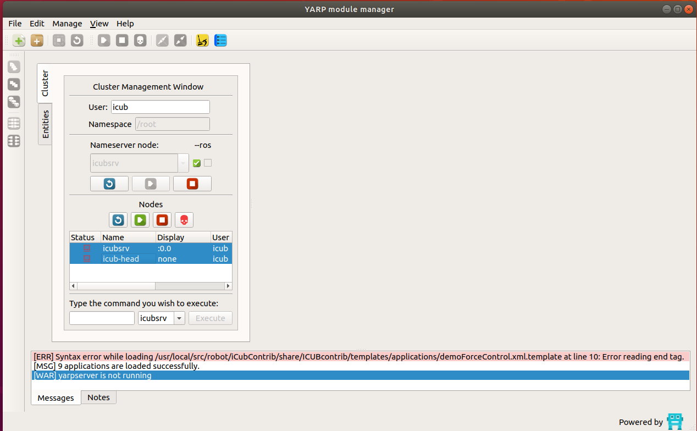
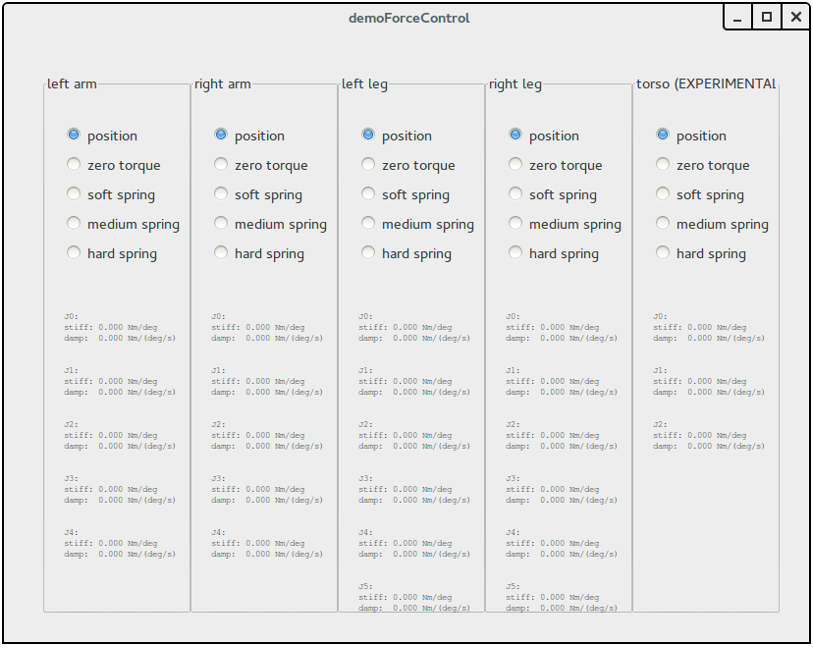
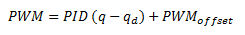
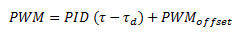
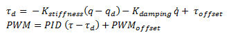

# Force Control on iCub

## `wholebodydynamics` YARP device 
The `wholebodydynamics` YARP device (contained in the C++ class [`yarp::dev::WholeBodyDynamicsDevice`](http://wiki.icub.org/codyco/dox/html/classyarp_1_1dev_1_1WholeBodyDynamicsDevice.html))
is reading measurements of the embedded force-torque sensors, of the joint position and low-level estimates of joint velocity and accelerations and of 
one IMU mounted in the robot, and from this reading is estimating the external force-torques and internal joint torques of the robot. 

## Differences with respect to the wholeBodyDynamics YARP module 
From the user perpective, the main differences w.r.t. to the wholeBodyDynamics YARP module are: 
* The estimation is performed using the iDynTree library, replacing the use of the iDyn library.
* The model of the robot and of the sensor is loaded from a URDF model, as documented in https://github.com/robotology/idyntree/blob/master/doc/model_loading.md . 
  This permits to run the estimation algorithm on arbitrary robot without modifyng the code, as in the case of the iCubHeidelberg01 that w.r.t. to normal iCub is missing the head and the arms. 
* The RPC interface is implemented using [YARP Thrift](http://www.yarp.it/thrift_tutorial_simple.html).
  This means that the `0` shorthand for performing the calibration of the force-torque offset is not supported anymore. The `calib` command however is compatible between the wholeBodyDynamics 
  YARP module and the `wholebodydynamics` YARP device, so please use that one in your code to be compatible with both interfaces. 
* The functionality of the gravityCompensator module are now integrated in the `wholebodydynamics` device, and can be enabled/disabled using the parameters in the `GRAVITY_COMPENSATION` group. 
  Furthermore, the gravity compensation torque offset is not sent anymore to the board if the axis control mode is set to `VOCAB_CM_TORQUE` . 

## Run the `wholebodydynamics` YARP device
Being a YARP device, it can run on the robot main PC in the robot's yarprobotinterface, or on an external pc using a separate yarprobotinterface.
The `wholebodydynamics` device requires robot-specific configuration files, and currently this configuration files are provided for the following robots:

| `YARP_ROBOT_NAME` | Number of F/T sensors | Internal electronics architecture | Support for running wholebodydynamics on the robot's yarprobotinterface |
|:---:|:---:|:---:|:---:|
| `icubGazeboSim`   | 6   | N/A | NO  |
| `iCubDarmstadt01` | 6   | ETH | YES |
| `iCubGenova02`    | 6   | ETH | YES |
| `iCubGenova04`    | 6   | ETH | YES |
| `iCubNancy01`     | 6   | ETH | YES |
| `iCubHeidelberg01` | 4  | ETH | YES |
| `iCubGenova01`    | 6   | CAN | NO  |
| `iCubGenova03`    | 6   | CAN | NO  |
| `iCubParis01`     | 6   | CAN | NO  |
| `iCubParis02`     | 6   | CAN | NO  |

Note however that  over time the configuration of this robots can change, and the configuration files contained in this repository may not be updated. Please check the status of the configuration files with the maintainer of this repository before using this configuration files.

### Run `wholebodydynamics` on an external PC
This is the recommended procedure in general. To launch the `wholebodydynamics` on an external PC running a *nix based OS, just run:
~~~
YARP_ROBOT_NAME=<yarp_robot_name> yarprobotinterface --config launch-wholebodydynamics.xml  
~~~
where `<yarp_robot_name>` is the robot for which you are launching the estimator.

For example, if you want to run the `wholebodydynamics` for the Gazebo simulation, you will need to run:
~~~
YARP_ROBOT_NAME=icubGazeboSim yarprobotinterface --config launch-wholebodydynamics.xml
~~~

Note that you can avoid to preprend the `YARP_ROBOT_NAME=icubGazeboSim` environmental variable.  

### Run `wholebodydynamics` on the robot 
Here you can find hot to run [wholebodydynamics](https://github.com/robotology/whole-body-estimators/blob/master/devices/wholeBodyDynamics/README.md) 

#### Using yarpmanager
On the server run `yarpmanager` and run the nodes

Open the `iCubStarup` application amd run `yarprobointerface` , `yarplogger` (optional to log messages) `wholeBodyDynamics` and `gravityCompensator` modules

#### Using configuration file
**Please note that this configuration is not officially supported by the iCub Facility support team, so please request support only from this repo.**

This setup requires adding one configuration file to the robot `yarprobotinterface` configuration files as distributed in the [robots-configuration](https://github.com/robotology/robots-configuration) repository. For doing this, please import the configuration files for your robot on the `~/.local/share/yarp/robots/${YARP_ROBOT_NAME}` using the `yarp-config` utility program. 

Assuming that `<codyco_prefix>` is the build or installation directory of this repo, copy the file `<codyco_prefix>/share/codyco/robots/${YARP_ROBOT_NAME}/estimators/wholebodydynamics.xml` 
in `~/.local/share/yarp/robots/${YARP_ROBOT_NAME}/estimators/wholebodydynamics.xml` (create the `estimators` directory if necessary). 
Then create a copy of the `icub_all.xml` file (or of any file that you want to use) called `icub_wbd.xml`. 
In `icub_wbd.xml`, add the following two lines before the `</robot>` closing tag:
~~~
<!--  ESTIMATORS   -->
<devices file="estimators/wholebodydynamics.xml" />
~~~
Now we can launch the `yarprobotinterface` with the `wholebodydynamics` device using the following command on the robot's PC:
~~~
yarprobotinterface --config icub_wbd.xml 
~~~

It may be convenient to create a modified version of the `iCubStartup.xml` `yarpmanager` application on the terminal PC on which you launch the `yarpmanager`, 
called `iCubStartupWithWBD.xml`, in which the `--config icub_wbd.xml` parameter is explicitly added when launching the `yarprobotinterface`. 

### Citations 
[1] : http://ieeexplore.ieee.org/abstract/document/6100813/

[2] : http://ieeexplore.ieee.org/abstract/document/5379525/

## Force control 

- First of all check if torque sensors are correctly reading data; to do that (with the robot in the calibrated position) run this command on the laptop server:

       yarp read ... /icub/left_arm/analog:o

- You’ll see a data dumping in the shell, try to move the part by hand and see if numbers are changing.
Repeat the command above for all parts having a sensor (typically left_arm, right_arm, left_leg, right_leg, left_foot, right_foot)

- In the yarpmanager, double click on **iCubStartup**
- Select `wholeBodyDynamics` and `gravityCompensator` modules, right click and run

⚠️ If you have problems opening the WholeBodyDynamics module, double check that in the file _icub_all.xml_ there is:

     portprefix ='icub'

after the RobotName, in the first lines.

- Open yarpmotorgui and check the torque value reading for affected joints, typically they should read as follow :

|Part|Joint 0|Joint 1| Joint 2  | Joint 3  | Joint 4 |
|---|---|---|---|---|---|
| Arms  | -1.5  |  +1.2 | -0.2  | +0.6  | 0 |
| Legs | +0.2  |  +0.1 |  0 | +0.1  | / |

If values are not close to the table above, stop running and check sensors.

- Now run `demoForceControl`

        icub@icubsrv:~$ demoForceControl

🔴 **Do not apply force to the torso (experimental)!**

For each part to test, first select soft spring, move it by hand checking a right force response. Then repeat with medium and hard spring.

⚠️ Be sure to move the part applying the force by hand respecting the following :

|Part|Point where to apply the force|
|---|---|
| Arms  | Forearm/wrist| 
|  Legs | Ankle|

### Ports and connections
wholeBodyDynamics and `yarprobotinterface`` communicate through yarp ports:

iCub ports are:

/icub/inertial provides 3DOF orientation tracker measurements
/icub/<part>/analog:o provides calibrated F/T measurements (an offset is present, due to the stresses of mounting)
/icub/joint_vsens/<part>:i acquires joint torque estimation from wholeBodyDynamics module
wholeBodyDynamics ports are:

/wholeBodyDynamics/inertial:i receive inertial data
/wholeBodyDynamics/<part>/FT:i reads F/T data from the analog ports
/wholeBodyDynamics/<part>/Torques:o provides joint torque measurements
The port connections required to run force control are thus:

/icub/inertial -> /wholeBodyDynamics/inertial:i
/icub/<part>/analog:o -> /wholeBodyDynamics/<part>/FT:i
/icub/joint_vsens/<part>:i -> /wholeBodyDynamics/<part>/Torques:o
Connecting all these ports for all the robot parts (left_arm, right_arm, left_leg, right_leg) is a laborious process and it's easy to make mistakes while typing the port names. For this reason, it's not recommended to make the connections manually, using the yarp connect command. Instead you can easily make all the necessary connections using the provided automated scripts.

The key concept to comprehend how force control works and how to use it is the concept of control mode. The control mode represents the current control algorithm that is running on the firmware of the control boards to control a specific joint. For example, the position control modes implements a PID control that tracks the commanded trajectories, while the impedance control realizes a compliant position control by computing the reference torque that an inner torque control loop has to track, given an equilibrium position and the stiffness of a simulated spring. The control mode of a joint can be changed online, during the execution of your application, using the apposite yarp interfaces. In this way you can assign different control modes to different joints in order to obtain the desired behaviour (e.g. you can set some joints in position control mode to obtain a 'stiff' behaviour and other joint in impedance control mode to obtain a compliant behaviour).

Five different control modes are currently implemented in the firmware of the control boards:

#### Position control mode

(Typical input parameters: desired position, trajectory velocity)
Position control is the standard control mode. In this control mode, the motors PWM is computed using a PID controller the receives in input the desired joint position and the current measurement from the joint encoders:

Note that when you command a new joint position, you are not instantaneously assigning the reference qd in the above formula. Instead, a mimum jerk trajectory generator takes in input your commanded position and the desired velocity, and produces a smooth movement creating a sequence of position references qd tracked by the PID controller.

#### Velocity control mode
(Typical input parameters: desired velocity, acceleration)
Velocity control mode allows you to control the robot by assigning a desired volocity/acceleration to a joint. The control law is the same of position control, but in this case qd is not directly controlled by the user, but it is obtained from the integration of the commanded user velocity. Also in this case a minimum jerk profile generator is used.

#### Torque control mode
(Typical input parameters: reference torque)
Torque control mode allows you to directly control the robot joints torque:
Pid trq.jpg
In this case the motors PWM is computed using a PID controller the receives in input the desired joint torque and the current measured joint torque. Additionally, a PWM offset can be added to the output of the control algorithm. If both the commanded reference torque and the PWM offset is set to zero, the robot joint will be free to be moved in the space (eventually it will move down as an effect of the gravity acting on that joint).

#### Openloop control mode ░░░</li></ul>
(Typical input parameters: motor PWM)
Openloop control mode allows you to directly control the joint motor, assigning directly the PWM (bypassing the PID controller)

#### Impedance Position control mode
(Typical input parameters: desired position, trajectory velocity + desired joint stiffness and damping)
Impedance control mode allows you to control the joint position and its compliance. In particular, you can control the equilibrium position of a virtual spring (using the standard yarp::dev::IPositionControl interface) and its stiffness/damping (using the yarp::dev::IImpedanceControl interface).
The control is implemented in the DSP firmware as follows:
Pid imp.jpg
Firstly, a reference torque is computed, accordingly to the input position and the commanded stiffness/damping parameters (Hooke's law). Secondly, the reference torque is tracked by a PID algorithm (same gains used by the torque control mode). By tuning the stiffness parameters, you can thus make the robot joint feeling like a hard or soft spring, while maintaining control on the desired joint position (note that the same mimum-jerk trajectory generator used by the position control is also used when position impedance control is running).

#### Impedance Velocity control mode
(Typical input parameters: desired velocity, acceleration + desired joint stiffness and damping)
The impedance velocity control mode is the corresponding impedance mode using velocity control. The control law is the same of the impedance position control, but in this case qd is not directly controlled by the user, but it is obtained from the integration of the commanded user velocity (also in this case minimum jerk profile generator is used).

#### Idle ███</li></ul>
(Typical input parameters: none)
This is not a real control mode, but represents the status of a joint in which the control is currently disabled (both because PWM has been deliberately turned off by the user or because a fault (e.g. overcurrent) occurred).

NOTE 1: The control mode of a joint can be set using the yarp::dev::iControlMode interface.

NOTE 2: When you send movement commands (i.e. position/velocity commands) to a joint, the obtained behaviour will change depending on the current control mode of the joint (e.g. a position command in position control mode will generate the standard stiff trajectory, while the same command executed in impedance control mode will change the equilibrium point of the simulated spring).
