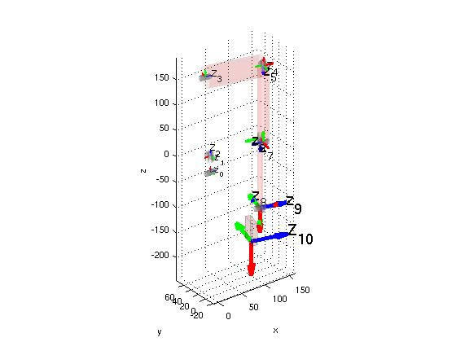

# **ICubFowardKinematics - arms**
---
## Left
Here's described how to construct the matrix T_RoLa whose definition is given in [ICubForwardKinematics](./icub-forward-kinematics.md). The matrix is constructed in two steps i.e. T_RoLa = T_Ro0 * T_0n. The first matrix T_Ro0 describes the rigid roto-translation from the root reference frame to points in the 0th reference frame as defined by the [Denavit-Hartenberg convention](./assets/chap3-forward-kinematics.pdf). In this case T_Ro0 is just a rigid rotation which aligns the z-axis with the first joint of the waist. The second matrix T_0n corresponds to the Denavit-Hartenberg description of the forward kinematic, i.e. the roto-translation from the 0th reference frame to the nth reference frame being n the number of degrees of freedom. The forward kinematic in this case includes the waist and the left arm forward kinematics.

The matrix T_0n is itself the composition of n matrices as defined by the DH convention: `T_0n = T_01 T_12 ... T_(n-1)n`.
Here is the updated [matlab](./assets/ICubFwdKinNew.zip) code for computing the forward kinematics with the Denavit Hartenberg notation

The hand reference frame is located in the palm as shown in the CAD figure. The '''x''' axis is in '''red'''. The '''y''' axis is in '''green'''. The '''z''' axis is in blue. 

|   |   |
|---|---|
| | |

Here is the matrix T_Ro0:

|     |     |     |     |
|-----|-----|-----|-----|
| 0   | -1  | 0   | 0   |
| 0   | 0   | -1  | 0   |
| 1   | 0   | 0   | 0   |
| 0   | 0   | 0   | 1   |

Here is the table of the actual DH parameters for **left arm v1**.

| Link i / H – D | Ai (mm) | d\_i (mm) | alpha\_i (rad) | theta\_i (deg)        |
|----------------|---------|-----------|----------------|-----------------------|
| i = 0          | 32      | 0         | pi/2           | -22 -&gt; 84          |
| i = 1          | 0       | -5.5      | pi/2           | -90 + (-39 -&gt; 39)  |
| i = 2          | 23.3647 | -143.3    | -pi/2          | 105 + (-59 -&gt; 59)  |
| i = 3          | 0       | 107.74    | -pi/2          | 90 + (5 -&gt; -95)    |
| i = 4          | 0       | 0         | pi/2           | -90 + (0 -&gt; 160.8) |
| i = 5          | 15      | 152.28    | -pi/2          | 75 + (-37 -&gt; 100)  |
| i = 6          | -15     | 0         | pi/2           | 5.5 -&gt; 106         |
| i = 7          | 0       | 137.3     | pi/2           | -90 + (-50 -&gt; 50)  |
| i = 8          | 0       | 0         | pi/2           | 90 + (10 -&gt; -65)   |
| i = 9          | 62.5    | -16       | 0              | (-25 -&gt; 25)        |

Here is the table of the actual DH parameters for **left arm v1.7**.

| Link i / H – D | Ai (mm) | d\_i (mm)                                     | alpha\_i (rad) | theta\_i (deg)        |
|----------------|---------|-----------------------------------------------|----------------|-----------------------|
| i = 0          | 32      | 0                                             | pi/2           | -22 -&gt; 84          |
| i = 1          | 0       | -5.5                                          | pi/2           | -90 + (-39 -&gt; 39)  |
| i = 2          | 23.3647 | -143.3                                        | -pi/2          | 105 + (-59 -&gt; 59)  |
| i = 3          | 0       | 107.74                                        | -pi/2          | 90 + (5 -&gt; -95)    |
| i = 4          | 0       | 0                                             | pi/2           | -90 + (0 -&gt; 160.8) |
| i = 5          | 15      | 152.28                                        | -pi/2          | 75 + (-37 -&gt; 100)  |
| i = 6          | -15     | 0                                             | pi/2           | 5.5 -&gt; 106         |
| i = 7          | 0       | 141.3 | pi/2           | -90 + (-50 -&gt; 50)  |
| i = 8          | 0       | 0                                             | pi/2           | 90 + (10 -&gt; -65)   |
| i = 9          | 62.5    | -16                                           | 0              | (-25 -&gt; 25)        |

Here is the table of the actual DH parameters for **left arm v2**.

| Link i / H – D | Ai (mm) | d\_i (mm)                                      | alpha\_i (rad) | theta\_i (deg)        |
|----------------|---------|------------------------------------------------|----------------|-----------------------|
| i = 0          | 32      | 0                                              | pi/2           | -22 -&gt; 84          |
| i = 1          | 0       | -5.5                                           | pi/2           | -90 + (-39 -&gt; 39)  |
| i = 2          | 23.3647 | -143.3                                         | -pi/2          | 105 + (-59 -&gt; 59)  |
| i = 3          | 0       | 107.74                                         | -pi/2          | 90 + (5 -&gt; -95)    |
| i = 4          | 0       | 0                                              | pi/2           | -90 + (0 -&gt; 160.8) |
| i = 5          | 15      | 152.28                                         | -pi/2          | 75 + (-37 -&gt; 100)  |
| i = 6          | -15     | 0                                              | pi/2           | 5.5 -&gt; 106         |
| i = 7          | 0       | 141.3  | pi/2           | -90 + (-50 -&gt; 50)  |
| i = 8          | 0       | 0                                              | pi/2           | 90 + (10 -&gt; -65)   |
| i = 9          | 62.5    | -25.98 | 0              | (-25 -&gt; 25)        |

## Right
Here's described how to construct the matrix T_RoRa whose definition is given in [ICubForwardKinematics](./icub-forward-kinematics.md). The matrix is constructed in two steps i.e. T_RoRa = T_Ro0 * T_0n. The first matrix T_Ro0 describes the rigid roto-translation from the root reference frame to points in the 0th reference frame as defined by the [Denavit-Hartenberg convention](./assets/chap3-forward-kinematics.pdf). In this case T_Ro0 is just a rigid rotation which aligns the z-axis with the first joint of the waist. The second matrix T_0n corresponds to the Denavit-Hartenberg description of the forward kinematic, i.e. the roto-translation from the 0th reference frame to the nth reference frame being n the number of degrees of freedom. The forward kinematic in this case includes the waist and the right arm forward kinematics.

The matrix T_0n is itself the composition of n matrices as defined by the DH convention: `T_0n = T_01 T_12 ... T_(n-1)n`. 
Here is the updated [matlab](./assets/ICubFwdKinNew.zip) code for computing the forward kinematics with the Denavit Hartenberg notation

The hand reference frame is located in the palm as shown in the CAD figure. The '''x''' axis is in '''red'''. The '''y''' axis is in '''green'''. The '''z''' axis is in blue. 

|   |   |
|---|---|
| | |

Here is the matrix T\_Ro0:

|     |     |     |     |
|-----|-----|-----|-----|
| 0   | -1  | 0   | 0   |
| 0   | 0   | -1  | 0   |
| 1   | 0   | 0   | 0   |
| 0   | 0   | 0   | 1   |

Here is the table of the actual DH parameters for **right arm v1**.

| Link i / H – D | Ai (mm)  | d\_i (mm) | alpha\_i (rad) | theta\_i (deg)         |
|----------------|----------|-----------|----------------|------------------------|
| i = 0          | 32       | 0         | pi/2           | -22 -&gt; 84           |
| i = 1          | 0        | -5.5      | pi/2           | -90 + (-39 -&gt; 39)   |
| i = 2          | -23.3647 | -143.3    | pi/2           | -105 + (-59 -&gt; 59)  |
| i = 3          | 0        | -107.74   | pi/2           | -90 + (5 -&gt; -95)    |
| i = 4          | 0        | 0         | -pi/2          | -90 +(0 -&gt; 160.8)   |
| i = 5          | -15.0    | -152.28   | -pi/2          | -105 + (-37 -&gt; 100) |
| i = 6          | 15.0     | 0         | pi/2           | 5.5 -&gt; 106          |
| i = 7          | 0        | -137.3    | pi/2           | -90 + (-50 -&gt; 50)   |
| i = 8          | 0        | 0         | pi/2           | 90 + (10 -&gt; -65)    |
| i = 9          | 62.5     | 16        | 0              | (-25 -&gt; 25) + 180   |

Here is the table of the actual DH parameters for **right arm v1.7**.

| Link i / H – D | Ai (mm)  | d\_i (mm)                                      | alpha\_i (rad) | theta\_i (deg)         |
|----------------|----------|------------------------------------------------|----------------|------------------------|
| i = 0          | 32       | 0                                              | pi/2           | -22 -&gt; 84           |
| i = 1          | 0        | -5.5                                           | pi/2           | -90 + (-39 -&gt; 39)   |
| i = 2          | -23.3647 | -143.3                                         | pi/2           | -105 + (-59 -&gt; 59)  |
| i = 3          | 0        | -107.74                                        | pi/2           | -90 + (5 -&gt; -95)    |
| i = 4          | 0        | 0                                              | -pi/2          | -90 +(0 -&gt; 160.8)   |
| i = 5          | -15.0    | -152.28                                        | -pi/2          | -105 + (-37 -&gt; 100) |
| i = 6          | 15.0     | 0                                              | pi/2           | 5.5 -&gt; 106          |
| i = 7          | 0        | -141.3 | pi/2           | -90 + (-50 -&gt; 50)   |
| i = 8          | 0        | 0                                              | pi/2           | 90 + (10 -&gt; -65)    |
| i = 9          | 62.5     | 16                                             | 0              | (-25 -&gt; 25) + 180   |

Here is the table of the actual DH parameters for **right arm v2**.

| Link i / H – D | Ai (mm)  | d\_i (mm)                                      | alpha\_i (rad) | theta\_i (deg)         |
|----------------|----------|------------------------------------------------|----------------|------------------------|
| i = 0          | 32       | 0                                              | pi/2           | -22 -&gt; 84           |
| i = 1          | 0        | -5.5                                           | pi/2           | -90 + (-39 -&gt; 39)   |
| i = 2          | -23.3647 | -143.3                                         | pi/2           | -105 + (-59 -&gt; 59)  |
| i = 3          | 0        | -107.74                                        | pi/2           | -90 + (5 -&gt; -95)    |
| i = 4          | 0        | 0                                              | -pi/2          | -90 +(0 -&gt; 160.8)   |
| i = 5          | -15.0    | -152.28                                        | -pi/2          | -105 + (-37 -&gt; 100) |
| i = 6          | 15.0     | 0                                              | pi/2           | 5.5 -&gt; 106          |
| i = 7          | 0        | -141.3 | pi/2           | -90 + (-50 -&gt; 50)   |
| i = 8          | 0        | 0                                              | pi/2           | 90 + (10 -&gt; -65)    |
| i = 9          | 62.5     | 25.98  | 0              | (-25 -&gt; 25) + 180   |
