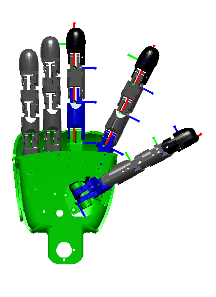

# **ICubFowardKinematics - fingers**

## Left
This page provides the forward kinematics of the thumb, the index and the middle fingers of the left hand. It describes how to construct all the finger matrices T_RoLt (thumb), T_RoLi (index) and T_RoLm (middle). Each matrix is constructed in two steps i.e. T_RoLfin = T_Ro0fin * T_0nfin (where fin is t for the thumb, i for the index and m for the middle). The first matrix T_Ro0 describes the rigid roto-translation from the end effector reference frame (described in [ICubFowardKinematics](icub-forward-kinematics-arms.md#left)) to points in the 0th reference frame as defined by the [Denavit-Hartenberg convention](./assets/chap3-forward-kinematics.pdf). The second matrix T_0n corresponds to the Denavit-Hartenberg description of the forward kinematic, i.e. the roto-translation from the 0th reference frame to the nth reference frame being n the number of degrees of freedom.

The matrix T_0n is itself the composition of n matrices as defined by the DH convention: `T_0n = T_01 T_12 ... T_(n-1)n`.

The frames are oriented as in the Figure. The '''x''' axis is in '''red'''. The '''y''' axis is in '''green'''. The '''z''' axis is in blue. 

### **THUMB**

Here is the matrix T\_Ro0t for the **thumb version a** (lengths are in
mm):

|           |           |          |            |
|-----------|-----------|----------|------------|
| 0.121132  | 0.043736  | 0.991672 | -25.391770 |
| -0.958978 | 0.263104  | 0.105535 | -11.783901 |
| 0.256297  | -0.963776 | 0.073812 | 1.7018     |
| 0         | 0         | 0        | 1          |

Here is the matrix T\_Ro0t for the **thumb version b** (lengths are in
mm):

|           |           |          |            |
|-----------|-----------|----------|------------|
| 0.478469  | 0.063689  | 0.875792 | -24.029759 |
| -0.878095 | 0.039246  | 0.476873 | -11.93433  |
| 0.004     | -0.997198 | 0.074703 | 1.68926    |
| 0         | 0         | 0        | 1          |

Here is the table of the actual DH parameters for **thumb**.

| Link i / H – D | Ai (mm) | di (mm) | alpha i (rad) | theta\_i (deg) |
|----------------|---------|---------|---------------|----------------|
| i = 0          | 0       | 0       | pi/2          | 10 -&gt; 90    |
| i = 1          | 21.0    | -5.6    | 0             | 0 (dummy link) |
| i = 2          | 26.0    | 0       | 0             | 0 -&gt; 90     |
| i = 3          | 22.0    | 0       | 0             | 0 -&gt; 90     |
| i = 4          | 16.8    | 0       | -pi/2         | 0 -&gt; 90     |

### **INDEX**

Here is the matrix T\_Ro0i for the **index** (lengths are in mm):

|           |          |           |            |
|-----------|----------|-----------|------------|
| 0.898138  | 0.439714 | 0.0       | 2.45549    |
| -0.43804  | 0.89472  | -0.087156 | -25.320433 |
| -0.038324 | 0.078278 | 0.996195  | 10.973325  |
| 0         | 0        | 0         | 1          |

Here is the table of the actual DH parameters for **index**.

| Link i / H – D | Ai (mm) | di (mm) | alpha i (rad) | theta\_i (deg) |
|----------------|---------|---------|---------------|----------------|
| i = 0          | 14.8    | 0       | -pi/2         | 0 -&gt; 20     |
| i = 1          | 25.9    | 0       | 0             | 0 -&gt; 90     |
| i = 2          | 22.0    | 0       | 0             | 0 -&gt; 90     |
| i = 3          | 16.8    | 0       | -pi/2         | 0 -&gt; 90     |

### **MIDDLE**

Here is the matrix T\_Ro0m for the **middle** (lengths are in mm):

|     |      |     |          |
|-----|------|-----|----------|
| 1.0 | 0.0  | 0.0 | 17.8     |
| 0.0 | 0.0  | 1.0 | -8.30233 |
| 0.0 | -1.0 | 0.0 | 11.8     |
| 0   | 0    | 0   | 1        |

Here is the table of the actual DH parameters for **middle**.

| Link i / H – D | Ai (mm) | di (mm) | alpha i (rad) | theta\_i (deg) |
|----------------|---------|---------|---------------|----------------|
| i = 0          | 28.5    | 0       | 0             | 0 -&gt; 90     |
| i = 1          | 24.0    | 0       | 0             | 0 -&gt; 90     |
| i = 2          | 16.8    | 0       | -pi/2         | 0 -&gt; 90     |

## Right
This page provides the forward kinematics of the thumb, the index and the middle fingers of the right hand. It describes how to construct all the finger matrices T_RoRt (thumb), T_RoRi (index) and T_RoRm (middle). Each matrix is constructed in two steps i.e. T_RoRfin = T_Ro0fin * T_0nfin (where fin is t for the thumb, i for the index and m for the middle). The first matrix T_Ro0 describes the rigid roto-translation from the end effector reference frame (described in [ICubFowardKinematics](icub-forward-kinematics-arms.md#right)) to points in the 0th reference frame as defined by the [Denavit-Hartenberg convention](./assets/chap3-forward-kinematics.pdf). The second matrix T_0n corresponds to the Denavit-Hartenberg description of the forward kinematic, i.e. the roto-translation from the 0th reference frame to the nth reference frame being n the number of degrees of freedom.

The matrix T_0n is itself the composition of n matrices as defined by the DH convention: `T_0n = T_01 T_12 ... T_(n-1)n`.

The frames are oriented as in the Figure. The '''x''' axis is in '''red'''. The '''y''' axis is in '''green'''. The '''z''' axis is in blue. .

### **THUMB**

Here is the matrix T\_Ro0t for the **thumb version a** (lengths are in
mm):

|           |          |           |            |
|-----------|----------|-----------|------------|
| 0.121132  | 0.043736 | -0.991672 | -25.391770 |
| -0.958978 | 0.263104 | -0.105535 | -11.783901 |
| 0.256297  | 0.963776 | 0.073812  | -1.7018    |
| 0         | 0        | 0         | 1          |

Here is the matrix T\_Ro0t for the **thumb version b** (lengths are in
mm):

|           |          |           |            |
|-----------|----------|-----------|------------|
| 0.478469  | 0.063689 | -0.875792 | -24.029759 |
| -0.878095 | 0.039246 | -0.476873 | -11.93433  |
| 0.004     | 0.997198 | 0.074703  | -1.68926   |
| 0         | 0        | 0         | 1          |

Here is the table of the actual DH parameters for **thumb**.

| Link i / H – D | Ai (mm) | di (mm) | alpha i (rad) | theta\_i (deg) |
|----------------|---------|---------|---------------|----------------|
| i = 0          | 0       | 0       | -pi/2         | 10 -&gt; 90    |
| i = 1          | 21.0    | 5.6     | 0             | 0 (dummy link) |
| i = 2          | 26.0    | 0       | 0             | 0 -&gt; 90     |
| i = 3          | 22.0    | 0       | 0             | 0 -&gt; 90     |
| i = 4          | 16.8    | 0       | -pi/2         | 0 -&gt; 90     |

### **INDEX**

Here is the matrix T\_Ro0i for the **index** (lengths are in mm):

|          |           |          |            |
|----------|-----------|----------|------------|
| 0.898138 | 0.439714  | 0.0      | 2.45549    |
| -0.43804 | 0.89472   | 0.087156 | -25.320433 |
| 0.038324 | -0.078278 | 0.996195 | -10.973325 |
| 0        | 0         | 0        | 1          |

Here is the table of the actual DH parameters for **index**.

| Link i / H – D | Ai (mm) | di (mm) | alpha i (rad) | theta\_i (deg) |
|----------------|---------|---------|---------------|----------------|
| i = 0          | 14.8    | 0       | pi/2          | 0 -&gt; 20     |
| i = 1          | 25.9    | 0       | 0             | 0 -&gt; 90     |
| i = 2          | 22.0    | 0       | 0             | 0 -&gt; 90     |
| i = 3          | 16.8    | 0       | -pi/2         | 0 -&gt; 90     |

### **MIDDLE**

Here is the matrix T\_Ro0m for the **middle** (lengths are in mm):

|     |     |      |          |
|-----|-----|------|----------|
| 1.0 | 0.0 | 0.0  | 17.8     |
| 0.0 | 0.0 | -1.0 | -8.30233 |
| 0.0 | 1.0 | 0.0  | -11.8    |
| 0   | 0   | 0    | 1        |

Here is the table of the actual DH parameters for **middle**.

| Link i / H – D | Ai (mm) | di (mm) | alpha i (rad) | theta\_i (deg) |
|----------------|---------|---------|---------------|----------------|
| i = 0          | 28.5    | 0       | 0             | 0 -&gt; 90     |
| i = 1          | 24.0    | 0       | 0             | 0 -&gt; 90     |
| i = 2          | 16.8    | 0       | -pi/2         | 0 -&gt; 90     |