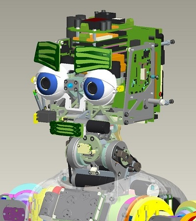

# iCub Forward Kinematics - Head

## V1
Here's described how to construct the matrices $T_{RoLe}$ and $T_{RoRe}$ whose definition is given in [ICubForwardKinematics](./icub-forward-kinematics.md). The matrices are constructed in two steps i.e. $T_{RoRe} = T_{Ro0} * T_{0n}$ and $T_{RoLe} = T_{Ro0} * T'_{0n}$. The first matrix $T_{Ro0}$ describes the rigid roto-translation from the root reference frame to points in the 0th reference frame as defined by the [Denavit-Hartenberg convention](./assets/chap3-forward-kinematics.pdf). In this case $T_{Ro0}$ is just a rigid rotation which aligns the z-axis with the first joint of the waist. The second matrices $T_{0n} and $T'_{0n}$ correspond to the Denavit-Hartenberg description of the right and left eye forward kinematic, i.e. the roto-translation from the 0th reference frame to the nth reference frame being n the number of degrees of freedom. The forward kinematic $T_{0n}$ in this case includes the waist and the right eye forward kinematics. The forward kinematic $T'_{0n}$ in this case includes the waist and the left eye forward kinematics.

The matrices $T_{0n}$ and $T'_{0n}$ are themselves the composition of n matrices as defined by the DH convention: $T_0n = T_{01} T_{12} ... T_{(n-1)n}$ and $T'_{0n} = T'_{01} T'_{12} ... T'_{(n-1)n}$.
Here is the updated [matlab](./assets/ICubFwdKinNew.zip) code for computing the forward kinematics with the Denavit Hartenberg notation

The eyes reference frames are located in the palm as shown in the CAD figure. 
The <font color=#ff2e31>$X$</font> axis is in red. The <font color=#2BE01B>$Y$</font> axis is in green. The <font color=#0030f2>$Z$</font> axis is in blue. 

|   |   |
|---|---|
| | |

Here is the matrix `T\_Ro0`:

|     |     |     |     |
|-----|-----|-----|-----|
| 0   | -1  | 0   | 0   |
| 0   | 0   | -1  | 0   |
| 1   | 0   | 0   | 0   |
| 0   | 0   | 0   | 1   |

Here is the table of the actual DH parameters which describe $T_{01}$ ,$T_{12}$, ... $T_{(n-1)n}$.

| Link i / H – D | Ai (mm) | d\_i (mm) | alpha\_i (rad) | theta\_i (deg)       |
|----------------|---------|-----------|----------------|----------------------|
| i = 0          | 32      | 0         | pi/2           | -22 -&gt; 84         |
| i = 1          | 0       | -5.5      | pi/2           | -90 + (-39 -&gt; 39) |
| i = 2          | 2.31    | -193.3    | -pi/2          | -90 + (-59 -&gt; 59) |
| i = 3          | 33      | 0         | pi/2           | 90 + (-40 -&gt; 30)  |
| i = 4          | 0       | 1         | -pi/2          | -90 + (-70 -&gt; 60) |
| i = 5          | -54     | 82.5      | -pi/2          | 90 + (-55 -&gt; 55)  |
| i = 6          | 0       | 34        | -pi/2          | -35 -&gt; 15         |
| i = 7          | 0       | 0         | pi/2           | -90 + (-50 -&gt; 50) |

Here is the table of the actual DH parameters which describe $T'_{01},
T'_{12}, ... T'_{(n-1)n}$.

| Link i / H – D | Ai (mm) | d\_i (mm) | alpha\_i (rad) | theta\_i (deg)       |
|----------------|---------|-----------|----------------|----------------------|
| i = 0          | 32      | 0         | pi/2           | -22 -&gt; 84         |
| i = 1          | 0       | -5.5      | pi/2           | -90 + (-39 -&gt; 39) |
| i = 2          | 2.31    | -193.3    | -pi/2          | -90 + (-59 -&gt; 59) |
| i = 3          | 33      | 0         | pi/2           | 90 + (-40 -&gt; 30)  |
| i = 4          | 0       | 1         | -pi/2          | -90 + (-70 -&gt; 60) |
| i = 5          | -54     | 82.5      | -pi/2          | 90 + (-55 -&gt; 55)  |
| i = 6          | 0       | -34       | -pi/2          | -35 -&gt; 15         |
| i = 7          | 0       | 0         | pi/2           | -90 + (-50 -&gt; 50) |

```
xml
Joint Poses (x y z, roll, pitch, yaw) w.r.t. root:

Eyes tilt (G\_sl6) = -62.81 0 340.8 1.57079 0 0

Right Eye (G\_sl7) = -62.81 34 340.8 -3.14159 0 0

Left Eye (Gp\_sl7) = -62.81 -34 340.8 -3.14159 0 0

Right Eye (G\_sl8) = -62.81 34 340.8 0 1.57079 0

Left Eye (Gp\_sl8) = -62.81 -34 340.8 0 1.57079 0
```
## V2
Here's described how to construct the matrices $T_{RoLe}$ and $T_{RoRe}$ whose definition is given in [ICubForwardKinematics](./icub-forward-kinematics.md). The matrices are constructed in three steps i.e. $T_{RoRe} = T_{Ro0} * T_{0n} * T_{nE}$ and $T_{RoLe} = T_{Ro0} * T'_{0n} * T_{nE}$. The first matrix $T_{Ro0}$ describes the rigid roto-translation from the root reference frame to points in the 0th reference frame as defined by the [Denavit-Hartenberg convention](./assets/chap3-forward-kinematics.pdf). In this case $T_{Ro0}$ is just a rigid rotation which aligns the z-axis with the first joint of the waist. The second matrices $T_{0n}$ and $T'_{0n}$ correspond to the Denavit-Hartenberg description of the right and left eye forward kinematic, i.e. the roto-translation from the 0th reference frame to the nth reference frame being n the number of degrees of freedom. The forward kinematic $T_{0n}$ in this case includes the waist and the right eye forward kinematics. The forward kinematic $T'_{0n}$ in this case includes the waist and the left eye forward kinematics. The last matrix  $T_{nE}$ represents the roto-translation from the nth reference frame to the one placed on the camera sensor.

The matrices $T_{0n}$ and $T'_{0n}$ are themselves the composition of n matrices as defined by the DH convention: $T_{0n} = T_{01} T_{12} ... T_{(n-1)n}$  and  $ T'_{0n} = T'_{01} T'_{12} ... T'_{(n-1)n}$.
Here is the updated [matlab](./assets/ICubFwdKinNewV2.zip) code for computing the forward kinematics with the Denavit Hartenberg notation

The eyes reference frames are located in the palm as shown in the CAD figure. 
The <font color=#ff2e31>$X$</font> axis is in red. The <font color=#2BE01B> $Y$</font> axis is in green. The <font color=#0030f2> $Z$</font> axis is in blue.

|   |   |
|---|---|
| | |

Here is the matrix $T_{Ro0}$:

$$
\begin{equation}
T_{Ro0} = 
\begin{bmatrix}
0 & -1 & 0 & 0 \\
0 & 0 & -1 & 0 \\
1 & 0 & 0 & 0 \\
0 & 0 & 0 & 1 \\
\end{bmatrix}
\end{equation}
$$

Here is the table of the actual DH parameters which describe $T_{01},T_{12}, \dots T_{(n-1)n}$ :

| Link i / H – D | Ai (mm) | d\_i (mm) | alpha\_i (rad) | theta\_i (deg)       |
|----------------|---------|-----------|----------------|----------------------|
| i = 0          | 32      | 0         | pi/2           | -22 -&gt; 84         |
| i = 1          | 0       | -5.5      | pi/2           | -90 + (-39 -&gt; 39) |
| i = 2          | 0       | -223.3    | -pi/2          | -90 + (-40 -&gt; 22) |
| i = 3          | 9.5     | 0         | pi/2           | 90 + (-20 -&gt; 20)  |
| i = 4          | 0       | 0         | -pi/2          | -90 + (-50 -&gt; 50) |
| i = 5          | -50.9   | 82.05     | -pi/2          | 90 + (-30 -&gt; 30)  |
| i = 6          | 0       | 34        | -pi/2          | -15 -&gt; 15         |
| i = 7          | 0       | 0         | pi/2           | -90 + (-30 -&gt; 30) |

Here is the table of the actual DH parameters which describe $T'_{01},T'_{12}, \dots T'_{(n-1)n}$ :

| Link i / H – D | Ai (mm) | d\_i (mm) | alpha\_i (rad) | theta\_i (deg)       |
|----------------|---------|-----------|----------------|----------------------|
| i = 0          | 32      | 0         | pi/2           | -22 -&gt; 84         |
| i = 1          | 0       | -5.5      | pi/2           | -90 + (-39 -&gt; 39) |
| i = 2          | 0       | -223.3    | -pi/2          | -90 + (-40 -&gt; 22) |
| i = 3          | 9.5     | 0         | pi/2           | 90 + (-20 -&gt; 20)  |
| i = 4          | 0       | 0         | -pi/2          | -90 + (-50 -&gt; 50) |
| i = 5          | -50.9   | 82.05     | -pi/2          | 90 + (-30 -&gt; 30)  |
| i = 6          | 0       | -34       | -pi/2          | -15 -&gt; 15         |
| i = 7          | 0       | 0         | pi/2           | -90 + (-30 -&gt; 30) |

For both left and right eye, the end-effector matrix $T_{nE}$ from the last link to the camera sensor is:

$$
\begin{equation}
T_{nE} = 
\begin{bmatrix}
1 & 0 & 0 & 0 \\
0 & 1 & 0 & 0 \\
0 & 0 & 1 & -2.15mm \\
0 & 0 & 0 & 1 \\
\end{bmatrix}
\end{equation}
$$
