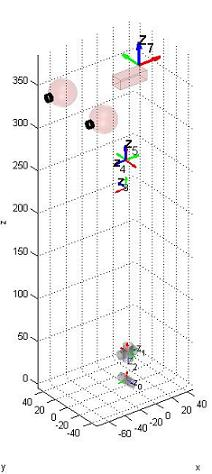
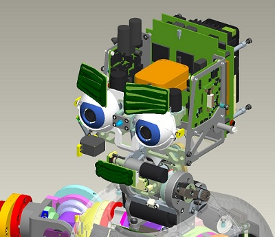

# iCub Forward Kinematics - IMU

## V1
Here's described how to construct the matrix T_RoIs whose definition is given in [ICubForwardKinematics](./icub-forward-kinematics.md). The matrix is constructed in three steps i.e. `T_RoIs = T_Ro0 * T_0n * T_nIs`. The first matrix T_Ro0 describes the rigid roto-translation from the root reference frame to points in the 0th reference frame as defined by the [Denavit-Hartenberg convention](https://github.com/icub-tech-iit/documentation/raw/master/docs/icub_kinematics/icub-forward-kinematics/assets/chap3-forward-kinematics.pdf). In this case T_Ro0 is just a rigid rotation which aligns the z-axis with the first joint of the waist. The second matrix T_0n correspond to the Denavit-Hartenberg description of the waist and neck forward kinematic, i.e. the roto-translation from the 0th reference frame to the nth reference frame being n the number of degrees of freedom. The forward kinematic T_0n in this case includes the waist and the neck forward kinematics.

The matrix T_0n is itself the composition of n matrices as defined by the DH convention: `T_0n = T_01 T_12 ... T_(n-1)n`. 
Here is the updated [matlab](https://github.com/icub-tech-iit/documentation/raw/master/docs/icub_kinematics/icub-forward-kinematics/assets/ICubFwdKinNew.zip) code for computing the forward kinematics with the Denavit Hartenberg notation.

The sensor reference frame is located in the palm as shown in the CAD figure. 
The '''x''' axis is in '''red'''. The '''y''' axis is in '''green'''. The '''z''' axis is in blue. 

|   |   |
|---|---|
| | |

Here is the matrix `T\_Ro0`:

|     |     |     |     |
|-----|-----|-----|-----|
| 0   | -1  | 0   | 0   |
| 0   | 0   | -1  | 0   |
| 1   | 0   | 0   | 0   |
| 0   | 0   | 0   | 1   |

Here is the table of the actual DH parameters which describe `T\_01,T\_12, ... T\_(n-1)n`.

| Link i / H – D | Ai (mm) | d\_i (mm) | alpha\_i (rad) | theta\_i (deg)       |
|----------------|---------|-----------|----------------|----------------------|
| i = 0          | 32      | 0         | pi/2           | -22 -&gt; 84         |
| i = 1          | 0       | -5.5      | pi/2           | -90 + (-39 -&gt; 39) |
| i = 2          | 2.31    | -193.3    | -pi/2          | -90 + (-59 -&gt; 59) |
| i = 3          | 33      | 0         | pi/2           | 90 + (-40 -&gt; 30)  |
| i = 4          | 0       | 1         | -pi/2          | -90 + (-70 -&gt; 60) |
| i = 5          | 22.5    | 100.5     | -pi/2          | 90 + (-55 -&gt; 55)  |

Here is the matrix `T\_nIs`:

|     |     |     |     |
|-----|-----|-----|-----|
| 1   | 0   | 0   | 0   |
| 0   | 0   | -1  | 0   |
| 0   | 1   | 0   | 6.6 |
| 0   | 0   | 0   | 1   |

In some circumstances it might be convenient to think of coding T\_nls
as a further virtual link located at the end of the chain and with its
joint constantly kept at 0 value. The DH parameters of this virtual link
are:

| Link i / H – D | Ai (mm) | d\_i (mm) | alpha\_i (rad) | theta\_i (deg) |
|----------------|---------|-----------|----------------|----------------|
| i = 6          | 0       | 6.6       | pi/2           | 0              |

# V2
Here's described how to construct the matrix T_RoIs whose definition is given in [ICubForwardKinematics](./icub-forward-kinematics.md). The matrix is constructed in three steps i.e. `T_RoIs = T_Ro0 * T_0n * T_nIs`. The first matrix T_Ro0 describes the rigid roto-translation from the root reference frame to points in the 0th reference frame as defined by the [Denavit-Hartenberg convention](https://github.com/icub-tech-iit/documentation/raw/master/docs/icub_kinematics/icub-forward-kinematics/assets/chap3-forward-kinematics.pdf). In this case T_Ro0 is just a rigid rotation which aligns the z-axis with the first joint of the waist. The second matrix T_0n correspond to the Denavit-Hartenberg description of the waist and neck forward kinematic, i.e. the roto-translation from the 0th reference frame to the nth reference frame being n the number of degrees of freedom. The forward kinematic T_0n in this case includes the waist and the neck forward kinematics.

The matrix T_0n is itself the composition of n matrices as defined by the DH convention: `T_0n = T_01 T_12 ... T_(n-1)n`. 
Here is the updated [matlab](https://github.com/icub-tech-iit/documentation/raw/master/docs/icub_kinematics/icub-forward-kinematics/assets/ICubFwdKinNewV2.zip) code for computing the forward kinematics with the Denavit Hartenberg notation.

The sensor reference frame is located in the palm as shown in the CAD figure. 
The '''x''' axis is in '''red'''. The '''y''' axis is in '''green'''. The '''z''' axis is in blue. 

|   |   |
|---|---|
| | |

Here is the matrix `T\_Ro0`:

|     |     |     |     |
|-----|-----|-----|-----|
| 0   | -1  | 0   | 0   |
| 0   | 0   | -1  | 0   |
| 1   | 0   | 0   | 0   |
| 0   | 0   | 0   | 1   |

Here is the table of the actual DH parameters which describe `T\_01,T\_12, ... T\_(n-1)n`.

| Link i / H – D | Ai (mm) | d\_i (mm) | alpha\_i (rad) | theta\_i (deg)       |
|----------------|---------|-----------|----------------|----------------------|
| i = 0          | 32      | 0         | pi/2           | -22 -&gt; 84         |
| i = 1          | 0       | -5.5      | pi/2           | -90 + (-39 -&gt; 39) |
| i = 2          | 0       | -223.3    | -pi/2          | -90 + (-59 -&gt; 59) |
| i = 3          | 9.5     | 0         | pi/2           | 90 + (-40 -&gt; 30)  |
| i = 4          | 0       | 0         | -pi/2          | -90 + (-70 -&gt; 60) |
| i = 5          | 18.5    | 110.8     | -pi/2          | 90 + (-55 -&gt; 55)  |

Here is the matrix `T\_nIs`:

|     |     |     |     |
|-----|-----|-----|-----|
| 1   | 0   | 0   | 0   |
| 0   | 0   | -1  | 0   |
| 0   | 1   | 0   | 6.6 |
| 0   | 0   | 0   | 1   |

In some circumstances it might be convenient to think of coding T\_nls
as a further virtual link located at the end of the chain and with its
joint constantly kept at 0 value. The DH parameters of this virtual link
are:

| Link i / H – D | Ai (mm) | d\_i (mm) | alpha\_i (rad) | theta\_i (deg) |
|----------------|---------|-----------|----------------|----------------|
| i = 6          | 0       | 6.6       | pi/2           | 0              |
