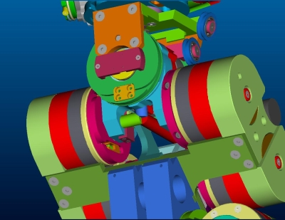

# **iCub Forward Kinematics**
The iCub forward kinematics are described with respect to a (root) reference frame which is positioned at the level of the waist in the center of the robot as represented in the following pic (colored cylinders: the x axis is in red, the y axis is in green, the z axis is in blue).

|   |   |
|---|---|
| | |

The origin of the root reference frame is a point on the axis of rotation of the torso pitch. Among all points in this axis, the origin is located in the middle of the robot in between the two legs.

1. The z axis of the root reference frame is parallel to gravity but pointing upwards.
2. The x axis of the root reference frame points behind the robot.
3. The y axis of the root reference frame points laterally and is chosen according to the right hand rule.

For simpler visualization the root reference frame of the forward kinematics is depicted in the picture below (light blue) (for the exact position refer the CAD pictures above):

Seven additional reference frames are defined with respect to this common root reference frame. The reference frames are located as shown in the CAD figure. The x axis is in red. The y axis is in green. The z axis is in blue.

- Left hand reference frame (see the CAD [picture](./img/LeftHandCADRefFrame.jpg))
- Right hand reference frame (see the CAD [picture](./img/RightHandCADRefFrame.jpg)
- Left Fingers reference frame (see the CAD [picture](./img/LeftHand.png))
- Right Fingers reference frame (see the CAD [picture](./img/RightHand.png))
- Left foot reference frame (see the CAD [picture](./img/LegsCADRefFrame.jpg))
- Right foot reference frame (see the CAD [picture](./img/LegsCADRefFrame.jpg))
- Left eye reference frame (see the CAD [picture](./img/HeadCADRefFrame.jpg))
- Right eye reference frame (see the CAD [picture](./img/HeadCADRefFrame.jpg))
- Inertia sensor reference frame (see the CAD [picture](./img/InertiaCADRefFrame.jpg))

The roto-translation which converts a point in one of these reference frames to the root reference frame are given by the following SE(3) matrices:

| End effector      |       | Reference frame | SE(3) Matrix                  | Description                                                                                | Matlab files                    |
|-------------------|-------|-----------------|-------------------------------|--------------------------------------------------------------------------------------------|---------------------------------|
|                   |       |                 |                               |                                                                                            |                                 |
| All               | -&gt; | Root            | **-**                         | Whole body (all reference frames)                                                          | [ICubFwdKinNew.zip](./assets/ICubFwdKinNew.zip)     |
|                   |       |                 |                               |                                                                                            |                                 |
| Left arm          | -&gt; | Root            | **T\_RoLa**                   | [iCub Left Arm Forward Kinematics](./icub-forward-kinematics-arms.md#left)                                                      | [ICubFwdKinNew.zip](./assets/ICubFwdKinNew.zip)      |
| Right arm         | -&gt; | Root            | **T\_RoRa**                   | [ iCub Right Arm Forward Kinematics](./icub-forward-kinematics-arms.md#right)                                                     | [ICubFwdKinNew.zip](./assets/ICubFwdKinNew.zip)      |
| Left hand         | -&gt; | Root            | **T\_RoLt, T\_RoLi, T\_RoLm** | [ iCub Left Fingers Forward Kinematics](./icub-forward-kinematics-fingers.md#left)                                                  | -                            |
| Right hand        | -&gt; | Root            | **T\_RoRt, T\_RoRi, T\_RoRm** | [ iCub Right Fingers Forward Kinematics](./icub-forward-kinematics-fingers.md#right)                                             | -                            |
| Left foot V1      | -&gt; | Root            | **T\_RoLf**                   | [ iCub Left Leg Forward Kinematics V1](./icub-forward-kinematics-legs.md#left-v1)                                                  | [ICubFwdKinNew.zip](./assets/ICubFwdKinNew.zip)      |
| Left foot V2.5    | -&gt; | Root            | **T\_RoLf**                   | [ iCub Left Leg Forward Kinematics V2.5](./icub-forward-kinematics-legs.md#left-v2_5)                                                 | [ICubFwdKinNewV2.5.zip](./assets/ICubFwdKinNewV2.5.zip)  |
| Right foot V1     | -&gt; | Root            | **T\_RoRf**                   | [ iCub Right Leg Forward Kinematics V1](./icub-forward-kinematics-legs.md#rigt-v1)                                                   | [ICubFwdKinNew.zip](./assets/ICubFwdKinNew.zip)      |
| Right foot V2.5   | -&gt; | Root            | **T\_RoRf**                   | [ iCub Right Leg Forward Kinematics V2.5](./icub-forward-kinematics-legs.md#right-v2_5)                                           | [ICubFwdKinNewV2.5.zip](./assets/ICubFwdKinNewV2.5.zip) |
| Left eye V1       | -&gt; | Root            | **T\_RoLe**                   | [ iCub Head Forward Kinematics (left eye) V1](./icub-forward-kinematics-head.md#v1)                                            | [ICubFwdKinNew.zip](./assets/ICubFwdKinNew.zip)      |
| Left eye V2       | -&gt; | Root            | **T\_RoLe**                   | [ iCub Head Forward Kinematics (left eye) V2](./icub-forward-kinematics-head.md#v2)                                            | [ICubFwdKinNewV2.zip](./assets/ICubFwdKinNewV2.zip)   |
| Right eye V1      | -&gt; | Root            | **T\_RoRe**                   | [ iCub Head Forward Kinematics (right eye) V1](./icub-forward-kinematics-head.md#v1) | [ICubFwdKinNew.zip](./assets/ICubFwdKinNew.zip)      |
| Right eye V2      | -&gt; | Root            | **T\_RoRe**                   | [ iCub Head Forward Kinematics (right eye) V2](./icub-forward-kinematics-head.md#v2) | [ICubFwdKinNewV2.zip](./assets/ICubFwdKinNewV2.zip)   |
| Inertia sensor V1 | -&gt; | Root            | **T\_RoIs**                   | [ iCub Inertial Sensor Forward Kinematics V1](./icub-forward-kinematics-inertial.md#v1)                                            | [ICubFwdKinNew.zip](./assets/ICubFwdKinNew.zip)      |
| Inertia sensor V2 | -&gt; | Root            | **T\_RoIs**                   | [ iCub Inertial Sensor Forward Kinematics V2](./icub-forward-kinematics-inertial.md#v2)                                            | [ICubFwdKinNewV2.zip](./assets/ICubFwdKinNewV2.zip)   |

Each of these matrices is constructed with two steps. The first consists in a rigid roto-translation from the points in the root reference frame to points in the 0th reference frame as defined by the Denavit-Hartenberg convention. The second step corresponds to the Denavit-Hartenberg description of the forward kinematic, i.e. the roto-translation from the 0th reference frame to the nth reference frame being n the number of degrees of freedom.

Finally, the following image shows the root reference frame and all other coordinate systems at each joint of the robot (no hands included), along with the fixed transformation matrices from limbs to base reference frames. The Upper/Lower Torso division has been made according to the iDyn library convention (which is different the one found in iKin).

