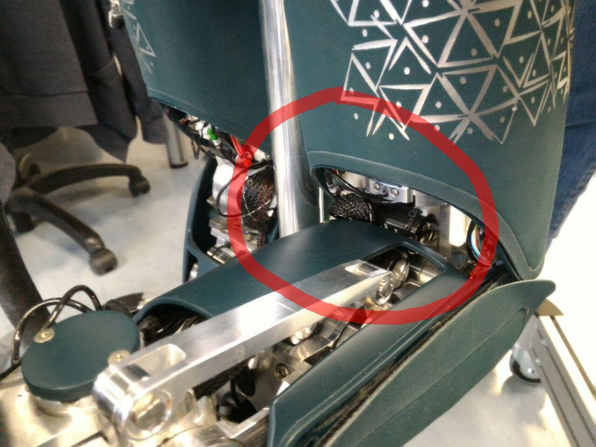
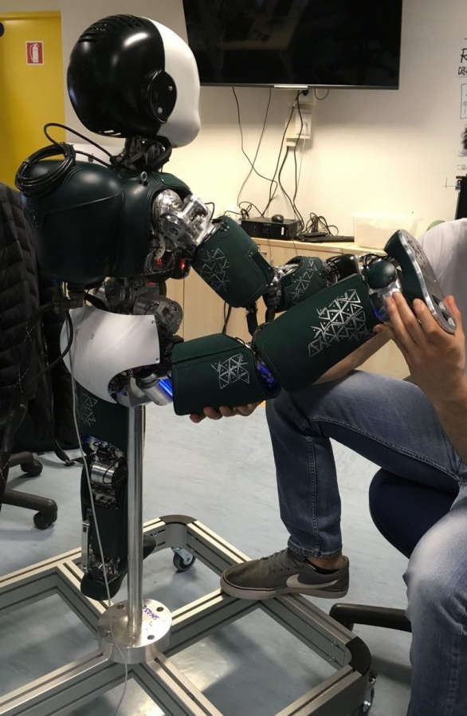
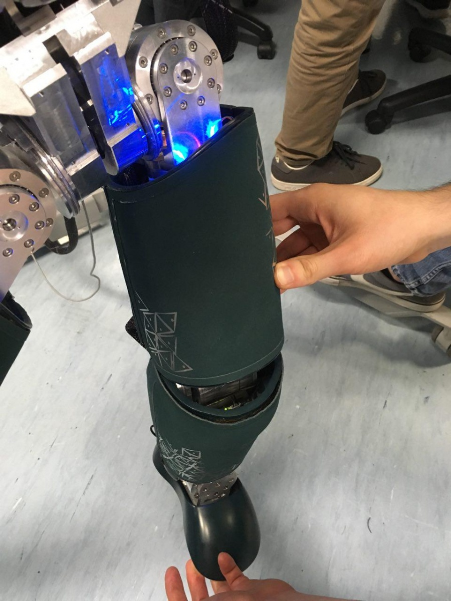
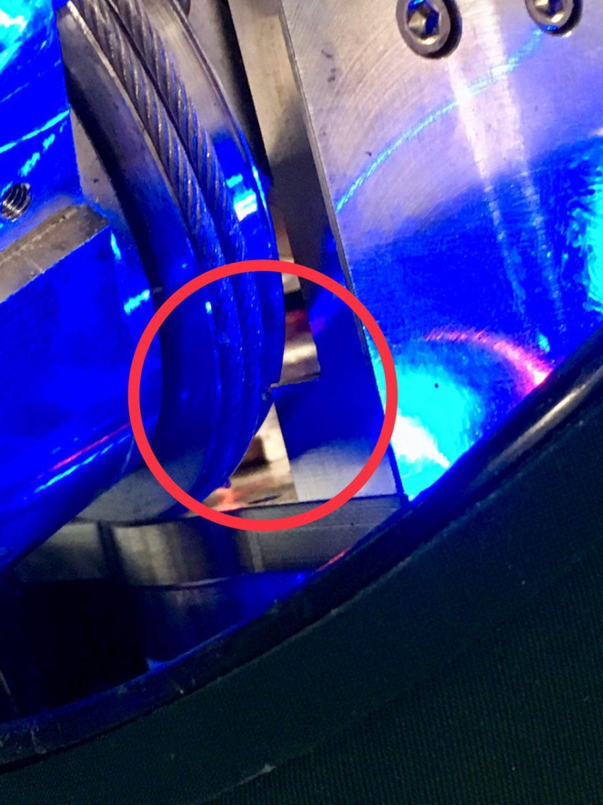

# **iCub Joints Limits**

## Range of motion and joints limits
---
Mechanical joints are characterized by a Range of Motion (RoM) which defines the admissible displacements. As an example, for rotational joints, the RoM defines the maximum angular displacement, while for prismatic joint, defines the maximum linear displacement. Generally, the RoM is enforced by "joints limits". In particular, once the joint "zero" (or nominal) configuration has been defined, the RoM can be described by 2 values: an upper limit and a lower limit.

In the case of iCub, the kinematic chains are constituted only by rotational joints, for which 3 different RoMs have been defined. Depending on the application, the user can implement a different RoM by modifying the values of the joints limits parameters in the hardware configuration files of motor control device. For more details about how to change the iCub hardware configuration files, please refer to [this guide](./../icub-robot-configuration/icub-robot-configuration.md).

- CAD RoM - "JOINT LEVEL": these limits define the range of motion of each joint considering only the mechanical hardware stops.
    - USE: manual hard-stop calibration (*).
    - DON'T USE: to run the robot.
- Hardware RoM - "KINEMATIC CHAIN LEVEL": these limits define the range of motion of each joint considering the entire kinematic chain of the iCub subassemblies (e.g. leg, arm). In particular, the "Hardware RoM" avoids self collisions and cover collisions between parent and child links, and prevents damages to the electrical wires.
    - USE: applications that require a large RoM for selected joints.
    - DON'T USE: when the robot is on the pole.
- Software RoM - "CONTROL LEVEL": these limits define the safest range of motion for each joint.
    - USE: daily use of the robot.
    - DON'T USE: -
    - 
(*) Refer to the [Notes](#notes) section at the end of the page for further details.

## iCub joints limits table
---

### iCub 2.5
| Joint name     | CAD Limits       | Hardware Limits | Software Limits |
|----------------|------------------|-----------------|-----------------|
| Neck pitch     |                  | \[-30, 22\]     | \[-30, 22\]     |
| Neck roll      |                  | \[-20, 20\]     | \[-20, 20\]     |
| Neck yaw       |                  | \[-45, 45\]     | \[-45, 45\]     |
| Torso yaw      |                  | \[-50, 50\]     | \[-50, 50\]     |
| Torso roll     |                  | \[-30, 30\]     | \[-30, 30\]     |
| Torso pitch    |                  | \[-20, 70\]     | \[-20, 70\]     |
| Shoulder pitch |                  | \[-95.5, 8\]    | \[-95.5, 8\]    |
| Shoulder roll  |                  | \[0, 160\]      | \[0, 160\]      |
| Shoulder yaw   |                  | \[-32, 80\]     | \[-32, 80\]     |
| Elbow          |                  | \[15, 106\]     | \[15, 106\]     |
| Hip pitch      | \[-46.5, 135.5\] | \[-30, 92\]     | \[-30, 85\]     |
| Hip roll       | \[-21, 121\]     | \[-15, 92\]     | \[0, 85\]       |
| Hip yaw        | \[-81, 81\]      | \[-72, 72\]     | \[-70, 70\]     |
| Knee           | \[-125, 4\]      | \[-100, 0\]     | \[-100, 0\]     |
| Ankle pitch    | \[-35, 35\]      | \[-30, 30\]     | \[-30, 30\]     |
| Ankle roll     | \[-26, 26\]      | \[-20, 20\]     | \[-20, 20\]     |

## Notes
---
- The knee joints of the iCub 2.5 can not reach the CAD 'lower limit' because of the electrical wires.

- The hip_roll joints of the iCub 2.5 can reach the CAD 'upper limit' only by moving the pitch and the yaw close to their CAD 'lower limits'.

- The hip_roll joints of the iCub 2.5 can not reach the CAD 'lower limit' because of a mechanic collision between the parent and child link.

|   |   |
|---|---|
| | |
