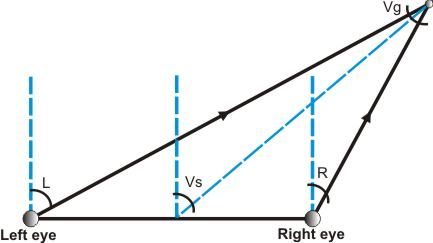

# **Vergence, Version and Disparity**

## VERGENCE ANGLE

`Vg = L - R`

where L is the angle of the left camera with respect to the homed optical axis (which is the cameras z-axis) as in the figure above; R is the angle of the right camera with respect to the homed optical axis.

## VERSION ANGLE

The version angle is the angle between the axis orthogonal to the baseline and passing through the baseline's midpoint and a line connecting this midpoint and the vergence point. The version angle satisfies the following nonlinear relation:

`tan(Vs) = (tan(L) + tan(R)) / 2`

However, the Firmware sends as version the following value:

`Vs = (L + R) / 2`

which holds for small angles (where `tan(x)≈x`), so that even though there is no lack of information since `L` and `R` angles can be accurately retrieved (see hereafter), the version `Vs` has physical meaning only for small values of `Vs`, L and R.

## CONVERTING [VERGENCE|VERSION] TO [DECOUPLED L|R]

Combining the above equations yields:

`L = Vs + Vg/2`

`R = Vs - Vg/2`

## DISPARITY

Disparity is defined as:

`d = xl - xr`

where `xl` is the left image normalized coordinate and xr is the right image normalized coordinate.
Object closer to the cameras than the current point of fixation, will elicit a positive disparity value.