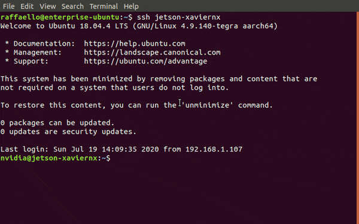

# Install jtop (OPTIONAL)

`jtop` (a.k.a [jetson-stats](https://github.com/rbonghi/jetson_stats)) is a package for monitoring and control your NVIDIA Jetson boards.



For installing it:

```bash
sudo -H pip install -U jetson-stats
```
