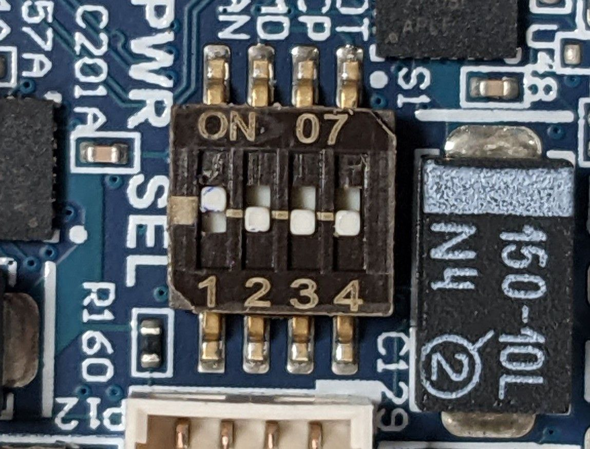

# The NVIDIA JetPack - Introduction

This guide is intended for developers who want to flash and set up the [Nvidia Jetson boards](https://www.nvidia.com/it-it/autonomous-machines/). These units use a [ConnectTech carrier board](https://connecttech.com/products/), so the preliminary instructions will be focused on that specific hardware. The table below shows _as an example_ the tested setup for each Nvidia board currently in use.

|Nvidia board|OS|JetPack |ConnectTech carrier board|BSP|
|:---:|:---:|:---:|:---:|:---:|
|Xavier AGX|Ubuntu 20.04|5.0.2|[Rogue](https://connecttech.com/product/rogue-carrier-nvidia-jetson-agx-xavier/)| [r35.0.1](https://connecttech.com/ftp/Drivers/L4T-Release-Notes/Jetson-AGX-Xavier/AGX-35.1.0.pdf)|
|Xavier NX|Ubuntu 18.04|4.6.2|[Quark](https://connecttech.com/product/quark-carrier-nvidia-jetson-xavier-nx/)|[r32.7.2](https://connecttech.com/ftp/Drivers/L4T-Release-Notes/Jetson-Xavier-NX/XAVIER-NX-32.7.2.pdf) |
|Orin NX|Ubuntu 20.04|5.1.2|[Boson for FRAMOS](https://connecttech.com/product/boson-for-framos-carrier-board-for-nvidia-jetson-xavier-nx/)|[r35.4.1](https://connecttech.com/ftp/Drivers/L4T-Release-Notes/Jetson-Orin-NX-Orin-Nano/ORIN-NX-NANO-35.4.1_.pdf) |

# Requirements

## Hardware
- x86 PC/laptop for downloading Jetpack and flashing the OS
- USB-C to USB-A (or USB-C to USB-C) cable to connect the PC to the ConnectTech carrier
- Power supply cable
- Bench/System/ATE programmable DC power supply, capable of supplying 20V/2A
- (optional) Ethernet cable to connect the board to access it with SSH

To use the Jetson board directly without SSHing into it:
- HDMI cable to connect to an external display
- USB mouse and keyboard

## Software
On the developer's host PC:

- Ubuntu 18.04-20.04 (depending on the version of the JetPack)
- Nvidia JetPack installed through SDK Manager (instructions below)
- [Connecttech BSP](https://connecttech.com/product/) **specific** for the `board_type` board (e.g. Xavier AGX, Orin NX) and JetPack `jetpack_ver` (e.g. 5.0.2, 5.1.2). (Not required if you already have the image ready to flash)

# Instructions

## Carrier hardware configuration
Each carrier board could be equipped with different switches that should be set at the startup. For example, for the `Rogue` carrier, make sure that the switches on the carrier are set like in the picture below, so that the unit can boot manually when pressing the power (PWR) button. DO NOT power on the unit until instructed.



## Hardware connection
1. Connect the carrier to the power supply through the provided cable, and set the power supply to 16V/2A.
2. Keep the power supply OFF.
3. Connect the HDMI cable, and the mouse/keyboard to the carrier.
4. Use the USB-C cable to connect the PC to the OTG USB port on the carrier.


## Flash a new image from scratch

If you need to install an new JetPack image from scratch please follow the following steps.

### Jetpack setup on the host 

1. Download the Nvidia SDK manager from the [official website](https://developer.nvidia.com/embedded/jetpack) by clicking *Download Nvidia SDK Manager*
2. Run SDKManager and login with developer.nvidia.com credentials, and follow these steps:
   1. Set the following options:
      - Target Hardware: Jetson `board_type`
      - Target operating system: *Linux Jetpack `jetpack_ver`*.
   2. Check that everything is selected and continue
   3. The SDKManager will ask the user password to download all the components and it will install them into a local folder on the host (~12Gb of free space required); remember: this is the password of the local Ubuntu host, not the Jetson one.
   4. After the installation, the SDK Manager will be ready to flash the OS image on the Nvidia board; **Do not preceed further!** Press SKIP to abort the operation and quit from the SDK Manager
3. Download the ConnectTech board support package from the [official website](https://connecttech.com/product/): under Downloads click on the BSP you need, it will be downloaded as `.tgz` archive.
4. At this point the `SDKManager` should have created a folder tree in `~/nvidia` containing all the files needed for the flash. Copy the `.tgz` package downloaded from ConnectTech website into `~/nvidia/nvidia_sdk/JetPack_<jetpack_ver>_Linux_<board_type>/Linux_for_Tegra/`
5. Extract the BSP: `tar -xzf CTI-<*>.tgz`
6. Now, go into the CTI-L4T directory: `cd ./CTI-L4T`
7. Run the install script (as root or sudo) to automatically install the BSP files to the correct locations: `sudo ./install.sh`

Before flashing the image, we need first to put the board in recovery mode.

### Booting the Nvidia Jetson board in Recovery mode

- With the **Nvidia Jetson Xavier AGX**:

  1. Press the Force Recovery (FR) button on the carrier and keep it pressed
  2. Turn on the power supply (16V)
  3. Wait for several seconds, keeping the FR button pressed
  4. Press the power (PWR) button for at least one second. Wait for several seconds
  5. Release the FR button.

   Now the board is in programming mode.

- With a **Nvidia Jetson Xavier NX**, instead, keep the button RST/RECOVERY pressed for several seconds and then, when released, the board will be in recovery mode.

- With the **Nvidia Jetson Orin NX**, the procedure is quite the same. The recovery mode could be achieved by pressing the Force Recovery and the Reset buttons simultaneously, then release the reset when the fan starts and, after ~2 sec, release the FR button too.

In order to check that the board went in recovery mode, run on a terminal in the host

```bash
watch lsusb
```

The board is in recovery mode if it appears something like this


### Flash the image

At this point we are ready to flash.

1. From the previously folder, do `cd ..` to return to the Linux_for_Tegra directory
2. Flash the image by running `sudo ./cti-flash.sh` script (otherwise you can use the manual flashing procedure).

!!! note
    For the `Jetson Orin NX` board, since it is equipped with the nvme disk, the flashing script to be launched is: `sudo ./cti-nvme-flash.sh cti/orin-nx/boson/base`

!!! tip

    Check out the [ConnectTech tutorial](https://connecttech.com/resource-center/kdb373/) explaining the complete procedure.

### Verify the installation
After the reboot process, you should be greeted with the OS configuration wizard.
After configuring the system, the Jetson board should boot normally and be ready to use.

### Post-flashing operations

#### Complete the OEM installation
After booting into the OS, follow the OEM installation with the following options:

1. Accept the license agreement
2. Select English language
3. Select the English (US) keyboard layout
4. Select the preferred time zone
5. Set the user name to `icub` with the hostname `icub-head-cam` or `ergocub` with hostname `ergocub-head`, depending on the robot the board will be mounted on
6. Allow login without password
7. Let the installation process finish

After rebooting into the graphical OS, run the following commands in a terminal to update the system:

```bash
sudo apt install -f
sudo apt update && sudo apt upgrade
```

#### Install the Cuda libraries (OPTIONAL)

Usually the Jetpack flashing procedure takes care of installing the Cuda toolkit and libraries. If running the command `nvcc --version` returns `Command not found`, then you need to install them manually though `apt`.

For example **Jetpack 4.5.1**, which uses **Cuda 10.2** do:

```bash
sudo apt install cuda-libraries-dev-10-1 cuda-nvcc-10-2
```

Then, within the `.bashrc`:

```bash
export CUDA_HOME=/usr/local/cuda-10.2
export LD_LIBRARY_PATH=$LD_LIBRARY_PATH:/usr/local/cuda-10.2/lib64:/usr/local/cuda-10.2/extras/CUPTI/lib64
export PATH=$PATH:$CUDA_HOME/bin
```

#### Install the latest CMake version (MANDATORY only for Ubuntu 18.04)
The latest Robotology superbuild version requires CMake >= 3.12, but Ubuntu 18.04 only provides CMake 3.10, so it needs to be upgraded.

To download the latest version, first remove CMake with:

```bash
sudo apt purge --auto-remove cmake
```

Get a copy of the signing key:

```bash
wget -O - https://apt.kitware.com/keys/kitware-archive-latest.asc 2>/dev/null | gpg --dearmor - | sudo tee /etc/apt/trusted.gpg.d/kitware.gpg >/dev/null
```

Add the repository:

```bash
sudo apt-add-repository "deb https://apt.kitware.com/ubuntu/ $(lsb_release -cs) main"
```

Update the repo index and install CMake:

```bash
sudo apt update
sudo apt install cmake
```

#### Install `librealsense` with Cuda support (OPTIONAL)

`librealsense` is a cross-platform library provided by Intel that can be used to take advantage of the features of the Intel Realsense cameras.
After installing the [cuda libraries](#install-the-cuda-libraries-optional), we can make the Realsense camera use also the gpu resources for better performances, enabling the cuda support.

In a terminal, clone the official repo with:

```bash
git clone https://github.com/IntelRealSense/librealsense.git
```

Install the librealsense required development packages:

```bash
sudo apt install libssl-dev freeglut3-dev libusb-1.0-0-dev pkg-config libgtk-3-dev unzip -y
```

Install the `udev` rules (the librealsense kernel patching procedure does not work with recent Jetpack versions):

```bash
sudo cp config/99-realsense-libusb.rules /etc/udev/rules.d/
sudo udevadm control --reload-rules && sudo udevadm trigger
```

Now you are ready to compile librealsense with Cuda support:

```bash
cd librealsense
mkdir build && cd build
cmake ../ -DFORCE_LIBUVC=BOOL:ON -DCMAKE_BUILD_TYPE=Release -DBUILD_WITH_CUDA=BOOL:ON -DBUILD_EXAMPLE=BOOL:OFF
make -j2
sudo make install
```

For more information, refer to the [official documentation](https://github.com/IntelRealSense/librealsense/blob/master/doc/installation_jetson.md) provided in the repository.


#### Install jtop (OPTIONAL)

`jtop` (a.k.a [jetson-stats](https://github.com/rbonghi/jetson_stats)) is a package for monitoring and control your NVIDIA Jetson boards.


For installing it:

```bash
sudo -H pip install -U jetson-stats
```

## Create a backup image

For this step you need to have completed the [steps about the sdkManager](#jetpack-setup-on-the-host).
Make sure that the Xavier was started in [recovery mode](#booting-the-xavier-in-recovery-mode) and it is found with `lsusb`.
On the host machine go to the `Linux_for_Tegra` folder and run:

```bash
cd ~/nvidia/nvidia_sdk/JetPack_<jetpack_ver>_Linux_<board_type>/Linux_for_Tegra
sudo ./flash.sh -r -k APP -G backup.img <board_identifier> mmcblk0p1
```

For example for flashing the NVIDIA Jetson Xavier NX, `board_identifier` is `jetson-xavier-nx-devkit-emmc`.

## Flashing a backup image

For this step you need to have completed the [steps about the sdkManager](#jetpack-setup-on-the-host) and also have successfully backed up a Jetpack image following [these steps](#create-a-backup-image).

```bash
cd ~/nvidia/nvidia_sdk/JetPack_<jetpack_ver>_Linux_<board_type>/Linux_for_Tegra
sudo mv bootloader/system.img* . #this save old image
sudo mv backup.img.raw bootloader/system.img #rename new image
sudo ./flash.sh -r jetson-xavier-nx-devkit-emmc mmcblk0p1
```
