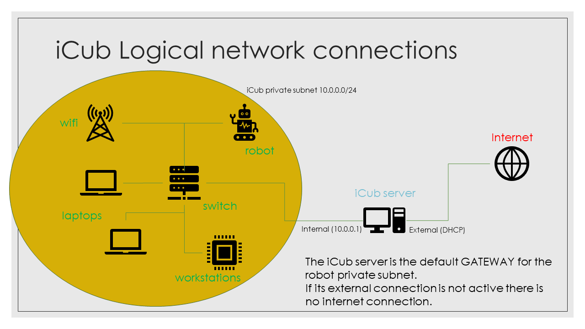

# iCub networking

The networking on icub can be divided in two parts:

- **internal (motor) networking** : it is a network that connects to icub-head and all the motor controller boards on the robot, it is a segregated network (there is no connection from the nodes on its subnet and the ouside world) and it is used to send motor commands from icub-head to motor control boards
- **extenal networking** : it is the network connection that connects icub-head to the robot private subnet; it is used to connect the robot to the other machines in its enviroments, to the icub-server and to internet; this connection cam _wired_ or _wireless_

It isa also available a _bluetooth_ connection on the icub-head, but it currently used only to read data from the battery controller in the robot backpack.

## The iCub private subnet

The icub private subnet is the subnnet that connects all the machines in the robot enmviroment, see the schema below



## icub-head network interfaces

On recent icub-head hardware there are 4 network interfaces:

- external cabled network - used to connect the icub-head to other machines in its enviroment, wired
- internal motor network - used to connect the icub-head to the onboard motor controllers
- external wireless network  - used to connect the icub-head to other machines in its enviroment, wireless
- bluetooth interface - used to connect the icub-head to the battery controller

## IP addresses and other network configurations

Below you can find the default network paramenters of the the main icub-head network (external and motor).

### Motor network configurations

This configuration depends deeply from the motor control board firware and thus it can't be changed

- **IP address** : 10.0.1.104 - _STATIC_
- **Netmask** : 255.255.255.0

since this is a segregated network, there is no default gateway.

### External network configurations

Usually it is a static configuration, but it works also in DHCP mode. This configuration _can be changed_ but it is not recommended

- **IP address** : 10.0.0.2
- **Netmask** : 255.255.255.0
- **Default Gateway** : 10.0.0.1
- **DNS server** : 10.0.0.1

# Networking implementation in iCubOS

# Basic principles

The basic idea is that to setup a [network bonding](https://docs.oracle.com/cd/E27300_01/E27309/html/vmusg-network-bonding.html) in active-passive mode with network and wifi connections, and the network has the role of master connection. So, if the network cable is connected to the robot, the traffic to icub-head passes through the cabled connection otherwise the system uses the wifi, but the connection keeps the same IP address. The switch is generally quite fast (couple of seconds), so we don't lose ssh connections to icub-head

## Netplan

Latest ubuntu uses [NETPLAN](https://netplan.io/) to configure the network via command line, so I setup netplan to create the above network bonding: netplan uses the configuration files it founds in the path
```
/etc/netplan/
```
on startup, netplan load all files in the above path **with the `.yaml` extension**
this behavior can be used to create several different configurations to choose from.

In icub-head we have many files in the `/etc/netplan` path

- `50-icub-static.yaml.notload` - a configuration file that uses **STATIC IP** for cabled network configuration (**no bonding, no wifi** - _THIS IS THE DEFAULT_ )
- `50-icub-dhcp.yaml.notload` - a configuration file that get IP for cabled network configuration from **DHCP server** (**no bonding, no wifi**)
- `50-icub-bonding-static.yaml.notload` - a configuration that **creates a bonding** with cabled network and WiFi and uses a **static IP** for the bonded connection
- `50-icub-bonding-dhcp.yaml.notload` - a configuration that **creates a bonding** with cabled network and WiFi and gets the IP for the bonded connection from **DHCP** server
- `50-icub.yaml` - a symbolic link that points to the active configuration

# Required configuration

There are some parameters that must be configured on each icub-head installation because they are hardware dependant (network interfaces names) or user-dependant (Wifi configuration)

## Network interfaces names

The names assigned to the network interfaces by the OS are hardware dependant, so on each new installation you must check that the name of the interfaces (internal, motor and wifi) written in the file  `/etc/netplan\50-icub.yaml` corresponds to the actual ones, shown by the commmand
 `ip link`

## WiFi

If wifi is used (see above), please change the Wifi configuration in the file  `/etc/netplan\50-icub.yaml` with youR _ESSID_ and _WiFi password_ in the lines below
 ```
   wifis:
     ...
     access-points:
       "please-put-your-ESSID-here":
         password: "please-put-your-wifi-password-here"
 ```
