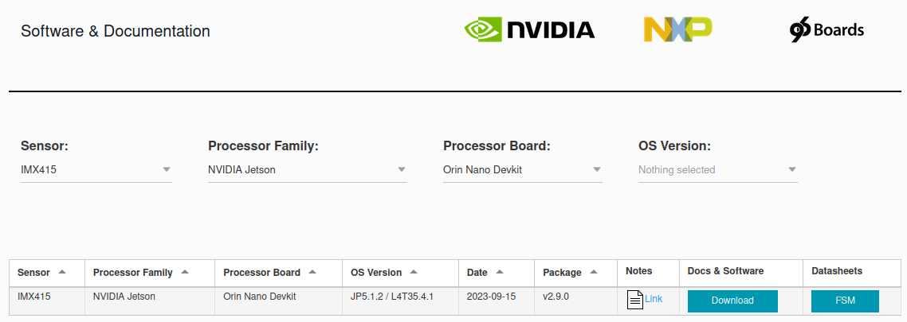

# Setup Orin NX for using with FRAMOS-IMX415-C

This guide aims to highlight the correct procedure to configure the setup for using the [`FRAMOS-IMX415`](https://www.framos.com/en/products/fsm-imx415-sensor-module-26361) cameras with the [`Orin NX`](https://www.nvidia.com/it-it/autonomous-machines/embedded-systems/jetson-orin/) from Nvidia + [`Boson for FRAMOS`](https://connecttech.com/product/boson-for-framos-carrier-board-for-nvidia-jetson-xavier-nx/) carrier from ConnectTech.

!!! info

    Be sure that the [Jetpack installation](./jetpack.md) procedure up to the BSP installation on the setup has been completed. At this point we are ready to flash the image.

### Flash the image

In the host:

1. Navigate into `/nvidia/nvidia_sdk_JetPack_5.1.2_Linux_JETSON_ORIN_NX_TARGETS/Linux_for_Tegra`
2. Run the flash script (as root or sudo):

   ```
   sudo ./cti-nvme-flash.sh cti/orin-nx/boson/fsm-imx415-2cam
   ```

3. Once the flash has completed, the board will reboot.

Check out the [ConnectTech tutorial](https://connecttech.com/resource-center/kdb373/) explaining the complete procedure.

### Complete the OEM installation
After booting into the OS, follow the OEM installation with the default options.

Set the user name to `ergocub` with the hostname `ergocub-head`. Allow login without password and let the installation process finish.

After rebooting into the graphical OS, run the following commands in a terminal to update the system:

```bash
sudo apt install -f
sudo apt update && sudo apt upgrade
reboot
```

### Switch profile on Orin NX
After the reboot process:

1. Open a new terminal on the Orin NX and run `sudo cti-orin-nx-nano-fdt.sh`
2. Follow the interactive procedure and select `Orin NX`, then `Boson NGX007` and finally the profile for the FRAMOS IMX415 cameras, i.e. `fsm-imx415-2cam`
3. Once the script exits, run `sync` and `reboot` to finalize the changes.

    

## Post-flashing operations

### Install FRAMOS drivers

From the [`FRAMOS Resource Center`](https://www.framos.com/en/fsm-startup), download the proper software by selecting the following entries:



Unzip the file in the folder you prefer, then navigate into and run:

```
sudo apt install ./framos-libsv_*_arm64.deb
```

As soon as the installation procedure has finished, please power off the Orin NX. Then plug-in your cameras to the `CAM1` and `CAM2` connectors, and finally power on the board again.

!!! warning  
    During the flashing procedure, the profile `fsm-imx415-2cam` has been selected, which means that two cameras could be used with this configuration. For this reason, only `CAM1` and `CAM2` connectors are enabled to read the data from the FRAMOS-IMX415, while CAM3 and CAM4 are not. Please, be sure that they are properly connected.

Check if the cameras are detected running `ls /dev/video*` from the command line.