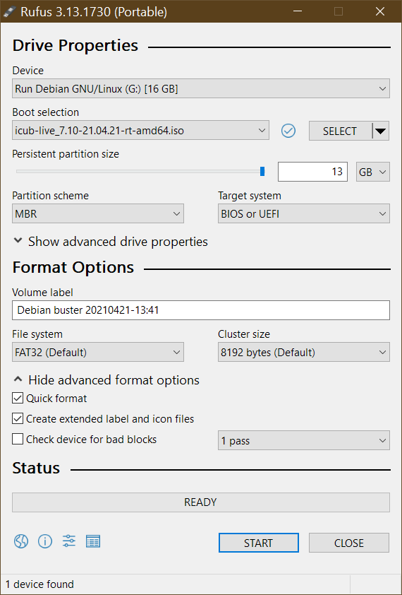

# Introduction
This page is ment to describe how a icub-live differs from a _vanilla_ debian live systems

## Note
_This page is valid ONLY for the PC104 image with version 5.0 and above_

# Additional Packages
The image is (at the moment of writing, version 7.10) based on a default Debian Buster (10) LIVE image, but with some additional packages:
```
build-essential
gcc
g++
make
gdb
cmake
cmake-curses-gui
pkg-config
libtinyxml-dev
libportaudio2
libace-dev
libgsl-dev
libopencv-dev
libpcap-dev
glade
libglademm-2.4-dev
libgtkmm-2.4-dev
libncurses5-dev
subversion
git
libraw1394-dev
libdc1394-22-dev
libpcap0.8
festival
swig
libreadline-dev
liblua5.2-dev
libeigen3-dev
libreadline5
portaudio19-dev
libboost-system-dev
sudo
ssh
openssh-server
nfs-common
ntpdate
libportaudiocpp0
libportaudio2
iperf
dnsutils
resolvconf
bash-completion
qtbase5-dev
qtdeclarative5-dev
qtmultimedia5-dev
qml-module-qtquick2
qml-module-qtquick-window2
qml-module-qtmultimedia
qml-module-qtquick-dialogs
qml-module-qtquick-controls
libqt5svg5
vim
less
iperf
dnsutils
alsa-utils
ethtool
usbutils
netcat-traditional
nmap
tcpdump
meld
bmon
unzip
```

# The kernel
The kernel used at the moment of writing is a x86 AMD64 kernel version  4.19.0-6 amd64 with Real Time patches (the rt-amd64 flavour).

# Custom files

## README, VERSION and ChangeLog
The following files, available in the root filesystem contains various informations about the LIVE release

- **README** : contains useful info about the LIVE imag and its requirements
- **VERSION** : contains version info (build version, build date and distro on which this build is created)
- **ChangeLog** : contains the release ChangeLog

# iCub startup scripts
Some scripts must to be executed at startup time, so we need to modify the rc.local file as follows

```
#!/bin/sh
#
# rc.local
#
# This script is executed at the end of each multiuser runlevel.
# Make sure that the script will "exit 0" on success or any other
# value on error.
#
# In order to enable or disable this script just change the execution
# bits.
#
# By default this script does nothing.
# run iCub config scripts
SCRIPT_DIR=/etc/rciCub.d
echo "Running scripts in $SCRIPT_DIR"
for filename in ${SCRIPT_DIR}/S*.sh; do
  echo "Running $filename"
  bash $filename
done

exit 0
```

In this way, all the startup scripts in /etc/rciCub.d are executed at boot time.

**Please note that some of the above scripts load kernel modules required by peripherals**

## The NTP script
This script is used to syncronize the PC104 clock with the one provided by icub-server (via NTP):

```
#!/bin/sh -e
#start script to synchronize data in a separated shell to avoid init process waiting for a response
/etc/rciCub.d/synchtime.sh &
exit 0
```

The above scrits only executes the following script in background

```
#!/bin/sh
sleep 30
for TRIALS in 0 1 2 3 4 5 6 7 8 9 ; do
  /usr/sbin/ntpdate-debian -u 2> /dev/null
  RESULT=$?
  if [ $RESULT -eq 0 ]; then
    echo "ntpdate synch OK "
    exit 0
  else
    sleep 20
  fi
done
echo "ntpdate synch failed: aborting!"
exit 1
```

## The mount script

This script is used to mount the remote NFS shares _only when the icub-server that exports them is reachable_

```
#! /bin/bash
# Mount remote filesystems
MOUNTS_FILE="/etc/rciCub.d/mounts.list"
PACKETS_PER_PING=10
MAX_RETRIES_N=3
SLEEP_TIME_SEC=5
PING_DEST="10.0.0.1"
echo "Mounting remote filesystems.."
COUNT=0
RETVAL=1
while [ "$COUNT" -lt "$MAX_RETRIES_N" ] && [ "$RETVAL" != "0" ]
do
  ping -c $PACKETS_PER_PING -q $PING_DEST
  RETVAL=$?
  if [ "$RETVAL" != "0" ]
  then
    echo "Failed to contact $PING_DEST, sleeping for $SLEEP_TIME_SEC seconds.."
    sleep $SLEEP_TIME_SEC
  fi
  (( COUNT += 1 ))
done
if [ "$RETVAL" != "0" ]
then
  echo " Failed: impossible to contact $PING_DEST"
  exit 1
fi
if [ ! -f "$MOUNTS_FILE" ]
then
  echo " Failed: remote mounts file $MOUNTS_FILE not found"
  exit 1
fi
mapfile -t MOUNTS_ARRAY  < $MOUNTS_FILE
for i in $(seq ${#MOUNTS_ARRAY[*]}); do
  if [ "${MOUNTS_ARRAY[$i]}" != "" ] && [ "${MOUNTS_ARRAY[$i]:0:1}" != "#" ]
  then
    SOURCE=$( echo ${MOUNTS_ARRAY[$i]} | awk '{ print $1}' )
    MOUNTPOINT=$( echo ${MOUNTS_ARRAY[$i]} | awk '{ print $2}' )
    FS_TYPE=$( echo ${MOUNTS_ARRAY[$i]} | awk '{ print $3}' )
    OPTIONS=$( echo ${MOUNTS_ARRAY[$i]} | awk '{ print $4}' )
    COUNT=0
    RETVAL=1
    while [ "$COUNT" -lt "$MAX_RETRIES_N" ] && [ "$RETVAL" != "0" ]
    do
      sleep $SLEEP_TIME_SEC
      echo "Mounting $SOURCE"
      mount -t $FS_TYPE -o $OPTIONS $SOURCE $MOUNTPOINT
      RETVAL=$?
      if [ "$RETVAL" != "0" ]
      then
        sleep $SLEEP_TIME_SEC
      fi
      (( COUNT += 1 ))
    done
  fi
done
exit 0
```

The mount.list file used by the mount script is as follows

```
# Source Dest_mountpoint FS_type options
# (please do not use blank spaces)
10.0.0.1:/exports/code /usr/local/src/robot nfs _netdev,auto,hard,intr
10.0.0.1:/exports/local_yarp /home/icub/.local/share/yarp nfs  _netdev,auto,hard,intr
```

# Kernel modules
The following kernel modules have been compiled manually and added to the system:
- AERFX2 driver
- CFW002 driver

Other files (libraries, header, UDEV scripts, start-up scripts, configuration files) required by each module have been added to the live image (see module specific instruction above).

The path `/usr/local/src` contains the modules source files

# Network configuration
The configuration is done via the file `/etc/network/interfaces` as follows

```
# The primary network interface (Motors network)
allow-hotplug eth0
iface eth0 inet static
  address 10.0.1.104
  netmask 255.255.255.0
auto eth0
# The secondary network interface (External network)
allow-hotplug eth1
iface eth1 inet static
  address 10.0.0.2
  netmask 255.255.255.0
  network 10.0.0.0
  broadcast 10.0.0.255
  gateway 10.0.0.1
  dns-nameservers 10.0.0.1 8.8.8.8
  dns-domain icub.local
  dns-search icub.local
auto eth1
```

# SSH configuration
In order to speed up SSH connection, the DNS lookup is disabled with parameter `UseDNS no` in SSH server configuration file `/etc/ssh/sshd_config`

Because the live system disables the password authentication at system startup, the script `/lib/live/config/9100-openssh-login` is used to enable it on starup by attind the following line to `/etc/ssh/sshd_config`
```
 PasswordAuthentication yes
```

# NTP configuration
We use icub-srv (10.0.0.1) as NTP server.

The package ntp is installed but not executed, so we add the followng line to `/etc/ntp.conf`
```
server 10.0.0.1
```

and we change the file `/etc/default/ntp` as follows
```
STARTUP_DISABLED='yes'
```

# NFS configuration
we mount the following two remote NFS shares from icub-srv
```
10.0.0.1:/exports/code /usr/local/src/robot nfs _netdev,auto,hard,intr
10.0.0.1:/exports/local_yarp /home/icub/.local/share/yarp nfs  _netdev,auto,hard,intr
```

So, the startup script is use to try to mount those shares, see `/etc/rc_iCub.d/s90_mount-remote-fs.sh`

 Moreover, in order to mount the above shares with the correct user rights, we add the following line to the file `/etc/default/nfs-common`
```
NEED_IDMAPD=yes
```

# Hostname
The hostname in `/etc/hostname` is set to
```
pc104
```

And the file `/etc/hosts` is as follows
```
127.0.0.1	localhost
127.0.1.1	pc104.icub.local pc104
10.0.0.1 	icubsrv
```

# User environment
The SKEL `/etc/skel` files are used to generate the desired user environment for the icub user modfing the following files

## .bashrc
```
#Load the iCub custom bashrc
ICUBRC_FILE="${HOME}/.bashrc_iCub"
if [ -f "$ICUBRC_FILE" ]; then
  source $ICUBRC_FILE
fi
.bashrc_iCub
# .bashrc_iCub
# setup the iCub enviroment
if [ "$ICUBRC_FILE_LOADED" ]; then
 return
fi
export ICUBRC_FILE_LOADED="true"
if [ "$PS1" ]; then
  echo "Setting up yarp and iCub env vars"
fi
# YARP and iCub enviroment variables
export ROBOT_CODE=/usr/local/src/robot
export ICUBcontrib_DIR=$ROBOT_CODE/iCubContrib
export YARP_ROOT=$ROBOT_CODE/yarp
export YARP_DIR=$YARP_ROOT/build
export ICUB_ROOT=${ROBOT_CODE}/icub-main
export ICUB_DIR=${ICUB_ROOT}/build
export icub_firmware_shared_DIR=${ROBOT_CODE}/icub-firmware-shared/build
export YARP_DATA_DIRS=${YARP_DIR}/share/yarp:${ICUB_DIR}/share/iCub:${ICUBcontrib_DIR}/share/ICUBcontrib
export FIRMWARE_BIN=${ROBOT_CODE}/icub-firmware/build
# Set the name of your robot here.
# Please change also the root user password
 export YARP_ROBOT_NAME=
 if [ "$YARP_ROBOT_NAME" = "" ] && [ -f "${ROBOT_CODE}/yarp_robot_name.txt" ]
 then
   export YARP_ROBOT_NAME=$( head --lines=1 ${ROBOT_CODE}/yarp_robot_name.txt )
 fi
# Set-up optimizations
export CMAKE_BUILD_TYPE=Release
export PATH=$PATH:$ICUB_DIR/bin:$YARP_DIR/bin
# DebugStream customization
export YARP_VERBOSE_OUTPUT=0
export YARP_COLORED_OUTPUT=1
export YARP_TRACE_ENABLE=0
export YARP_FORWARD_LOG_ENABLE=0
# To enable tab completion on yarp port names
if [ -f $YARP_ROOT/scripts/yarp_completion ]; then
  source $YARP_ROOT/scripts/yarp_completion
fi
```

## .gitconfig
```
[core]
       pager = less -FRSX
       editor = vim
       autocrlf = input
[merge]
       tool = vimdiff
[credential]
       helper = cache --timeout=7200
[branch]
       autosetuprebase = always
[user]
       name = iCub User
       email = robotcub-hackers@lists.sourceforge.net
```

## .ssh/authorized_keys
This file contains the key for passwordless login

## .local/share/yarp/REMOTEFS_NOT_MOUNTED
This is a placeholder for the remote mounted path

# Other improvements

## Real time
The following files are modified in order to obtain better real time networking performances

- `/etc/security/limits.d/icub.conf`
```
 icub	soft	rtprio	99
 icub	hard	rtprio	99
```
- `/etc/sysctl.d/20-net-rbuffer.conf`
```
# This sets the max OS receive buffer size for all types of connections
net.core.rmem_max=8388608
```

# How the iCub LIVE image is built
The iCub live ISO image is built with a custom script based on the Debian LIVE tools (included in the package live-build).

## The live-build script
You can find the script here: <https://github.com/icub-tech-iit/icub-os-files/tree/master/scripts/icub-live>
The script requires some additional packages to be installed (before starting, it checks for dependancies and if any is missing it installs the package). 
The script is based on the Debian live-build system and uses the configuration files and templates inside the folder [live-build](https://github.com/icub-tech-iit/icub-os-files/tree/master/scripts/icub-live/live-build). See the code on the [repository](https://github.com/icub-tech-iit/icub-os-files) for further details.

The script syntax is the following:
```
  icub_create-live [options] -s all|config|build|clean|cleancache|cleanall
``` 

The parameter STAGE is mandatory and can be one of the following:
```
  config - create config files
  build - build image based on config stage
  clean - cleanup build files
  cleancache - clean only cache
  cleanall - clean both build and cache files
  cleaniso - clean all iso and related files
  all - execute clean, config and build
 ```
Options are :
```
  -L LOG_FILE : logs to file LOG_FILE
  -D : compile the live system in debug mode
  -d : print defaults
  -h : print the help
```

eg.
```
icub_create-live -s all
```

If there are no errors, the script will produce an iso image along with its MD5 control file.

## How to create a bootable USB media with persistence from the iso
We used the [RUFUS](https://rufus.ie) for Windows to put the ISO on a USB memory stick. While it is possible to use any other similar tool that supports PERSISTENCE, we found that the PC104 board does not boot when the USB is burned usign some other tools, so it's **strongly** recommended to use RUFUS.

In RUFUS, just select the iSO image, the USB target pendrive and _enable the persistence_ (this will create a secondary partition on the disk where the modified files will are written) as below



The persistence requires an additional kernel booting parameter to be added in the file `\isolinux\live.cfg` where the line starting with `append boot=` must contain the keyword `persistence`, but the `icub_create-live` script already creates the above file with correct parameters: then, _the ISO file produced by the script does not require any further modification_.

## From USB pendrive to an IMG file
In order to distribuite easily PC104 OS releases, we create an IMG file from a bootable USB created as above, using the [Win32 Disk Imager tool](https://sourceforge.net/projects/win32diskimager/). 
