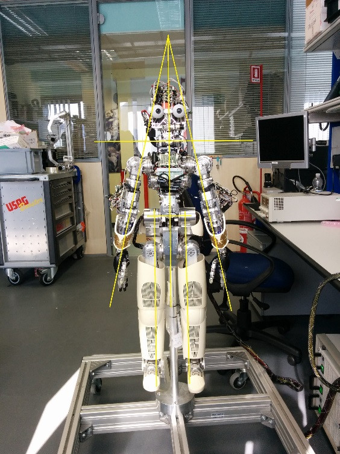
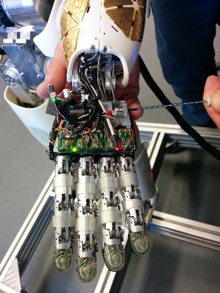
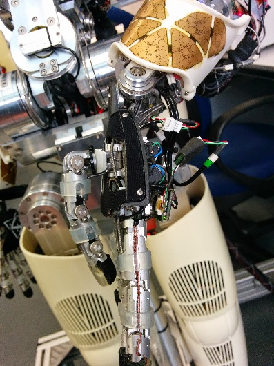
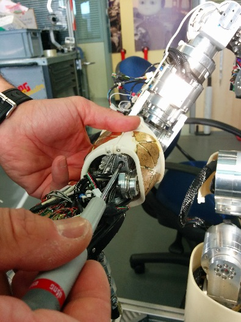

# Robot Calibration
This page shows how to calibrate the v1.3 CAN based robot.

## Preliminary actions

- Set the power supply at 40V, 10A and turn on the robot
- Place the robot in the `zero position` by hand (once calibrated a fine calibration will be done for a better result)

|   |   |
|---|---|
| | |

- On the server run `yarpmanager` and start the `icubsrv` an `pc104` clusters: 
  
`icub@icubsrv:~$ yarpmanager`


- Connect with the `pc104`: 

`icub@icubsrv:~$ ssh -X pc104`


## Run yarprobotinterface in calibration mode
First turn on the motors. Go to the robot folder:

    cd $ROBOT_CODE/robots-configurations/iCubRobotName

Edit the file **general.xml** and set the first two values as `true`: `skipCalibration` and `UseRawEncoderData`

```xml
<?xml version="1.0" encoding="UTF-8" ?>
<!DOCTYPE params PUBLIC "-//YARP//DTD yarprobotinterface 3.0//EN" "http://www.yarp.it/DTD/yarprobotinterfaceV3.0.dtd">

<params xmlns:xi="http://www.w3.org/2001/XInclude" portprefix="icub" build="1">
  
  <group name="GENERAL">
      <param name="skipCalibration">    true </param>
      <param name="useRawEncoderData">  true  </param>
      <param name="useLimitedPWM">      false  </param>
      <param name="verbose">            false  </param>
  </group>
</params>
```

The file `icub_all.xml` enables the calibration of all the robot parts (including the skin) - therefore you can comment the parts that you don't want to calibrate. If you are calibrating without the skin, comment the skin part and save in a new file.

Here is how the file `icub_all.xml` looks like:

```xml
<?xml version="1.0" encoding="UTF-8" ?>
<!DOCTYPE robot PUBLIC "-//YARP//DTD yarprobotinterface 3.0//EN" "http://www.yarp.it/DTD/yarprobotinterfaceV3.0.dtd">
<robot name="iCubLondon01" build="1" portprefix="icub" xmlns:xi="http://www.w3.org/2001/XInclude">
<devices>
    <!-- cartesian --> 
    <xi:include href="cartesian/left_arm_cartesian.xml" />
    <xi:include href="cartesian/right_arm_cartesian.xml" />
    
    <!-- motor controllers wrappers -->
    <xi:include href="wrappers/motorControl/left_arm_mc_wrapper.xml" />
    <xi:include href="wrappers/motorControl/right_arm_mc_wrapper.xml" />
    <xi:include href="wrappers/motorControl/left_leg_mc_wrapper.xml" />
    <xi:include href="wrappers/motorControl/right_leg_mc_wrapper.xml" />
    <xi:include href="wrappers/motorControl/head_mc_wrapper.xml" />
    <xi:include href="wrappers/motorControl/torso_mc_wrapper.xml" />
    <xi:include href="hardware/motorControl/icub_left_arm.xml" />
    <xi:include href="hardware/motorControl/icub_left_hand.xml" />
    <xi:include href="hardware/motorControl/icub_right_arm.xml" />
    <xi:include href="hardware/motorControl/icub_right_hand.xml" />
    <xi:include href="hardware/motorControl/icub_left_leg.xml" />
    <xi:include href="hardware/motorControl/icub_right_leg.xml" />
    <xi:include href="hardware/motorControl/icub_head.xml" />
    <xi:include href="hardware/motorControl/icub_torso.xml" />
    
    <!-- VIRTUAL ANALOG SERVERs -->
    <xi:include href="wrappers/VFT/left_arm_VFT_wrapper.xml" />
    <xi:include href="wrappers/VFT/left_leg_VFT_wrapper.xml" />
    <xi:include href="wrappers/VFT/right_arm_VFT_wrapper.xml" />
    <xi:include href="wrappers/VFT/right_leg_VFT_wrapper.xml" />
    <xi:include href="wrappers/VFT/torso_VFT_wrapper.xml" />
    <xi:include href="hardware/VFT/left_arm_virtual_strain.xml" />
    <xi:include href="hardware/VFT/left_leg_virtual_strain.xml" />
    <xi:include href="hardware/VFT/right_arm_virtual_strain.xml" />
    <xi:include href="hardware/VFT/right_leg_virtual_strain.xml" />
    <xi:include href="hardware/VFT/torso_virtual_strain.xml" />

    <!-- REAL ANALOG SENSORS -->
    <xi:include href="wrappers/FT/left_arm_FT_wrapper.xml" />
    <xi:include href="wrappers/FT/left_leg_FT_wrapper.xml" />
    <xi:include href="wrappers/FT/right_arm_FT_wrapper.xml" />
    <xi:include href="wrappers/FT/right_leg_FT_wrapper.xml" />
    <xi:include href="wrappers/MAIS/left_hand_mais_wrapper.xml" />
    <xi:include href="wrappers/MAIS/right_hand_mais_wrapper.xml" />
    <xi:include href="hardware/FT/left_arm_strain.xml" />
    <xi:include href="hardware/FT/left_leg_strain.xml" />
    <xi:include href="hardware/FT/right_arm_strain.xml" />
    <xi:include href="hardware/FT/right_leg_strain.xml" />
    <xi:include href="hardware/MAIS/left_hand_mais.xml" />
    <xi:include href="hardware/MAIS/right_hand_mais.xml" />

    <!-- SKIN -->
    <xi:include href="wrappers/skin/left_arm_skin_wrapper.xml" />
    <xi:include href="wrappers/skin/right_arm_skin_wrapper.xml" />
    <xi:include href="wrappers/skin/torso_skin_wrapper.xml" />
    <xi:include href="hardware/skin/left_arm.xml" />
    <xi:include href="hardware/skin/right_arm.xml" />
    <xi:include href="hardware/skin/torso.xml" />

    <!-- MTX INERTIAL SENSOR & SKIN INERTIAL SENSOR-->
    <xi:include href="wrappers/inertials/head-imuFilter_wrapper.xml" />
    <xi:include href="wrappers/inertials/head-imuFilter.xml" />
    <xi:include href="wrappers/inertials/head-inertials_wrapper.xml" />
    <xi:include href="wrappers/inertials/head-inertials_wrapper-deprecated.xml" />
    <xi:include href="hardware/inertials/head-inertial.xml" />
    <!--
    <xi:include href="wrappers/skin/left_hand_inertial_wrapper.xml" />
    <xi:include href="wrappers/skin/right_hand_inertial_wrapper.xml" />
    <xi:include href="hardware/skin/left_hand_inertial_mtb.xml" />
    <xi:include href="hardware/skin/right_hand_inertial_mtb.xml" />
    -->

    <!-- CALIBRATORS -->
    <xi:include href="calibrators/head_calib.xml" /> 
    <xi:include href="calibrators/torso_calib.xml" />
    <xi:include href="calibrators/right_leg_calib.xml" />
    <xi:include href="calibrators/left_leg_calib.xml" />
    <xi:include href="calibrators/left_arm_calib.xml" />
    <xi:include href="calibrators/right_arm_calib.xml" />
    <xi:include href="calibrators/left_hand_calib.xml" />
    <xi:include href="calibrators/right_hand_calib.xml" />
</devices>
</robot>

```
After ensuring that `icub_all.xml` is correct you can proceed with the calibration.

!!!warning
    PRESS THE FAULT BUTTON 

Run `yarprobotinterface` and wait for the robot calibration (press Enter multiple times).

✍️ Note: If you want to separately calibrate different parts of the robot (for example for a first check) you can create a new file .xml from icub_all and run it with the command `yarprobotinterface --config fileName.xml`

!!!info 
    After running yarprobotinterface you will see some errors messages related to the fault button pressed. 

## Calibration

- On the server/laptop run `yarpmotorgui` in order to check the joints encoder readings


!!!warning
    Use a `Windows` pc with `Microsoft Office` installed to have the correct behaviour of the `.xls` file macros.

### Head calibration (only head V2)
Open the `.xls` file in your robot folder (i.e. `iCub_Calibration_V1_3_1_iCubLondon01.xls`), and put the values read from `yarpmotorgui` in the correspondent cells.


!!!warning
    Take care that the `Delta` column has all values set to 0.

### Torso
Open the `.xls` file in your robot folder (i.e. `iCub_Calibration_V1_3_1_iCubLondon01.xls`), and put the values read from `yarpmotorgui` in the correspondent cells.


!!!warning
    Take care that the `Delta` column has all values set to 0.

## Hands calibration
Referring to the table below, using a screwdriver read the values `Min` and `Max` :

|Part|Joint#|Motor|Min|Max|
|---|---|---|---|---|
|Fingers abduction|7|->| | |
|Thumb abduction|8|->| | |
|Thumb proximal|9|| | |
|Thumb distal|10|| | |
|Index proximal|11|| | |
|Index distal|12|| | |
|Middle proximal|13|| | |
|Middle distal|14|| | |
|Ring and little|15|| | |


!!!warning
    Take care that values read respect the relationship :`Min` < `Max`
    Otherwise you have to move the magnet until you reach the above situation.

Open the `.xls` file in your robot folder (i.e. `iCub_Calibration_V1_3_1_iCubLondon01.xls`), and put the values read from `yarpmotorgui` in the correspondent cells.


!!!warning
    Take care that the `Delta` column has all values set to 0.

## Legs calibration 
Open the `.xls` file in your robot folder (i.e. `iCub_Calibration_V1_3_1_iCubLondon01.xls`), and put the values read from `yarpmotorgui` in the correspondent cells.


!!!warning
    Take care that the `Delta` column has all values set to 0.

## Arms Fine Calibration
Here's described how to correct small errors in the calibration of the iCub. It applies mainly to the shoulder and elbow joints (joint0...joint3) but can be applied also for the other joints of the arm.

!!!info
    This procedure has to be done after the calibration of the torso.

Put the iCub in a suitable posture and let's call this configuration `theta_desired` in accordance to the convention you decided to use. As an example, if you decide to use the convention described in [ICubForwardKinematics](./../icub-forward-kinmatics/../icub_kinematics/icub-forward-kinematics/icub-forward-kinematics.md), you might decide to use the posture in the pictures which corresponds to `theta_desired = [-90 15 15 90] [deg]` (remember we are just considering the three dof of the shoulder and the elbow, an example is given in the pictures below).

|   |   |   |
|---|---|---|
| | ||

The aim is to insert the calibration deltas in each arm's `Delta` column cells of the `.xls` file using the formula: `Delta = Theta - Theta_Desired`.

## Eyes calibration (only head V2)
The eyes mechanism has a total of three degrees of freedom. Both eyes can pan (independently) and tilt (simultaneously).


Thus the three joints to calibrate are: version (left-right movement), vergence (in-out) and tilt (up-down).

While the tilt can be calibrated by directly inserting the delta value in the `Delta` column cell of the `.xls` file, the version and vergence need to be calibrated as follows:

`Joint 4 (version): delta = |delta_j4| + |delta_j5|`

`Joint 5 (vergence): delta = |delta_j4| - |delta_j5|`

with sign to be chosen accordingly.

## Generate the new `.xml` files
In order to get the new `.xml` files you need to :

- Press`Generate Calibrators` button 

## Cameras calibration

### Get GUID from camera
Open a terminal on the pc104 and type :

```xml
  icub@pc104:~$ yarpdev --device grabberDual --subdevice dragonfly2 --name /cam0 --d 0 --allow-deprecated-devices
```

and you’ll get the info below


Now open a terminal on the server and type :

```xml
  icub@icubsrv:~$ yarpview --name /view0
  icub@icubsrv:~$ yarp connect /cam0 /view0
```

Check which camera is working and then put the “Unique ID” in the respective files in

```xml
$ROBOT_CODE/robots-configuration/<$YARP_ROBOT_NAME>/camera
```


Do all steps above again for the other camera, changing the `--d 0` parameter to `--d 1` in the first command.


### Calibrating cameras
Now you need to ensure that the 2 cameras are perfectly aligned with each other. In order to do this, show a black cross to the robot at a specific distance (see pictures below) and adjust the cameras until reaching the correct alignment.


- Run `yarprobotinterface` and wait for robot calibration.

- Run `yarpmanager`, open `Cameras` entity then run the 2 `yarpdev` modules and connect.

- Open and run ONLY the 2 yarpview modules and connect.

- In a terminal on the server type:

```xml
$ stereoCalib --from icubEyes.ini

```

!!!warning
    DO NOT open the StereoCalibration app directly from yarpmanager otherwise you will not be able to see the result of the calibration process.

- Then type:

```xml
$ yarp rpc /stereoCalibration/cmd
```

hen type “start”, a message “Starting Calibration…” will appear.

Now show the chess to the robot taking care to move it with a different inclination for each acquisition (30 in total). Stay still and just move the chessboard around. The chess needs to fit all the screen and be in landscape view. The system only acquire data if the colored lines appear over the chessboard.

In the terminal of the stereoCalib you should see:

```xml 
  Running Left Camera Calibration... 
  RMS error reported by calibrateCamera: 0.592978  
  Running Right Camera Calibration... 
  RMS error reported by calibrateCamera: 0.147403
  30 pairs have been successfully detected.
  Running stereo calibration ...
  done with RMS error= 0.717102
  average reprojection err = 0.958607
  Saving Calibration Results... 
  ```

!!!info
    To get good parameters you should see errors below 1.

❗ After calibration, you need to MANUALLY copy the calibration data inside the file iCubEyes.ini

📚 For additional info look [here](./icub-stereo-calib.md).