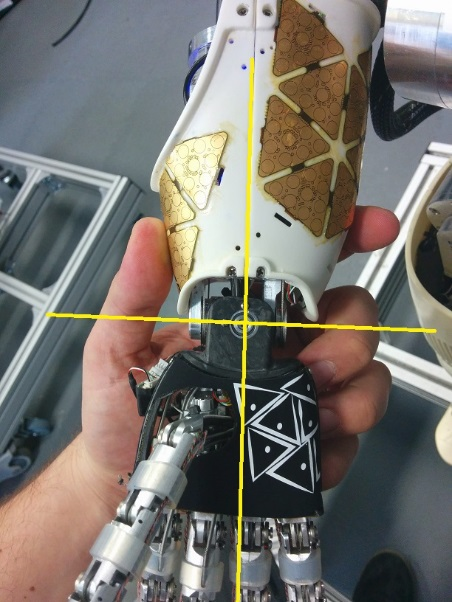
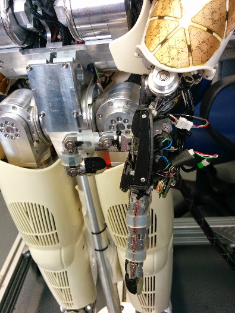
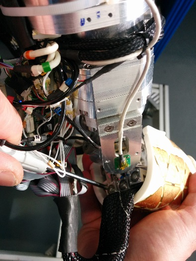
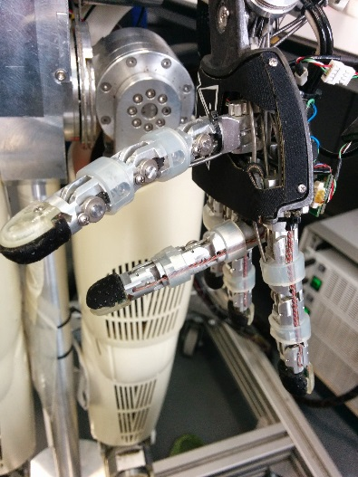
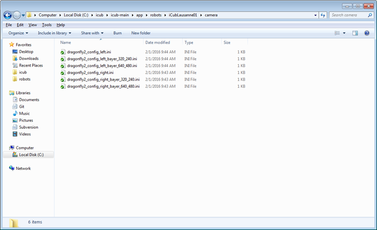

# Robot Calibration of iCub v2.X
This page shows how to calibrate the robot.

## Preliminary actions

- Set the power supply at 40V, 10A and turn on the robot
- Place the robot in the `zero position` by hand (once calibrated a fine calibration will be done for a better result)

|   |   |
|---|---|
| | |

- On the server run `yarpmanager` and start the `icubsrv` an `pc104` clusters: 
  
`icub@icubsrv:~$ yarpmanager`


- Connect with the `icub-head`: 

`icub@icubsrv:~$ ssh -X icub-head`


## Run yarprobotinterface in calibration mode
First turn on the motors. Go to the robot folder:

    cd $ROBOT_CODE/robots-configurations/iCubRobotName

Edit the file **general.xml** and set the first two values as `true`: `skipCalibration` and `UseRawEncoderData`

```xml
<?xml version="1.0" encoding="UTF-8" ?>
<!DOCTYPE params PUBLIC "-//YARP//DTD yarprobotinterface 3.0//EN" "http://www.yarp.it/DTD/yarprobotinterfaceV3.0.dtd">

<params xmlns:xi="http://www.w3.org/2001/XInclude" portprefix="icub" build="1">
  
  <group name="GENERAL">
      <param name="skipCalibration">    true </param>
      <param name="useRawEncoderData">  true  </param>
      <param name="useLimitedPWM">      false  </param>
      <param name="verbose">            false  </param>
  </group>
</params>
```

The file `icub_all.xml` enables the calibration of all the robot parts (including the skin) - therefore you can comment the parts that you don't want to calibrate. If you are calibrating without the skin, comment the skin part and save in a new file.

Here is how the file `icub_all.xml` looks like:

```xml
<?xml version="1.0" encoding="UTF-8" ?>
<!DOCTYPE robot PUBLIC "-//YARP//DTD yarprobotinterface 3.0//EN" "http://www.yarp.it/DTD/yarprobotinterfaceV3.0.dtd">

<robot name="iCubHongKong01" portprefix="icub" build="1">
    <params>
    <xi:include href="hardware/electronics/pc104.xml" />
    </params>
          
    <devices>
	
    <!-- CARTESIANS --> 
    <xi:include href="cartesian/left_arm-cartesian.xml" />
    <xi:include href="cartesian/right_arm-cartesian.xml" /> 
    
    <!-- HEAD -->
    <xi:include href="./hardware/motorControl/head-eb20-j0_1-mc.xml" />  
    <xi:include href="./hardware/motorControl/head-eb21-j2_5-mc.xml" /> 
    <xi:include href="./wrappers/motorControl/head-mc_wrapper.xml" /> 

    <!-- FACE -->
    <xi:include href="./hardware/motorControl/face-eb22-j0-mc.xml" /> 
    <xi:include href="./wrappers/motorControl/face-mc_wrapper.xml" /> 

    <!-- TORSO --> 
    <xi:include href="hardware/motorControl/torso-eb5-j0_2-mc.xml" />
    <xi:include href="wrappers/motorControl/torso-mc_wrapper.xml" /> 

    <!-- LEFT ARM -->
    <xi:include href="hardware/motorControl/left_arm-eb1-j0_3-mc.xml" />
    <xi:include href="hardware/motorControl/left_arm-eb24-j4_7-mc.xml" />
    <xi:include href="hardware/motorControl/left_arm-eb25-j8_11-mc.xml" />
    <xi:include href="hardware/motorControl/left_arm-eb26-j12_15-mc.xml" />
    <xi:include href="wrappers/motorControl/left_arm-mc_wrapper.xml" /> 

    <!-- RIGHT ARM -->
    <xi:include href="hardware/motorControl/right_arm-eb3-j0_3-mc.xml" />
    <xi:include href="hardware/motorControl/right_arm-eb27-j4_7-mc.xml" />
    <xi:include href="hardware/motorControl/right_arm-eb28-j8_11-mc.xml" />
    <xi:include href="hardware/motorControl/right_arm-eb29-j12_15-mc.xml" />
    <xi:include href="wrappers/motorControl/right_arm-mc_wrapper.xml" />

    <!-- LEFT LEG -->
    <xi:include href="hardware/motorControl/left_leg-eb6-j0_3-mc.xml" />
    <xi:include href="hardware/motorControl/left_leg-eb7-j4_5-mc.xml" />
    <xi:include href="wrappers/motorControl/left_leg-mc_wrapper.xml" /> 

    <!-- RIGHT LEG -->
    <xi:include href="hardware/motorControl/right_leg-eb8-j0_3-mc.xml" />
    <xi:include href="hardware/motorControl/right_leg-eb9-j4_5-mc.xml" />
    <xi:include href="wrappers/motorControl/right_leg-mc_wrapper.xml" />  

    <!-- INERTIAL SENSOR--> 
    <xi:include href="wrappers/inertials/head-imuFilter_wrapper.xml" />
    <xi:include href="wrappers/inertials/head-imuFilter.xml" />
    <xi:include href="wrappers/inertials/head-inertials_wrapper.xml" />
    <xi:include href="hardware/inertials/head-inertial.xml" />
    
    <!-- ANALOG SENSOR MAIS -->
    <xi:include href="wrappers/MAIS/left_arm-mais_wrapper.xml" /> 
    <xi:include href="wrappers/MAIS/right_arm-mais_wrapper.xml" /> 
    <xi:include href="hardware/MAIS/left_arm-eb26-j12_15-mais.xml" /> 
    <xi:include href="hardware/MAIS/right_arm-eb29-j12_15-mais.xml" />  
    
    <!--  SKINS  --> 
    <xi:include href="wrappers/skin/left_arm-skin_wrapper.xml" />
    <xi:include href="hardware/skin/left_arm-eb24-j4_7-skin.xml" />
    <xi:include href="wrappers/skin/right_arm-skin_wrapper.xml" />  
    <xi:include href="hardware/skin/right_arm-eb27-j4_7-skin.xml" /> 
    <xi:include href="wrappers/skin/left_leg-skin_wrapper.xml" />
    <xi:include href="wrappers/skin/right_leg-skin_wrapper.xml" />
    <xi:include href="hardware/skin/left_leg-eb10-skin.xml" />
    <xi:include href="hardware/skin/right_leg-eb11-skin.xml" />
    <xi:include href="wrappers/skin/torso-skin_wrapper.xml" />
    <xi:include href="hardware/skin/torso-eb22-skin.xml" />  
   
    <!-- ANALOG SENSOR FT -->
    <xi:include href="wrappers/FT/left_arm-FT_wrapper.xml" /> 
    <xi:include href="wrappers/FT/right_arm-FT_wrapper.xml" />
    <xi:include href="wrappers/FT/right_leg-FT_wrapper.xml" /> 
    <xi:include href="wrappers/FT/left_leg-FT_wrapper.xml" />
    <xi:include href="wrappers/FT/right_foot-FT_wrapper.xml" /> 
    <xi:include href="wrappers/FT/left_foot-FT_wrapper.xml" />
    <xi:include href="hardware/FT/left_arm-eb1-j0_3-strain.xml" /> 
    <xi:include href="hardware/FT/right_arm-eb3-j0_3-strain.xml" />
    <xi:include href="hardware/FT/left_leg-eb6-j0_3-strain.xml" /> 
    <xi:include href="hardware/FT/left_leg-eb7-j4_5-strain.xml" />
    <xi:include href="hardware/FT/right_leg-eb8-j0_3-strain.xml" /> 
    <xi:include href="hardware/FT/right_leg-eb9-j4_5-strain.xml" />   

    <!-- VIRTUAL ANALOG SENSORS (WRAPPER ONLY) -->
    <xi:include href="wrappers/VFT/left_arm-VFT_wrapper.xml" /> 
    <xi:include href="wrappers/VFT/right_leg-VFT_wrapper.xml" /> 
    <xi:include href="wrappers/VFT/left_leg-VFT_wrapper.xml" />     
    <xi:include href="wrappers/VFT/right_arm-VFT_wrapper.xml" /> 
    <xi:include href="wrappers/VFT/torso-VFT_wrapper.xml" />
    
    <!--  CALIBRATORS -->
    <xi:include href="calibrators/left_arm-calib.xml" />
    <xi:include href="calibrators/right_arm-calib.xml" /> 
    <xi:include href="calibrators/left_leg-calib.xml" />
    <xi:include href="calibrators/right_leg-calib.xml" />
    <xi:include href="calibrators/torso-calib.xml" />
    <xi:include href="calibrators/head-calib.xml" />
    <xi:include href="calibrators/face-calib.xml" />

    </devices>
</robot> 
```
After ensuring that `icub_all.xml` is correct you can proceed with the calibration.

!!!warning
    PRESS THE FAULT BUTTON 

Run `yarprobotinterface` and wait for the robot calibration (press Enter multiple times).

✍️ Note: If you want to separately calibrate different parts of the robot (for example for a first check) you can create a new file .xml from icub_all and run it with the command `yarprobotinterface --config fileName.xml`

!!!info 
    After running yarprobotinterface you will see some errors messages related to the fault button pressed. 

## Calibration
For the calibration of every part of the robot, there is a specific `.xml` file located in the `calibrators` folder (see [here for an example](https://github.com/robotology/robots-configuration/tree/master/iCubHongKong01/calibrators)). 

### Calibration types
There are different types of joints calibration, specified in the calibrationType parameter:

- **type 12**: you only need to insert the absolute value of the encoder in the `zero position`
- **type 5**: no need to insert values, it calibrates automatically (for instance pronosupination of the arm)
- **type 7**: you need to insert two values , `Vmax` and `Vmin` (for instance fingers abduction and thumb oppose)
- **type 6**: (fingers) you need to insert two values, `Vmax` and `Vmin`, orresponding to fingers closed (ideally 0) and open (ideally 255)

```xml
<?xml version="1.0" encoding="UTF-8" ?>
<!DOCTYPE devices PUBLIC "-//YARP//DTD yarprobotinterface 3.0//EN" "http://www.yarp.it/DTD/yarprobotinterfaceV3.0.dtd">


	<device xmlns:xi="http://www.w3.org/2001/XInclude" name="left_arm-calibrator" type="parametricCalibratorEth">
                <xi:include href="../general.xml" />

		<group name="GENERAL">
		    <param name="joints">16</param> <!-- the number of joints of the robot part -->
		    <param name="deviceName"> Left_Arm_Calibrator </param>
		</group>
		<!-- joint logical number                     0           1         2           3           4      5     6     7     8     9    10    11    12     13     14    15 -->
		<group name="HOME">
			<param name="positionHome">           -30        30         0          45           0     0      0    35    65     0     0     0     0      0      0     0  </param>
			<param name="velocityHome">           10         10         10         10           30    30     30   60    30    30    30    30    30     30     30    30  </param>
		</group>                                                                        
				                                                                
		<group name="CALIBRATION">                                                      
			<param name="calibrationType">        12         12         12         12           5      12     12    7     7     6     6     6     6      6      6     6     </param>
			<param name="calibration1">           12895   	 19391      57775      50843       -1500   28767  13823 0     0     0     0     0     0      0      0     0     </param>
			<param name="calibration2">	      0          0          0          0	    16384  0      0     0     0     9102  9102  9102  9102   9102   9102  3640  </param>
			<param name="calibration3">           0          0          0          0	    0      0      0     0     0    -1     1    -1     1     -1      1    -1     </param>
			<param name="calibration4">           0          0          0          0            0      0      0     2520  471   255   510   255   510    255    510   765   </param>
			<param name="calibration5">           0          0          0          0            0      0      0     3030  3436  26    5     26    55     5     20    164   </param>
			<param name="calibrationZero">        0          0          0          0            0      0      0     0     0     0     0     0     0      0      0     0     </param>
			<param name="calibrationDelta">       1.4       -5.7       -10        -3.5          0      4.7   -3.5   0     0     0     0     0     0     0      0      0     </param>
						                                                        
			<param name="startupPosition">       -35         30         0          50           0      0      0     15    30    0     0     0     0      0      0     0     </param>
			<param name="startupVelocity">        10         10         10         10           30     30     30    100   100   100   100   100   100    100    100   100   </param>
			<param name="startupMaxPwm">          2000       2000       2000       2000         2000   0      0     0     0     0     0     0     0      0      0     0     </param>
			<param name="startupPosThreshold">    2          2          2          2            90     90     90    90    90    90    90    90    90     90     90    90    </param>
		</group>

		<param name="CALIB_ORDER">(0 1 2 3) (4) (5 6 7) (8 9 11 13) (10 12 14 15) </param> 

		<action phase="startup" level="10" type="calibrate">
		    <param name="target">left_arm-mc_wrapper</param>
		</action>

		<action phase="interrupt1" level="1" type="park">
		    <param name="target">left_arm-mc_wrapper</param>
		</action>

		<action phase="interrupt3" level="1" type="abort" />

	</device>
```
- On hte server/laptop run `yarpmotorgui` in order to check the joints encoder readings


### Head calibration (only V2)
Open the [calibrator file](https://github.com/robotology/robots-configuration/blob/master/iCubHongKong01/calibrators/head-calib.xml), and put the values read from `yarpmotorgui` for the `joints 0,1,2,3` in the `<param name="calibration1">` inside the `<group name="CALIBRATION">`.

!!!info
    The joints params in the `xml` files are organized as:
    `Column 1 = Joint 0` ... `Column n = Joint n-1`.

```xml
 <group name="CALIBRATION">
        <param name="calibrationType">      12         12          12          12           5           5           </param>
        <param name="calibration1">   	    30600	31535       46239        6687	     3000        3000	        </param>
        <param name="calibration2">         0           0           0	        0        8192   	 8192           </param>
        <param name="calibration3">	        0	        0           0	        0	        0    	    0           </param> 
        <param name="calibration4">         0           0           0           0           0           0           </param>
        <param name="calibration5">         0           0           0           0           0           0           </param>                
        <param name="calibrationZero">      0           0           0           0           0           0           </param>
        <param name="calibrationDelta">     0           0           0           0           0           0           </param> 
      
        <param name="startupPosition">      0           0           0           0           0           0           </param>        
        <param name="startupVelocity">      10          10          20          20          20          20          </param>        
        <param name="startupMaxPwm">        3000        3000        3000        3000        0           0           </param>        
        <param name="startupPosThreshold">  90          90          2           2           2           2           </param>        
        </group> 
```

!!!warning
    Take care that the `<param name="calibrationDelta"> ` has all values seto to 0.

### Torso
Open the [calibrator file](https://github.com/robotology/robots-configuration/blob/master/iCubHongKong01/calibrators/torso-calib.xml), and put the values read from `yarpmotorgui` for the `joints 0,1,2` in the `<param name="calibration1">` inside the `<group name="CALIBRATION">`.

!!!info
    The joints params in the `xml` files are organized as:
    `Column 1 = Joint 0` ... `Column n = Joint n-1`.

```xml
 <group name="CALIBRATION">
		<param name="calibrationType">                    12                     12                        12       </param>
		<param name="calibration1">                       1535                11951                     36671       </param> 
		<param name="calibration2">                       0                       0                         0       </param> 
		<param name="calibration3">                       0                       0                         0       </param> 
		<param name="calibration4">                       0                       0                         0       </param>
		<param name="calibration5">                       0                       0                         0       </param>
		<param name="calibrationZero">                    0                       0                         0       </param>
		<param name="calibrationDelta">                   0                       0                         0       </param>

		<param name="startupPosition">                    0                       0                         0       </param>
		<param name="startupVelocity">                    10                      10                        10      </param>
		<param name="startupMaxPwm">                      5500                    5500                      5500    </param>
		<param name="startupPosThreshold">                2                       2                         2       </param>
 </group>
```

!!!warning
    Take care that the `<param name="calibrationDelta"> ` param has all values seto to 0.

## Arms calibration 
Open the [letf arm calibrator file](https://github.com/robotology/robots-configuration/blob/master/iCubHongKong01/calibrators/left_arm-calib.xml) or  [right arm calibrator file](https://github.com/robotology/robots-configuration/blob/master/iCubHongKong01/calibrators/right_arm-calib.xml), and put the values read from `yarpmotorgui` for the `joints 0,1,2,3` in the `<param name="calibration1">` inside the `<group name="CALIBRATION">`.

!!!info
    The joints params in the `xml` files are organized as:
    `Column 1 = Joint 0` ... `Column n = Joint n-1`.

```xml
 <group name="CALIBRATION">                                                      
			<param name="calibrationType">         12        12         12         12        5      12     12      7     7     6     6     6     6      6      6     6     </param>
			<param name="calibration1">         12895     19391      57775      50843     -1500  28767  13823      0     0     0     0     0     0      0      0     0     </param>
			<param name="calibration2">	            0         0          0          0	  16384      0      0      0     0  9102  9102  9102  9102   9102   9102  3640  </param>
			<param name="calibration3">             0         0          0          0	      0      0      0      0     0    -1     1    -1     1     -1      1    -1     </param>
			<param name="calibration4">             0         0          0          0         0      0      0   2520   471   255   510   255   510    255    510   765   </param>
			<param name="calibration5">             0         0          0          0         0      0      0   3030  3436    26     5    26    55     5     20    164   </param>
			<param name="calibrationZero">          0         0          0          0         0      0      0     0      0     0     0     0     0     0      0      0     </param>
			<param name="calibrationDelta">         0         0          0          0         0      0      0     0      0     0     0     0     0     0      0      0     </param>
						                                                        
			<param name="startupPosition">        -35        30          0         50         0      0      0    15     30     0     0     0     0      0      0     0     </param>
			<param name="startupVelocity">         10        10         10         10        30     30     30   100    100   100   100   100   100    100    100   100   </param>
			<param name="startupMaxPwm">         2000      2000       2000       2000      2000      0      0     0      0     0     0     0     0      0      0     0     </param>
			<param name="startupPosThreshold">      2         2          2          2        90     90     90    90     90    90    90    90    90     90     90    90    </param>
		</group>
```

!!!warning
    Take care that the `<param name="calibrationDelta"> ` param has all values seto to 0.

## Wrist calibration
Place the wrist in the `zero position` :

|   |   |
|---|---|
| | |

Open the [letf arm calibrator file](https://github.com/robotology/robots-configuration/blob/master/iCubHongKong01/calibrators/left_arm-calib.xml) or  [right arm calibrator file](https://github.com/robotology/robots-configuration/blob/master/iCubHongKong01/calibrators/right_arm-calib.xml), and put the values read from `yarpmotorgui` for the `joints 5,6` in the `<param name="calibration1">` inside the `<group name="CALIBRATION">`.

!!!info
    The joints params in the `xml` files are organized as:
    `Column 1 = Joint 0` ... `Column n = Joint n-1`.

```xml
 <group name="CALIBRATION">                                                      
			<param name="calibrationType">         12        12         12         12        5      12     12      7     7     6     6     6     6      6      6     6     </param>
			<param name="calibration1">         12895     19391      57775      50843     -1500  28767  13823      0     0     0     0     0     0      0      0     0     </param>
			<param name="calibration2">	            0         0          0          0	  16384      0      0      0     0  9102  9102  9102  9102   9102   9102  3640  </param>
			<param name="calibration3">             0         0          0          0	      0      0      0      0     0    -1     1    -1     1     -1      1    -1     </param>
			<param name="calibration4">             0         0          0          0         0      0      0   2520   471   255   510   255   510    255    510   765   </param>
			<param name="calibration5">             0         0          0          0         0      0      0   3030  3436    26     5    26    55     5     20    164   </param>
			<param name="calibrationZero">          0         0          0          0         0      0      0     0      0     0     0     0     0     0      0      0     </param>
			<param name="calibrationDelta">         0         0          0          0         0      0      0     0      0     0     0     0     0     0      0      0     </param>
						                                                        
			<param name="startupPosition">        -35        30          0         50         0      0      0    15     30     0     0     0     0      0      0     0     </param>
			<param name="startupVelocity">         10        10         10         10        30     30     30   100    100   100   100   100   100    100    100   100   </param>
			<param name="startupMaxPwm">         2000      2000       2000       2000      2000      0      0     0      0     0     0     0     0      0      0     0     </param>
			<param name="startupPosThreshold">      2         2          2          2        90     90     90    90     90    90    90    90    90     90     90    90    </param>
		</group>
```

!!!warning
    Take care that the `<param name="calibrationDelta"> ` param has all values seto to 0.

## Hands calibration
Referring to the table below, using a screwdriver read the values `Min` and `Max` :

|Part|Joint#|Motor|Min|Max|
|---|---|---|---|---|
|Fingers abduction|7|->| | |
|Thumb abduction|8|->| | |
|Thumb proximal|9|| | |
|Thumb distal|10|| | |
|Index proximal|11|| | |
|Index distal|12|| | |
|Middle proximal|13|| | |
|Middle distal|14|| | |
|Ring and little|15|| | |


!!!warning
    Take care that values read respect the relationship :`Min` < `Max`s
    Otherwise you have to move the magnet until you reach the above situation.

Open the [letf arm calibrator file](https://github.com/robotology/robots-configuration/blob/master/iCubHongKong01/calibrators/left_arm-calib.xml) or  [right arm calibrator file](https://github.com/robotology/robots-configuration/blob/master/iCubHongKong01/calibrators/right_arm-calib.xml), and put the values `Min` and `Max` read from `yarpmotorgui` respectively in the `<param name="calibration4">` and `<param name="calibration5">` inside the `<group name="CALIBRATION">` for each joint in the table above.

!!!info
    The joints params in the `xml` files are organized as:
    `Column 1 = Joint 0` ... `Column n = Joint n-1`.

```xml
<group name="CALIBRATION">                                                      
			<param name="calibrationType">         12        12         12         12        5      12     12      7     7     6     6     6     6      6      6     6     </param>
			<param name="calibration1">         12895     19391      57775      50843     -1500  28767  13823      0     0     0     0     0     0      0      0     0     </param>
			<param name="calibration2">	            0         0          0          0	  16384      0      0      0     0  9102  9102  9102  9102   9102   9102  3640  </param>
			<param name="calibration3">             0         0          0          0	      0      0      0      0     0    -1     1    -1     1     -1      1    -1     </param>
			<param name="calibration4">             0         0          0          0         0      0      0   2520   471   255   510   255   510    255    510   765   </param>
			<param name="calibration5">             0         0          0          0         0      0      0   3030  3436    26     5    26    55     5     20    164   </param>
			<param name="calibrationZero">          0         0          0          0         0      0      0     0      0     0     0     0     0     0      0      0     </param>
			<param name="calibrationDelta">         0         0          0          0         0      0      0     0      0     0     0     0     0     0      0      0     </param>
						                                                        
			<param name="startupPosition">        -35        30          0         50         0      0      0    15     30     0     0     0     0      0      0     0     </param>
			<param name="startupVelocity">         10        10         10         10        30     30     30   100    100   100   100   100   100    100    100   100   </param>
			<param name="startupMaxPwm">         2000      2000       2000       2000      2000      0      0     0      0     0     0     0     0      0      0     0     </param>
			<param name="startupPosThreshold">      2         2          2          2        90     90     90    90     90    90    90    90    90     90     90    90    </param>
</group>
```

!!!warning
    Take care that the `<param name="calibrationDelta"> ` param has all values seto to 0.

## Legs calibration 
Open the [letf leg calibrator file](https://github.com/robotology/robots-configuration/blob/master/iCubHongKong01/calibrators/left_leg-calib.xml) or  [right leg calibrator file](https://github.com/robotology/robots-configuration/blob/master/iCubHongKong01/calibrators/right_leg-calib.xml), and put the values read from `yarpmotorgui` for the `joints 0,1,2,3,4,5` in the `<param name="calibration1">` inside the `<group name="CALIBRATION">`.

!!!info
    The joints params in the `xml` files are organized as:
    `Column 1 = Joint 0` ... `Column n = Joint n-1`.

```xml
<group name="CALIBRATION">
    <param name="calibrationType">           12        12         12        12      12      12        </param>
    <param name="calibration1">              223      6239      57663      36031   63375   63535      </param> 
    <param name="calibration2">              0         0          0         0       0       0         </param> 
    <param name="calibration3">              0         0          0         0       0       0         </param> 
                                                                
    <param name="calibration4">              0         0          0         0       0       0         </param>
    <param name="calibration5">              0         0          0         0       0       0         </param>
    <param name="calibrationZero">           0         0          0         0       0       0         </param>
    <param name="calibrationDelta">          0         0          0         0       0       0         </param>


    <param name="startupPosition">           0         5          0         0       0       0         </param>
    <param name="startupVelocity">           5         5          10        10      10      10        </param>
    <param name="startupMaxPwm">             1200      1200       1200      1200    1500    1500      </param>
    <param name="startupPosThreshold">       2         2          2         2       2       2         </param>
</group>
```

!!!warning
    Take care that the `<param name="calibrationDelta"> ` param has all values seto to 0.

## Arms Fine Calibration
Here's described how to correct small errors in the calibration of the iCub. It applies mainly to the shoulder and elbow joints (joint0...joint3) but can be applied also for the other joints of the arm.

!!!info
    This procedure has to be done after the calibration of the torso.

Put the iCub in a suitable posture and let's call this configuration `theta_desired` in accordance to the convention you decided to use. As an example, if you decide to use the convention described in [ICubForwardKinematics](./../icub-forward-kinmatics/../icub_kinematics/icub-forward-kinematics/icub-forward-kinematics.md), you might decide to use the posture in the pictures which corresponds to `theta_desired = [-90 15 15 90] [deg]` (remember we are just considering the three dof of the shoulder and the elbow, an example is given in the pictures below).

|   |   |   |
|---|---|---|
| | ||

The aim is to insert the calibration deltas`<param name="calibrationDelta">` in each file using the formula: `Delta = Theta - Theta_Desired`.

## Eyes calibration
The eyes mechanism has a total of three degrees of freedom. Both eyes can pan (independently) and tilt (simultaneously).


Thus the three joints to calibrate are: version (left-right movement), vergence (in-out) and tilt (up-down).

While the tilt can be calibrated by directly inserting the delta value in the calibration file, the version and vergence need to be calibrated as follows:

`Joint 4 (version): delta = |delta_j4| + |delta_j5|`

`Joint 5 (vergence): delta = |delta_j4| - |delta_j5|`

with sign to be chosen accordingly.

## Cameras calibration

### Get GUID from camera
Open a terminal on the icub-head and type :

```xml
  icub@icub-head:~$ yarpdev --device grabberDual --subdevice dragonfly2 --name /cam0 --d 0 --allow-deprecated-devices
```

and you’ll get the info below


Now open a terminal on the server and type :

```xml
  icub@icubsrv:~$ yarpview --name /view0
  icub@icubsrv:~$ yarp connect /cam0 /view0
```

Check which camera is working and then put the “Unique ID” in the respective files in

```xml
$ROBOT_CODE/robots-configuration/<$YARP_ROBOT_NAME>/camera
```



Do all steps above again for the other camera, changing the `--d 0` parameter to `--d 1` in the first command.


### Calibrating cameras
Now you need to ensure that the 2 cameras are perfectly aligned with each other. In order to do this, show a black cross to the robot at a specific distance (see pictures below) and adjust the cameras until reaching the correct alignment.


- Run `yarprobotinterface` and wait for robot calibration.

- Run `yarpmanager`, open `Cameras` entity then run the 2 `yarpdev` modules and connect.

- Open and run ONLY the 2 yarpview modules and connect.

- In a terminal on the server type:

```xml
$ stereoCalib --from icubEyes.ini

```

!!!warning
    DO NOT open the `StereoCalibration` app directly from yarpmanager otherwise you will not be able to see the result of the calibration process.

- Then type:

```xml
$ yarp rpc /stereoCalib/cmd
```

hen type “start”, a message “Starting Calibration…” will appear.

Now show the chess to the robot taking care to move it with a different inclination for each acquisition (30 in total). Stay still and just move the chessboard around. The chess needs to fit all the screen and be in landscape view. The system only acquire data if the colored lines appear over the chessboard.

In the terminal of the stereoCalib you should see:

```xml 
  Running Left Camera Calibration... 
  RMS error reported by calibrateCamera: 0.592978  
  Running Right Camera Calibration... 
  RMS error reported by calibrateCamera: 0.147403
  30 pairs have been successfully detected.
  Running stereo calibration ...
  done with RMS error= 0.717102
  average reprojection err = 0.958607
  Saving Calibration Results... 
  ```

!!!info
    To get good parameters you should see errors below 1.

❗ After calibration, you need to MANUALLY copy the calibration data inside the file iCubEyes.ini

📚 For additional info look [here](./icub-stereo-calib.md).
