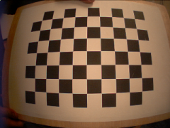
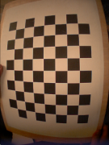

# Stereo calibration
In this tutorial we explain how to run the stereo calibration procedure with the stereoCalib module. Before starting the procedure print a chessboard calibration pattern. For convenience, you can find it in `$ICUB_ROOT/app/cameraCalibration/data`.

Make sure you have a config file, e.g. cameraCalib.ini, with the following parameters:

```xml
[STEREO_CALIBRATION_CONFIGURATION]
boardWidth W
boardHeight H
boardSize S
numberOfImages N
MonoCalib value
```

- The `boardWidth` W is the number of corners along the width direction of the chessboard pattern (e.g. 8 for the provided pattern).
- The `boardHeight` H is the number of corners along the height direction of the chessboard pattern (e.g. 6 for the provided pattern).
- The `boardSize` S specifies the length (in meters) of one side of the squares in the chessboard pattern.
- The `numberOfImages` N specifies the number of images used for the calibration procedure (usually 20-30).
- The `MonoCalib` value identifies if the module has to run the stereo calibration (Val=0) or the mono calibration (Val=1). For the mono calibration, connect only the camera that you want to calibrate.

The group [STEREO_CALIBRATION_CONFIGURATION] is the only one used by the module, all the other groups in the config file will be ignored. As default the stereoCalib module uses the iCubEyes.ini located in $ICUB_ROOT/app/cameraCalibration/conf.

To run the calibration module and all the connections, you can use the stereoCalib.xml.template file provided in: $ICUB_ROOT/app/cameraCalibration/scripts. Additional details on the created ports can be found in the stereoCalib module page. Notice that some ports are for special purposes and are not useful to regular users.

In order to start a calibration procedure open a new terminal and connect to the RPC port:

```xml
yarp rpc /stereoCalib/cmd
```

The calibration procedure can be started writing the command:

```xml
start
```

Show now the chessboard pattern in landscape mode (see examples below). Try to cover the most part of the images and show it in different image positions in order to obtain a complete distortion map. As feedback you should see the detected corners in the two yarpview(s). The procedure continues to acquire images automatically after a short delay between one image and the next one.

|Example of correct calibration image|Example of incorrect calibration image|
|---|---|
| | |

The values printed above are related to the average reprojection error of the 3D points to the image plane. To get good parameters you should see errors below 1 pixel.

The parameters will be saved in the output file located in the context of the module (default: $ICUB_ROOT/app/cameraCalibration/conf/outputCalib.ini).

An example of output calibration file is:

```xml
[CAMERA_CALIBRATION_RIGHT]
w 320
h 240
fx 215.483
fy 214.935
cx 174.868
cy 105.63
k1 -0.343166
k2 0.0987467
p1 -0.00180031
p2 -0.000303536

[CAMERA_CALIBRATION_LEFT]
w 320
h 240
fx 215.622
fy 215.056
cx 163.367
cy 111.212
k1 -0.367522
k2 0.132343
p1 -0.000399841
p2 -0.00016906

[STEREO_DISPARITY]
HN (0.996239 -0.016423 -0.0850726 -0.0667909 0.0189257 0.999409 0.0286955 -0.00388152 0.084551 -0.0301976 0.995961 -0.0128745 0 0 0 1)
QL ( 0.000000	 0.000000	 0.000000	-0.020714	-0.001918	 0.000767	-0.000575	-0.000048)
QR ( 0.000000	 0.000000	 0.000000	-0.020714	-0.001918	 0.000767	-0.000575	-0.000021)
```

The parameters w and h are the image resolution used during the calibration.

The parameters fx and fy are the focal lengths (along the x and y axes respectively) expressed in pixel units.

The point (cx, cy) is the principal points, and usually is the image center.

The values k1, k2, p1, p2 are the distortion coefficients.

In the [STEREO_DISPARITY] group the extrinsic parameters are saved. HN is the rototranslation matrix between the left and the right camera, whereas QL and QR are the torso and head angles used during the calibration procedure.

Additional information regarding the calibration parameters can be found in the [OpenCV Documentation](http://opencv.jp/opencv-2.2_org/cpp/calib3d_camera_calibration_and_3d_reconstruction.html).
