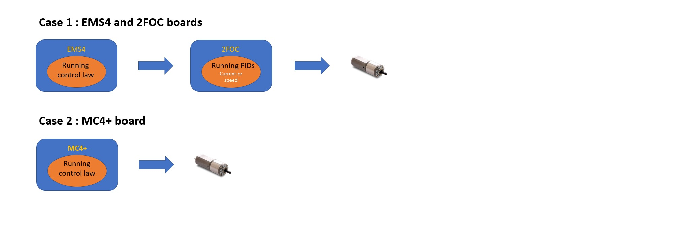
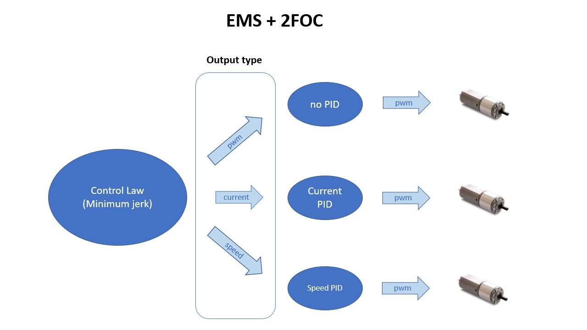

# Configuration of devices
To configure a device it is necessary some specific data depending on device type and information of electronic board it refers to. So, more devices can refer to the same electronic board: for example a motion control device and a skin device could share the same electronic board, this mean that the board can controller some joints and can read skin values at the same time. In following sections, you can find an overview of configuration of each device type, while the meaning of each parameter is describes in respective template file in folder `iCubTemplates/iCubTemplateVx_y` in the [`robots-configuration`](https://github.com/robotology/robots-configuration) repository. Currently the most recent version is `iCubTemplateV6_0`.

## Motor control device
Configuration of a motor control device is composed by the wiring, mechanicals and obviously by motor control specification related to joints it manages. In Ethernet robots, a motor control device corresponds to a motor control electronic board that manages from one up to twelve joints.

The entry point of motor control device configuration is the file named `body_part-ebX-jA_B-mc.xml`, that is included in `icub_all.xml`. This file contains all parameters that the robot's user can modify, for example PID and joints limits, and links other 4 files that only maintainers should modify. These other four files are:

 - `general.xml`: contains some flags that change behavior of the device
 - `body_part-ebX-jA_B-eln.xml`: contains description of electronic board , such as ip address, and specific parameters of communication protocol used by firmware and yarp devices.
 - `body_part-ebX-jA_B-mec.xml`: contains specific information about mechanics. Usually this file should be equal for all robots of same version.
 - `body_part-ebX-jA_B-mc_service.xml`: contains all the information necessary for the firmware to initialize the motion control service: it needs to know for each joint which is its pwm port, which is its encoder and where is connected.

It is important to notice that each parameter inside mechanicals, motion-control and motion-control-service files needs to have the same number of values of number of joints to configure.

## Motor Control on iCub
The motor control on the iCub robots is managed by three kinds of boards: `EMS4`, `2FOC`, and `MC4+`. It is performed in the following two ways:

 - **Case 1** : EMS4 + 2FOC In this case, the user must define the current and speed PIDs groups (that will be running on the 2FOC) in addition of the control law.

 - **Case 2**: MC4+ In this case, the user has to define the control law and the output is fixed to PWM

.

One of the major changes, starting from version 3.0, consists of introduction of CONTROLS tag: it allows the user to save in file different PID configurations and he/she can choose which configuration he/she wants to use depending on the experiment he/she wants to run on the robot. To do this, the user writes one or more sections of PID within the file and indicates the selected PID in the "CONTROLS" group.

Anyway, the user must be careful to respect the hardware configuration under use when tuning the PID gains in the control group. The control law is fixed to minimun jerk but the ouput of the PID depends on the HW configuration. Referring to the image above, we have currently [two kinds of HW configurations](../../icub_wiring/icub2_x.md#ethernet-backbone) available on the robot:

.

In this image, we can see in particular the configuration in the case of working with an EMS4 and 2FOC boards.

On the left we can see the possible PIDs running on the EMS4 board, then its output types, and then the PIDs that will be running on the 2FOC consequently.

The 2FOC Current Control is always required [with EMS+2FOC boards] even if the control reference from the EMS to the 2FOC is PWM or velocity for two reasons:

1. There is always a closed-loop current control that suppresses the Id (direct current). Our control model uses the Clarke-Park transform, combining the three-phase currents into two currents, quadrature and direct. The quadrature current generates the torque, while the direct current is totally dissipated as heat, and because of that its suppression is a good practice.

2. Even if the input reference is PWM or velocity, there is a closed-loop current control that is activated to reduce the current when it exceeds the peak current value. The output of this controller is subtracted from the pwm reference received from the EMS (PWM mode) or generated by the velocity closed loop of the 2FOC.

Refer to the [newest template](https://github.com/robotology/robots-configuration/blob/devel/iCubTemplates/iCubTemplateV6_0/hardware/motorControl/body_part--ebX-jA_B-mc.xml) for more details on the parameters and their values.

## FT sensor device
This device represents a Force-Torque sensor mounted on robot, so in its configuration there are information about its CAN address, to which Ethernet board it is connected, etc. See the template file for more details.

## Mais device
This device represents a mais sensor mounted on robot, so in its configuration there are information about its CAN address, to which Ethernet board it is connected, etc. See the template file for more details.

## Skin device
A skin device represents a part of skin of robot; usually the part corresponds to a body part of robot. To configure this device, its is necessary the list of mtb boards that belong to this part and some data to configure each tactile point. Since almost all tactile points uses the same configuration values, there is a parameter called “DefaultCfg”, that is the default configuration, but there is also a “SpecialCfg” parameter by which the user can specified different configuration value for some tactile points.

The configuration of this device is in two files: the entry point is `body_part-ebX-skin.xml`, where there are information about the location of mtb board and it includes `body_part-ebX-skinSpec.xml`, that contains tactile points configuration.

Please, see template file for more details.

## Inertial device
This device represents inertial sensors mounted on mtb boards connected to an Ethernet board. See [templates](https://github.com/robotology/robots-configuration/tree/master/iCubTemplates/iCubTemplateV6_0/hardware/inertials) for more details.