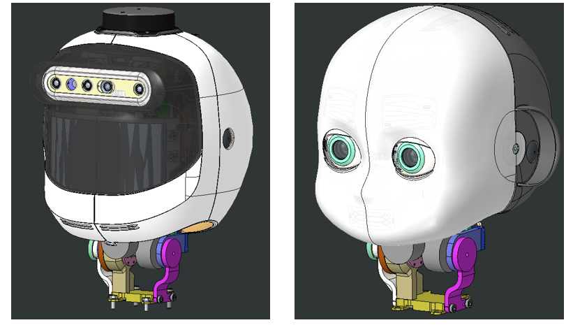

# Neck MK3

## Introduction

This documentation page describes the new ergoCub/iCub `Neck MK3`.
The development of the project has been carried out in https://github.com/icub-tech-iit/study-icub-headedge.

The MK3 solution sports a compact tendonless serial kinematics mechanism that was designed precisely to circumvent the issues observed with the tendons employed in the MK2 prototype.

The neck is compatible with both the ergoCub and iCub heads, with only minimal differences in the assembly.

<figure markdown="span">
    
</figure>

## General description

<figure markdown="span">
    
</figure>

Neck MK3 follows a 'SERIAL' configuration of joints in this order from bottom to top: `pitch`, `roll`, `yaw`. The interfaces with the head and the chest have been adapted to match the previous ones.

The selected motors for the joints are:

- [`FAULHABER_3216W024BXTH`](https://www.faulhaber.com/fileadmin/Import/Media/EN_3216_BXTH_DFF.pdf) for pitch and roll
<figure markdown="span">
    
</figure>

- [`FAULHABER_2214S024BXTH`](https://www.faulhaber.com/fileadmin/Import/Media/EN_2214_BXTH_DFF.pdf) for yaw
<figure markdown="span">
    
</figure>

Compared to the previous neck version, the MK3 neck designed for ergoCub is 10 mm higher, when measured from the pitch joint axis as in the figure below:

<figure markdown="span">
    
</figure>

The differences between the neck designed for iCub and the one for ergoCub are concerned with only two parts:

| Alias in ergoCub | Alias in iCub | Description  |   Images      |
|----------------------|--------|---------------|------------|
|     IC_033_P_044         |    IC_034_P_038    | This component features hardstops along the edge for the `pitch` joint. The difference between ErgoCub and iCub lies in the allowed range of motion to prevent interference: for ergoCub -45 to +22 degrees; for iCub -30 to +22 degrees | Figure A   |
|       IC_033_P_041       |    IC_034_P_033    | This part differs between the necks designed for ErgoCub and iCub in several aspects, including the overall height (the ErgoCub version is 10 mm taller) and the shape. In fact, in the version designed for iCub, it was necessary to carve out a space to allow the head frame to pass during yaw movement, which would otherwise cause interference  |  Figure B

<figure markdown="span">
    
</figure>

<figure markdown="span">
    
</figure>

## Range of Motion

### ergoCub

| Joint | degrees |
|----------------------|------|
|    PITCH       |   -45; +22   |
|       ROLL      |    -30; +30   |
|       YAW      |    -45; +45   |

### iCub

| Joint | degrees |
|----------------------|------|
|    PITCH       |   -30; +22   |
|       ROLL     |    -30; +30  |
|       YAW      |    -45; +45  |
