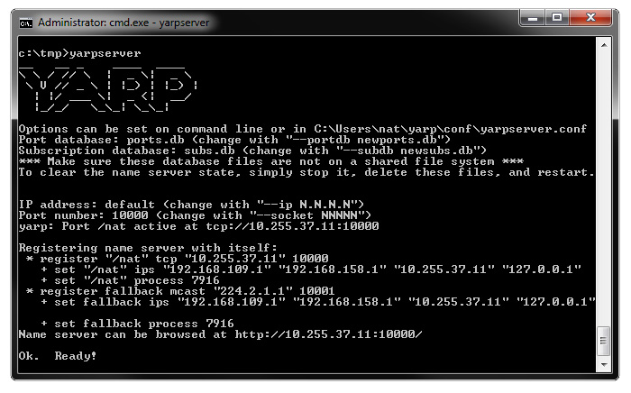
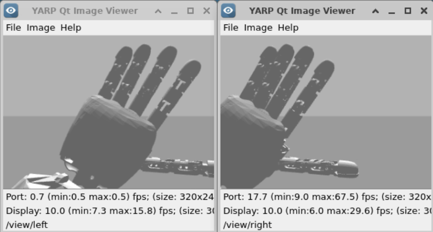
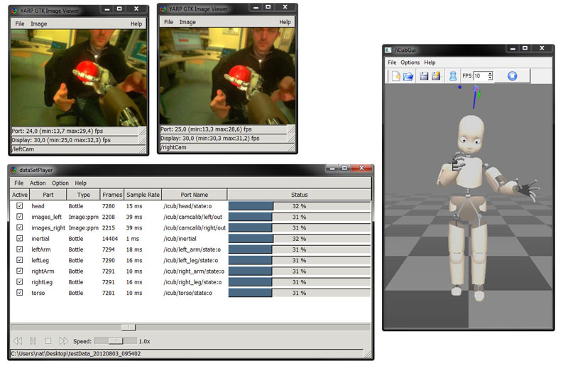

# Check your installation

This page will guide your through simple steps to check
that you have correctly installed YARP and the iCub software. We assume
you have followed all installations steps.

## Check YARP

First step is to have a yarpserver running.

In a terminal type:

```console
yarpserver
```

Depending on the system the console will look something like this:



If you type on a web browser `http://127.0.0.1:10000` you get
information about the name server (registered ports, info, etc.).

We can just check functionality by running a simple example. On another
terminal type:

```console
yarp read /portread
```

on a third terminal:

```console
yarp write /portwrite
```

and on yet another terminal:

```console
yarp connect /portwrite /portread
```

you'll see the effect on the name server:

```console
yarp: registration name /portwrite ip 127.0.0.1 port 10012 type tcp
yarp: registration name /portread ip 127.0.0.1 port 10002 type tcp
```

Now, anything typed on the yarp write will be sent and printed on the
read side.

## Check iCub
You can run the iCub simulator on Gazebo.
To this end, we need to grab some Gazebo specific configuration files.

Open a terminal and type in the following to get configured:

```console
git clone https://github.com/vvv-school/tutorial_joint-interface.git
cd tutorial_joint-interface
cmake -S . -B build
cmake --build build --target install
```

Finally, you can launch the simulator:

```console
gazebo tutorial_joint-interface.sdf
```

The simulator should open up in a new window:


Now you can move each joint individually using the `yarpmotorgui` tool.

On a different terminal type:

```console
yarpmotorgui --robot icubSim
```

Unselect the legs and click on <kbd>✔️ OK</kbd>


Select the `left_arm` and drag the position of each joint to move the
arm:


You can now view the output from the cameras. On different consoles, run
two viewers:

```console
yarpview --name /view/left
yarpview --name /view/right
```

and connect them:

```console
yarp connect /icubSim/cam/left/rgbImage:o /view/left
yarp connect /icubSim/cam/right/rgbImage:o /view/right
```



## Play a recorded sequence
You can also use the dataSetPlayer to replay a recorded sequence. This
will reproduce all the sensory information available on the real robot
during a simple experiment. Follow the instructions at https://yarp.it/latest/group__yarpdataplayer__example.html.



## Tutorials
Now you are ready to try our tutorials available at http://www.icub.eu/doc/icub-main/icub_tutorials.html.
