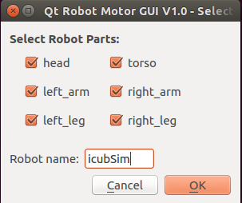
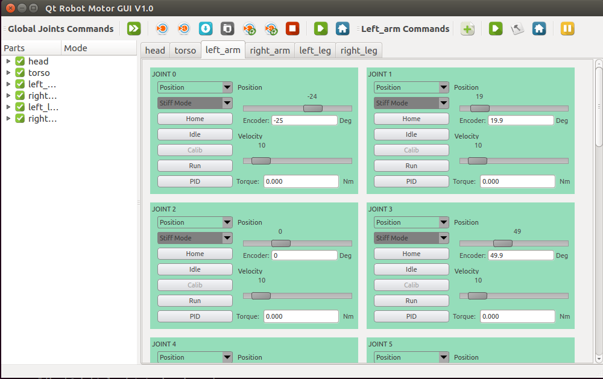
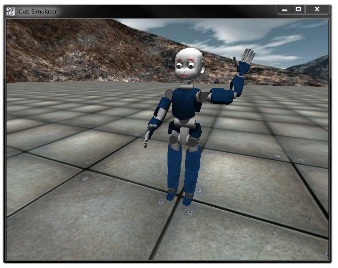

# Check your installation

This page will guide your through simple steps to check
that you have correctly installed YARP and the iCub software. We assume
you have followed all installations steps.

## Check YARP

First step is to have a yarpserver running.

In a terminal type:

~~~
yarpserver
~~~

Depending on the system the console will look something like this:

If you type on a web browser [http://127.0.0.1:10000](http://127.0.0.1:10000) you get
information about the name server (registered ports, info, etc.).

We can just check functionality by running a simple example. On another
terminal type:

~~~
yarp read /portread
~~~

on a third terminal:

~~~
yarp write /portwrite
~~~

and on yet another terminal:

~~~
yarp connect /portwrite /portread
~~~

you'll see the effect on the name server:

~~~
yarp: registration name /portwrite ip 127.0.0.1 port 10012 type tcp
yarp: registration name /portread ip 127.0.0.1 port 10002 type tcp
~~~

Now, anything typed on the yarp write will be sent and printed on the
read side.

## Check iCub
You can run the iCub simulator.

Open a terminal and type:

~~~
iCub_SIM
~~~

The simulator should open in a new window:

Now you can move each joint individually using the `yarpmotorgui` tool.

On a different terminal type:

~~~
yarpmotorgui
~~~

Modify the name of the robot: type *icubSim* in the edit window (see
below).

Select the `left_arm` and drag the position of each joint to move the
arm:

You can now view the output from the cameras. On different consoles, run
two viewers:

~~~
yarpview --name /view/left
yarpview --name /view/right
~~~

and connect them:

~~~
yarp connect /icubSim/cam/left /view/left
yarp connect /icubSim/cam/right /view/right
~~~

## Play a recorded sequence
You can also use the dataSetPlayer to replay a recorded sequence. This
will reproduce all the sensory information available on the real robot
during a simple experiment. Follow the instructions here [http://www.yarp.it/group__yarpdataplayerExample.html](http://www.yarp.it/group__yarpdataplayerExample.html).

## Tutorials
Now you are ready to try our tutorials available at [http://www.icub.eu/doc/icub-main/icub_tutorials.html](http://www.icub.eu/doc/icub-main/icub_tutorials.html).
