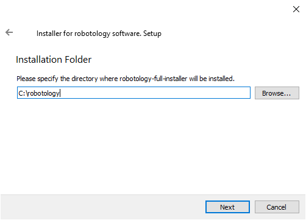
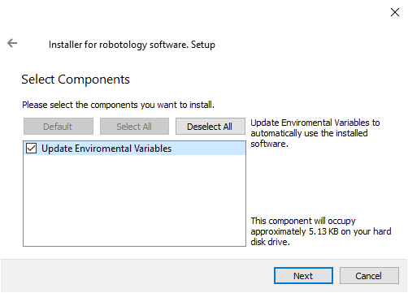

# Install iCub software from pre-compiled binaries on Windows

We support installation on Windows using the pre-compiled Windows installer available for the robotology-superbuild. For more info, check the [`robotology-superbuild` documentation](https://github.com/robotology/robotology-superbuild#windows-from-binaries). This page contains a recap of the instructions necessary to use this installer.

## Instructions

Download and execute the Robotology installer available from [`robotology-superbuild` releases](https://github.com/robotology/robotology-superbuild/releases). Pick up the binaries containing the `full-installer` file. When prompted with the dialog below, **do not change the destination directory** as the archive still contains a few packages that are not fully relocatable.

Keep the following checkbox ticked if you want the installer to update the environment variables.

##  Getting MS C++ Redistributable
Unless you already have the Microsoft Visual Studio installed on your machine, make sure that you have at least the [Microsoft Visual C++ Redistributable for Visual Studio 2015, 2017 and 2019](https://support.microsoft.com/en-us/help/2977003/the-latest-supported-visual-c-downloads) installed in your system. In particular, you can install the [64-bit version](https://aka.ms/vs/16/release/vc_redist.x64.exe).

## Check your installation
After you followed the installation instructions, you can check if your installation was successful by following the instructions in the [Check your installation](./check_your_installation.md) page.
