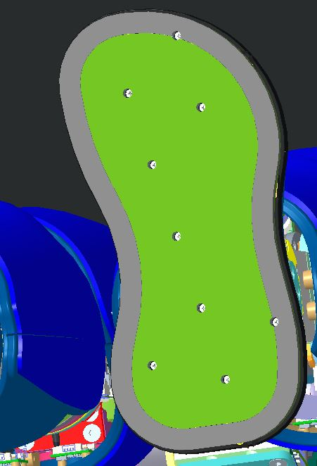
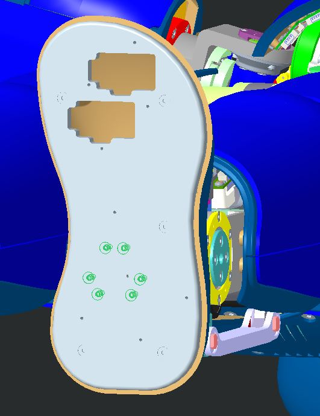
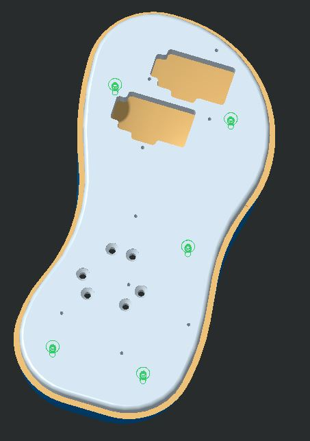
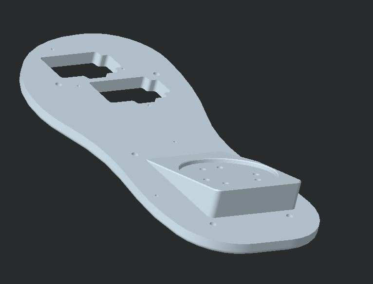

# KIT_007 Ankle for climbing stairs

# 🚧 AVAILABLE SOON 🚧

We are going to replace iCub feet plates in order to increase the step length and climb some stairs.

|       |       	          |
|   :--- |    :-----------           |
|    IIT alias (used as ordering reference)| KIT_007 |
|    Applicable to|iCub 2.4|
|Available onboard |available as an option|

## Content material

|  Pieces |     Alias    	          |          Description                        |  Cod. Wgst |
|   :---: |    :-----------:            |     :---:                                   |   :---:   |
|   1   | RC_IIT_028_P_001 | left foot shaped plate | 15058 |
|   1   | RC_IIT_028_P_002 | right foot shaped plate |15059|
| 12 | V3-8--_-_U5933_C | screw 3x8 – UNI5933 –hexagon socket countersunk head |2468|

## Assembly instruction

- First of all we need to remove the sensorized sole from the foot loosening the screws in picture

|  |
|:-----------------------------------------------------------: |
| the sole and its screws |

- Now we can separate the footplate and its cover loosening the screws green in picture

|  |
| :-----------------------------------------------------------: |
|  The neck with the pulleys in red |

- At this point we are going to separate cover and foot plate removing these screws

    | 
  
 |
    | :-----------------------------------------------: |
    |       how to separate foot plate from cover       |

- Now we can follow the procedure back mounting the cover on the new foot plate

    | 
  
 |
    | :--------------------------------------------------: |
    |                  the new foot plate                  |

- Tight it back to the robot using the screws provided in the UKIT_007.

- Mount back the sensorized sole using the same screws as before

