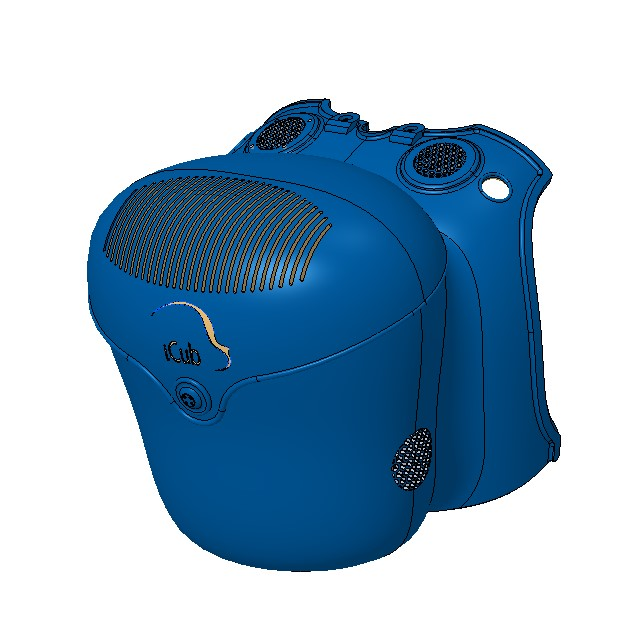
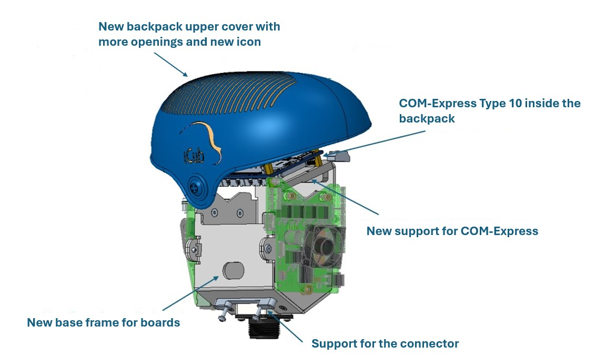
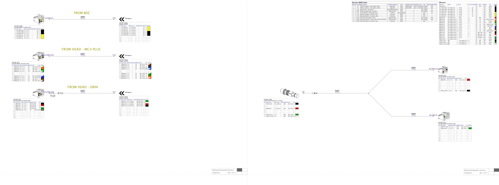
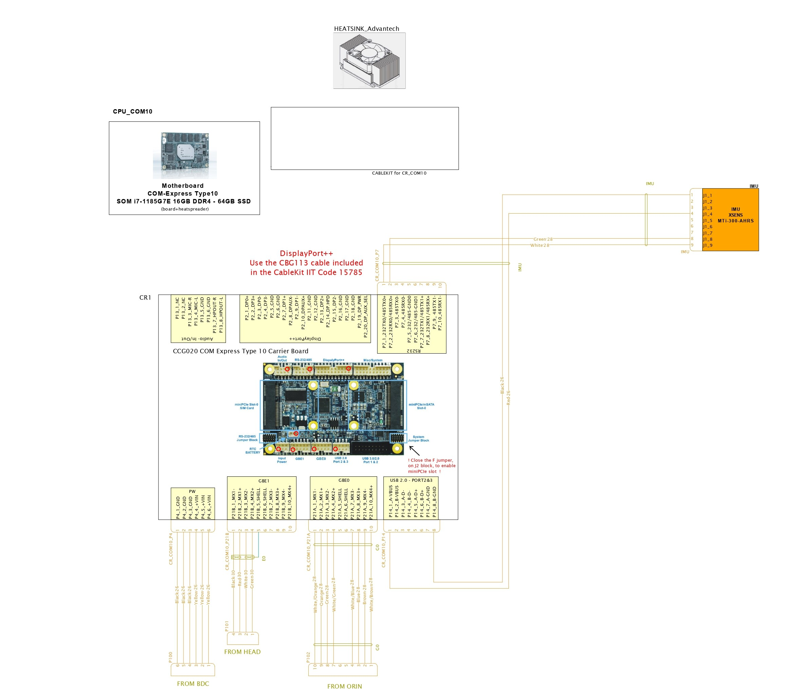

# KIT_010 iCub Backpack with COM-Express
!!! warning

    This UKIT is still a work in progress!

## Upgrade Kit

This upgrade kit is meant to update the iCub backpack with new accomodation for the COM-Express and new design for its upper cover.

<figure markdown="span">
    
</figure>

| | |
| :---: | :---: |
| IIT alias (used as ordering reference) | KIT_010 |
| Applicable to | iCub versions ≥ 2.x |
| Available onboard | – |

|  #  |     Code   |   Alias  |  Rev | UM |  Qty  |  Description |
|   :---: |   :---: |   :---: |   :---: |   :---: |   :---: |   :---: |
| 1 | 17831   | MKIT_010 |   | Pieces  |  1  |  iCub backpack update |
|  2  |  |		WKIT_010	 |	 	| Pieces	| 1	| iCub2.x, COM Express Type 10 (wiring) |
|  3  |  |		EKIT_010	 |	 	| Pieces	| 1	| iCub2.x, COM Express Type 10 (electronics) |

## Content material  MKIT_010

<figure markdown="span">
    
</figure>

| Alias                         | Description                                                                 | Code  | Rev | Qty |
|-------------------------------|-----------------------------------------------------------------------------|-------|-----|-----|
| M3X06-6LOBE-ISO14581-A2-70     | M3 x  6 , ISO14581, 6LOBE socket countersunk flat head screw, f. threaded, A2-70 | 15831 |     | 6   |
| M2_5X06-6LOBE-ISO14583-A2-70   | M2_5 x  6, ISO14583, 6LOBE socket pan head machine screw, fully threaded, A2-70 | 15993 |     | 4   |
| IC_034_G_029                   | BASE FRAME for boards                                                        | 18400 | A1   | 1   |
| IC_034_G_030                   | Support for COM with inserts                                                 | 18401 | A1   | 1   |
| IC_034_G_031                   | Support for connector with inserts                                           | 18402 | 0   | 1   |
| IC_034_G_034                   | Cover backpack assy                                                          | 18405 | 0   | 1   |
| RC_IIT_025_P_130               | Hinge for backpack                                                           | 13615 | A3  | 1   |

## Content material  WKIT_010

|  Code  | BOM |  Alias | Rev |  Qty | Description      |
|:-----:|:---:|:--------------:|:---:|--------:|:------------------:|
                                     |

| 🔘 Click to download the PDF |
| :---: |
|  |

## Content material  EKIT_010
|  Pieces |     Alias    |    Rev    |  Description       |  Code Wgst |
|   :---: |    :-----------:      |     :---: |   :---:   |   :---:   |
| 1 | CONNECTTECH_CCG020 | | Carrier Board for COM-Express Type10, Connecttech CCG020 | 15301 |
| 1 | KONTRON_34099-0000-99-0_R2_1 | | COMe mini Active Uni Cooler (w/o HSP) | 15626 |
| 1 | CKG035 | | CableKit for Carrier Board COM-Express Type10, CCG020 | 15785 |
| 1 | ADVANTECH_SOM-7583C7-S8A1 | | COM-Express Type10, Advantech SOM i7-1185G7E 16GB DDR4, 64GB SSD | 16252 |

Draft Logic schematic

| 🔘 Click to download the PDF |
| :-------------------------: |
|  |

## Assembly instruction

### Assembly sequence

## Software instructions

