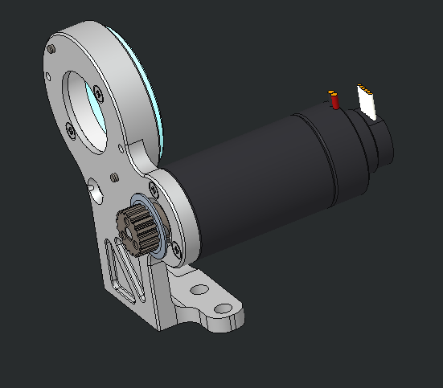
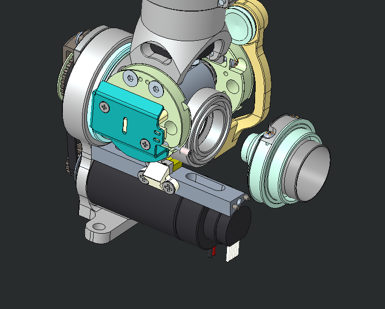

# KIT_006 Update of differential neck pulley for iCub

We are going to replace parts in the neck, you can either operate with the head's covers mounted or not (probably more comfortable).
It is possible to work with leaving the head attached to the robot or not.

|       |       	          |
|   :--- |    :-----------           |
|    IIT alias (used as ordering reference)| KIT_006  |
|    Applicable to|iCub, head V2| 
|Available onboard |since iCub SN 043 (August 2020)|

## Content material

|  Pieces |     Alias    	          |          Description                        |  Cod. Wgst |
|   :---: |    :-----------:            |     :---:                                   |   :---:   |
|    2   | RC_IIT_010_P_071   | Differential neck HFUC pulley                       | 6791 |
|    4   | V2-3--_-_ISO7045_CZ |       M 2 x 3 – ISO7045 – SS A2              |2425|

## Assembly instruction

We are going to replace the part in the following picture with its new version A2, this is really similar to the previous one but the groove (red in picture) which is now smaller.

|  |
|:-----------------------------------------------------------: |
|  The pulley part to be changed |

There are two of these parts  in iCub's neck. Here is a picture of the neck with the parts in red.

|  |
| :-----------------------------------------------------------: |
|  The neck with the pulleys in red |

Here are the instructions for replacing the left pulley.

- First of all you need to remove tendons from the neck. [Neck's tendons replacement](../../icub_tendons/neck.md)
- Remove the green highlighted assembly loosening the screws indicated by arrows

    | 
  
 |
    | :-----------------------------------------------------------: |
    |  tbd |

- Untight the screw shown in left picture to extract the whole motor assembly shown on the right.

    | 
  
 |  
  
 |
    | :----: | :----: |
    | The whole neck | The motor assembly |

- Gently remove pulley's assembly as on left picture and remove the flex spline from the pulley untightening the screw shown on rigth.

    | 
  
 |  
  
 |
    | :----: | :----: |
    | pulley assembly |  the screw to remove    |

- Repeat the procedure above to extract  the rigth pulley.
- When the two old pulleys are removed,  mount back the new ones by following instructions in reverse.
