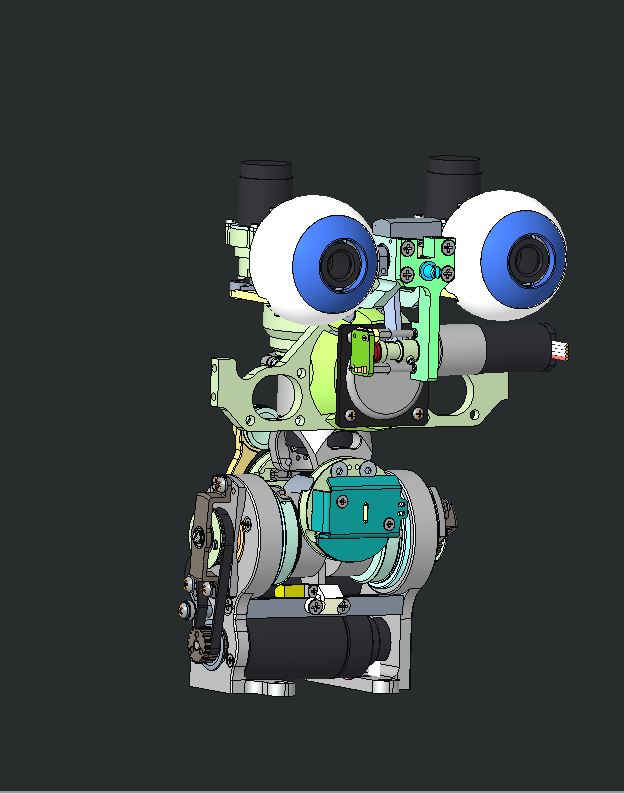
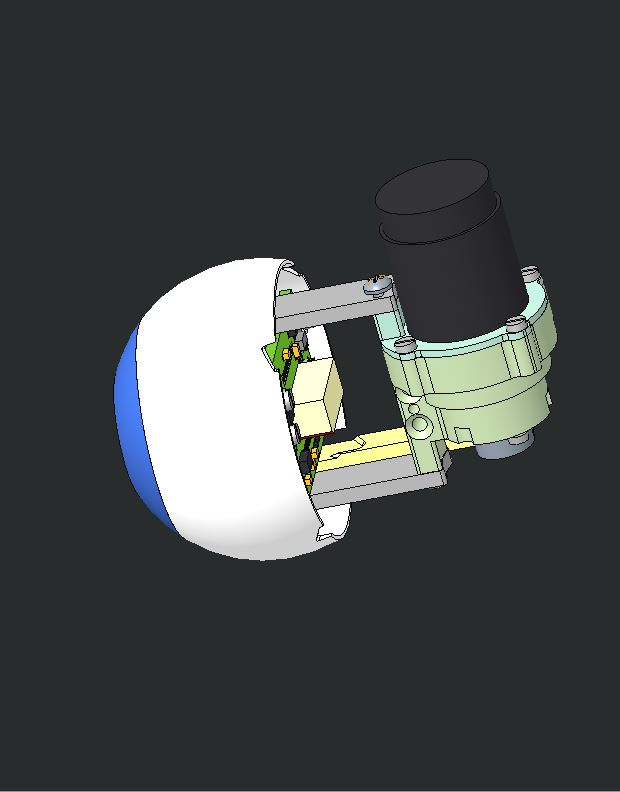
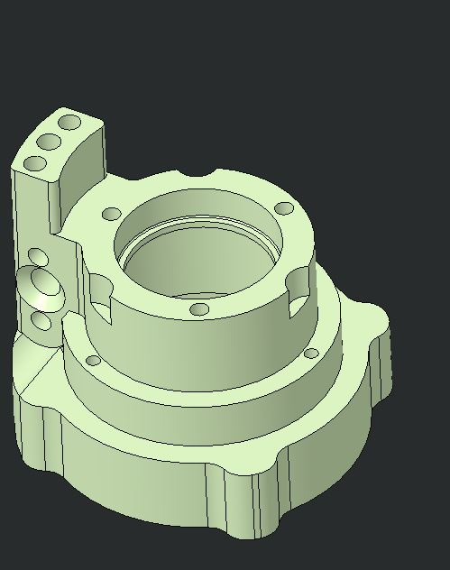

# KIT_005 Eyes motor replacement support

|       |       	          |
|   :--- |    :-----------           |
|    IIT alias (used as ordering reference)| KIT_005  |
|    Applicable to|iCub, head V2| 

## Content material

|  Pieces |     Alias           |          Description                        |  Cod. Wgst |
|   :---: |    :---:            |     :---:                                   |   :---:   |
|    2   | RC_IIT_010_P_038 | EYE_ACTUATING-JOINT_BASE | 2617 |
|     1   | RC_IIT_010_P_047 | V2 eye tilt brace A | 2626 |
|     1   |  RC_IIT_010_P_048  | V2 eye tilt brace B | 2627 |
|    2   |  2-10--_-_ISO7046-1_CH  | Screw -M 2 x 10  –  ISO7046 – SS A2 | 2596 |
|     4   | S1_5-6--_-_I2338_B | Dowel pin 1.5 x 6 stainless steel A2, UNI1707 |   2354    |

## Assembly instruction

We are going to replace parts in the eyes tilt assembly, there are some preliminary actions to take:

* we need to turn off the head and the whole robot.

* we need to remove head's covers .

* we need to unplug and remove the whole boards' frame.

    | 
  
 | 
  
 |
    | :--------------------------------------------------: | :--------------------------------------------------: |
    |                    without covers                    |                without boards' frame                 |

  

    We are going to replace the 4 parts here in picture.
    
| 
  
 |
| :-----------------------------------------------------------: |
|  Brackets unmounting |
    
    
  We need to remove eye's assembly from the head unlocking two cross recessed screws

| 
  
 | 
  
 |
| :--------------------------------------------------: | :--------------------------------------------------: |
|                    the screws to remove                   |                eye's group                 |

Unmount the groupand replace the old case with the new one

| 
  
 | 
  
 |
| :--------------------------------------------------: | :--------------------------------------------------: |
|                    old one                   |                new one                 |

While mounting the motoreducer group checl if it moves at the correct amount of current, if not try to slightly release these screws

 | 
  
 |
 | :-----------------------------------------------------------: |
 |  motoreducer group |

Before mounting back the eyes on the face we need to replace the brackets.
Releasing the grub screws (blue arrows) we can remove the pins (yellow arrows) and later the brackets (red arrows) mounting back the new ones
- First of all you need to remove tendons from the neck, 
- Remove the green highlighted assembly loosening the screws indicated by arrows

| 
   
 |
| :-----------------------------------------------------------: |
|  Brackets unmounting |

Mount the head back following the instruction in reverse
Do not hesitate to contact [iCub support](https://github.com/robotology/icub-tech-support) for any doubt.
