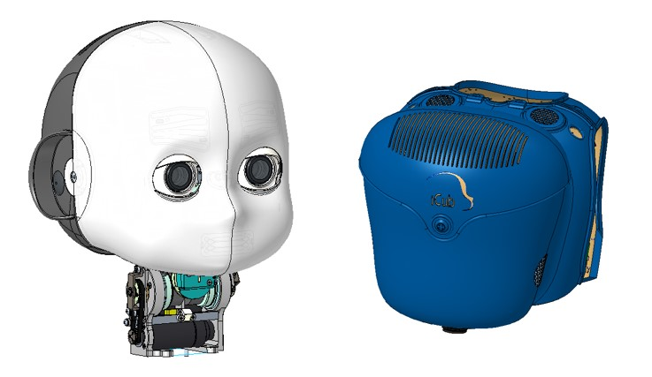
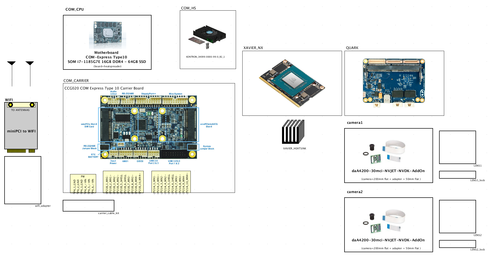

# KIT_009 iCub new head

## Upgrade Kit

This upgrade kit is meant to update the head with high resolution cameras, bigger FOV lenses, more reliable eyes' tilt mechanism and new computational units.

  

|       |       	          |
|   :--- |    :-----------           |
|    IIT alias (used as ordering reference)| KIT_009 |
|    Applicable to|iCub |
|Available onboard ||

|  #  |     Cod    |   Alias  |  Rev | UM |  Qta  |  Description |
|   :---: |   :---: |   :---: |   :---: |   :---: |   :---: |   :---: |
| 1 |    | MKIT_009 |   | Pieces  |  1  |  |
|  2  |	     |		WKIT_009	 |	 	| Pieces	| 1	|  |
|  3  | 16519 |		EKIT_009	 |	 	| Pieces	| 1	| iCub2.x, Basler cameras, GPU and COM Express Type 10 (electronics) |

## Content material  MKIT_009

|  Pieces |     Alias    |  Description       |  Cod. Wgst |
|   :---: |    :-----------:      |     :---: |   :---:   |
|        |       |             |           |
|        |       |             |           |
|        |       |             |           |
|        |       |             |           |
|        |       |             |           |
|        |       |             |           |

## Content material  WKIT_009

|  Pieces |     Alias    |    REV    |  Description       |  Cod. Wgst |
|   :---: |    :-----------:      |     :---: |   :---:   |   :---:   |
|        |       |      |             |           |
|        |       |      |             |           |

## Content material  EKIT_009 
|  Pieces |     Alias    |    REV    |  Description       |  Cod. Wgst |
|   :---: |    :-----------:      |     :---: |   :---:   |   :---:   |
| 1 |PUIAUDIO_AS04004PO-2-R_SPKR|      |   Miniature speaker, 4R, 82dBA,200Hz, 3W,          | 12035 |
| 1 | 13463 |      | HMC mini PCIE to M.2 KEY E adapter | 13463 |
| 2 | 13570 | | Flexible WIFI Antenna 2.4-5GHz, 34.90*9mm, 200mm cable, MHF4 connector | 13570 |
| 1 | CONNECTTECH_CCG020 | | Carrier Board for COM-Express Type10, Connecttech CCG020 | 15301 |
| 1 | KONTRON_34099-0000-99-0_R2_1 | | COMe mini Active Uni Cooler (w/o HSP) | 15626 |
| 1 | CKG035 | | CableKit for Carrier Board COM-Express Type10, CCG020 | 15785 |
| 1 | ADVANTECH_SOM-7583C7-S8A1 | | COM-Express Type10, Advantech SOM i7-1185G7E 16GB DDR4, 64GB SSD | 16252 |
| 1 | 16433 | | Intel AX210, Mini PCI-e WiFi 6E, 2x2 AC + BT 5.2, M.2 2230 key E |   16433   |
| 2 | BASLER_2000036061 | | M12 Lens, Focus 2.1mm, Aperture 1.8 FOV 170 degree with IR cut filter, 1/3 | 16483 |
| 1 | 16487 | | NVIDIA JETSON XAVIER NX, 69.6mm x 45mm 260-pin SO-DIMM connector, 8 GB LPDDR4, 16GB eMMC | 16487 |
| 1 | 16488 | | NVIDIA Jetson Xavier NX Aluminum Heatsink with 36mm Fan for  with Long Cable | 16488 |
| 1 | CONNECTTECH_NGX014 | | Quark Carrier board for NVIDIA® Jetson Nano™ and Xavier NX Module, 5V input | 16518 |
| 2 | 16547 | | Camera Kit for NVIDIA Xavier NX or Jetson Nano, daA4200-30mci, M13B0618W, adapter board and 200mm flat cable |   16547   |

Draft Logic schematic

  

[download pdf](https://github.com/icub-tech-iit/electronics-wiring-public/blob/master/icub-upgrade-kits/kit_009/16519%20-%20iCub2.x%20Cameras%20upgrade%20kit%20(electronic%20parts)/16519_0.1_Logic_EKIT_009_Cameras%20upgrade%20kit.pdf)

## Assembly instruction.

**Assembly sequence** : 
This upgrade kit is a radical change in the head. For the assembly sequence, refer to the repository  https://github.com/icub-tech-iit/cad-mechanics-public

## Kinematics

Due to mechanical design constraints, the kinematics of the upgraded head underwent slight changes. While the DH table is the same as the v2 (see: [Head V2 Kinematics](../../icub_kinematics/icub-forward-kinematics/icub-forward-kinematics-head.md)), the end-effector matrix changes to:

$$
\begin{equation}
T_E = 
\begin{bmatrix}
1 & 0 & 0 & 0 \\
0 & 1 & 0 & 0 \\
0 & 0 & 1 & -5.4mm \\
0 & 0 & 0 & 1 \\
\end{bmatrix}
\end{equation}
$$
