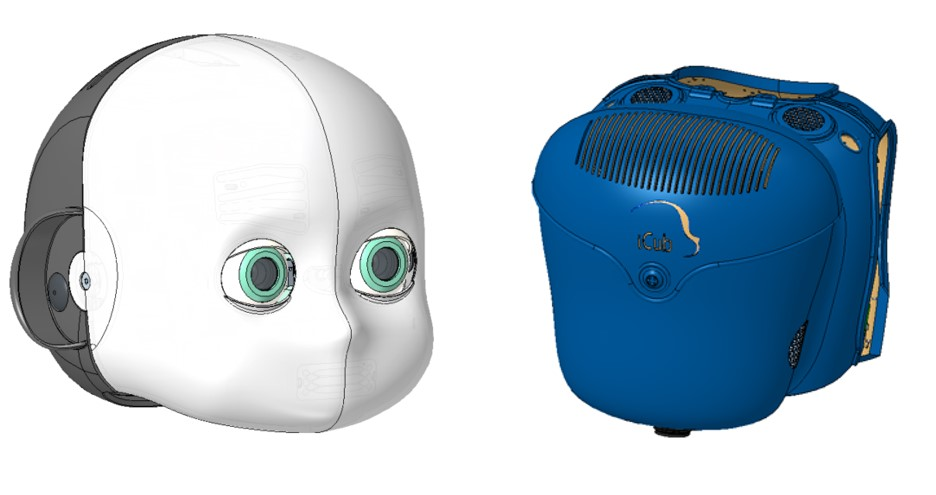
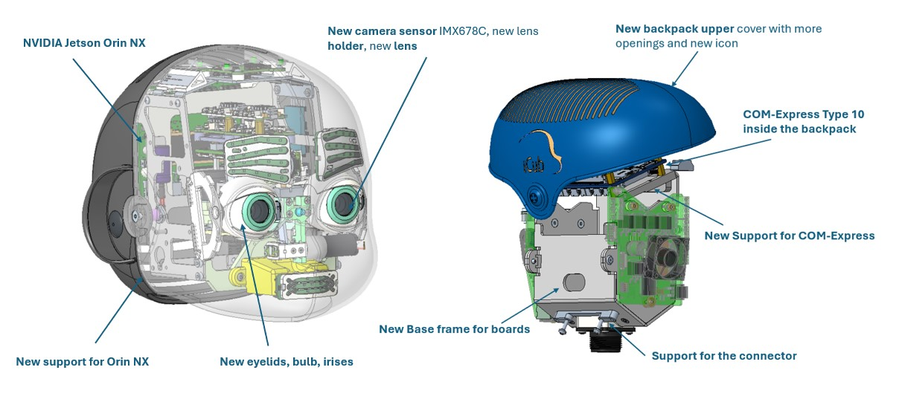
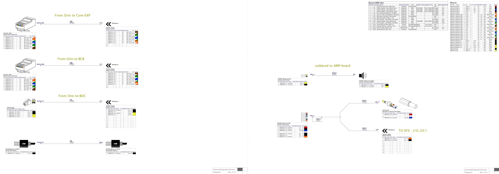
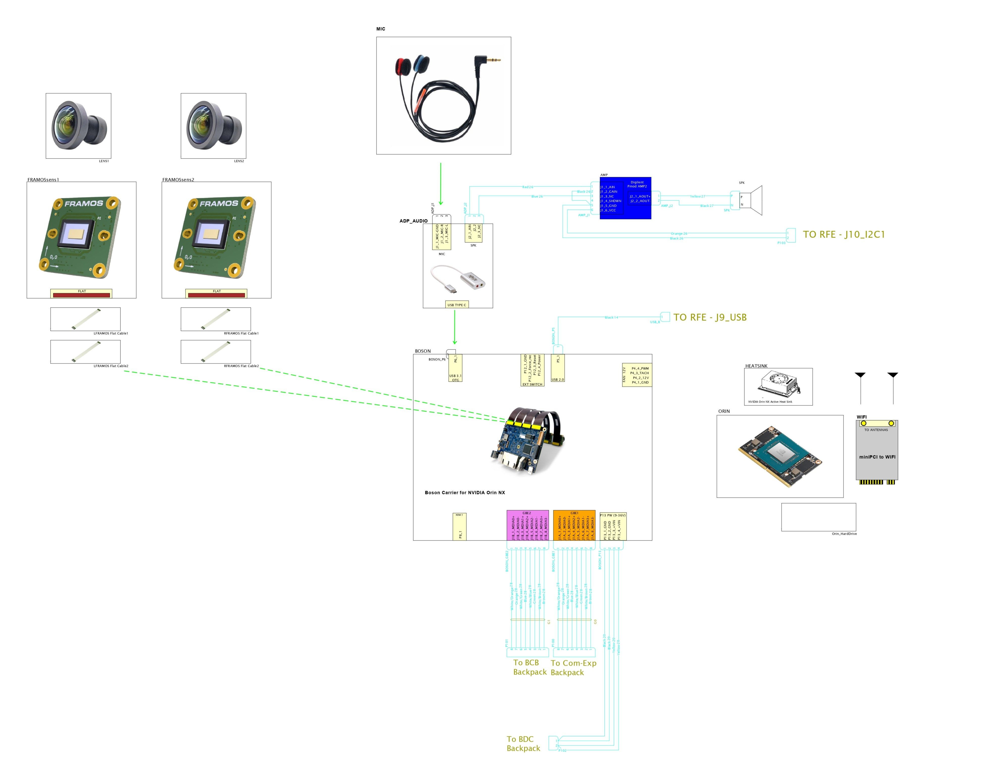

# KIT_009 iCub Head with 4K Cameras

!!! warning

    This UKIT is still a work in progress!

## Upgrade Kit

This upgrade kit is meant to update the head with new eyes composed by high-resolution cameras, bigger FOV lenses, new GPU, new accomodation for the COM-Express in the backpack, new design for the upper cover of the backpack.

<figure markdown="span">
    
</figure>

| | |
| :---: | :---: |
| IIT alias (used as ordering reference) | KIT_009 |
| Applicable to | iCub versions ≥ 2.x |
| Available onboard | – |

|  #  |     Code   |   Alias  |  Rev | UM |  Qty  |  Description |
|   :---: |   :---: |   :---: |   :---: |   :---: |   :---: |   :---: |
| 1 |  18476  | MKIT_009 | A2  | Pieces  |  1  | iCub eyes Mk4 |
|  2  | 17018 |		WKIT_009	 |	 	| Pieces	| 1	| iCub2.x, Basler cameras, GPU, and COM Express Type 10 (wiring) |
|  3  | 16519 |		EKIT_009	 |	 	| Pieces	| 1	| iCub2.x, Basler cameras, GPU, and COM Express Type 10 (electronics) |

## Content material  MKIT_009

<figure markdown="span">
    
</figure>

| Alias                          | Description                                                                      | Code  | Rev | Qty |
|--------------------------------|----------------------------------------------------------------------------------|-------|-----|-----|
| RMB_UL_255X                    | RMB BEARING UL 255X                                                              | 2344  |     | 6   |
|S1_5-6--_-_I2338_B              | Dowel pin Ø1.5 x 6 stainless steel A2, DIN7, ISO2338B, VSM12771, UNI1707         | 2354  |     | 10  |
|MYONIC_SHIM_PS_2-5_4_THK_0-1    | Myonic Precision Shim PS Ø3x4 mm thickness 0,10 mm                               | 2698  |     | 8   |
|MYONIC_SHIM_PS_5_7_THK_0- 15    | Myonic Precision Shim PS Ø5x7 mm thickness 0,15 mm                               | 2701  |     | 10  |
| RC_IIT_023_P_027               | Eyelid motor encoder support                                                     | 5831  | A5  | 1   |
| RC_IIT_023_P_058               | Eyes tilt rod                                                                    | 5848  | A2  | 1   |
| G2-2--_-_U5923_G               | Set screw, hex socket, M2,0 x 2,0, stainless steel A2, DIN913, ISO4026, UNI5923  | 12766 |     | 4   |
| M3x06-6LOBE-ISO14581-A2-70     | M3x 6 , ISO14581, 6LOBE socket countersunk flat head screw, f. threaded, A2-70   | 15831 |     | 6   |
| M1_6X04-6LOBE-ISO14583-A4-70   | M1.6 x  4 , ISO14583, 6LOBE socket pan head machine screw, fully threaded, A4-70 | 15841 |     | 2   |
| M2X08-6LOBE-ISO14583-A2-70     | M2 x  8 , ISO14583, 6LOBE socket pan head machine screw, fully threaded, A2-70   | 15854 |     | 4   |
| M2_5X06-6LOBE-ISO14581-A2-70   | M2.5 x  6 , ISO14581, 6LOBE socket countersunk flat head screw, f. threaded, A2- | 15931 |     | 4   |
| M2_5X06-6LOBE-ISO14583-A2-70   | M2_5 x  6, ISO14583, 6LOBE socket pan head machine screw, fully threaded, A2-70  | 15993 |     | 8   |
| M2_5X08-6LOBE-ISO14583-A2-70   | M2_5 x  6, ISO14583, 6LOBE socket pan head machine screw, fully threaded, A2-70  | 15994 |     | 6   |
| M3X06-6LOBE-ISO14583-A2-70     | M3 x  6, ISO14583, 6LOBE socket pan head machine screw, fully threaded, A2-70    | 16022 |     | 4   |
| M2X06-6LOBE-ISO14583-A2-70     | M2 x  6, ISO14583, 6LOBE socket pan head machine screw, fully threaded, A2-70    | 15853 |     | 8   |
| IC_034_G_007                   | Eye bulb with inserts                                                            | 18375 | A2  | 2   |
| IC_034_G_025                   | Orin NX support with inserts                                                     | 18384 | A1  | 1   |
| IC_034_M_020                   | V2 eye tilt brace A                                                              | 18385 | A1  | 1   |
| IC_034_P_017                   | Eye pan frame with protrusion                                                    | 18386 | 0   | 2   |
| IC_034_P_039                   | Eye CCD mounting plate                                                           | 18581 | A1   | 2   |
| IC_034_P_020                   | Eye tilt brace A                                                                 | 18388 | A1  | 1   |
| IC_034_P_021                   | Eyelid reinforcement                                                             | 18389 | 0   | 1   |
| IC_034_P_022                   | Eyelid upper                                                                     | 18390 | A1  | 1   |
| IC_034_P_023                   | Eye pan frame                                                                    | 18391 | 0   | 2   |
| IC_034_P_025                   | V2 eye pan rod                                                                   | 18392 | A1  | 2   |
| IC_034_G_029                   | backpack, base frame with inserts                                                | 18400 | A1  | 1   |
| IC_034_G_030                   | Support for COM with inserts                                                     | 18401 | A1  | 1   |
| IC_034_G_031                   | Support for connector with inserts                                               | 18402 | 0   | 1   |
| IC_034_G_034                   | Cover backpack assy                                                              | 18405 | 0   | 1   |
| IC_034_P_034                   | V2 head eyes tilt frame                                                          | 18475 | 0   | 1   |
| RC_IIT_025_P_130               | Hinge for backpack                                                               | 13615 | A3  | 1   |

## Content material  WKIT_009

|  Code  | BOM |  Alias | Rev |  Qty | Description      |
|:-----:|:---:|:--------------:|:---:|--------:|:------------------:|
| 12070 |     | 12070                       |     |  1,2000 | FTP-LAN cable, Small Diameter AWG28, CAT6                 |
| 1379 |     | 1379                       |     |  1,0000 | USB cable, USB A to USB B, L: 1mt                                           |
| 13824 |     | 13824           |     |  2,0000 | Flying connector, RJ45, 8 contacts, 1 row, male, Straight, w to w, lock, key, for 28 - 30 AWG |
| 4158 |     | 4158                       |     |  1,2000 | PVC insulated cable, 1 pole, 0.5mmq, AWG20, 500V, yellow                                                          |
| 4225 |     | 4225 |     |  0,2000 | Teflon insulated cable, 1 pole, AWG26, 600V, blue, UL E20042   |
| 4411   |     | 4411                         |     |  1,2000 | PVC insulated cable, 1 pole, 0.5mmq, AWG20, 500V, black                                           |
| 518  |     | 518                        |     |  0,2000 | PVC insulated cable, 1 pole, 0.1mmq, AWG27, 150V, black                                          |
| 520  |     | 520                        |     |  0,2000 | PVC insulated cable, 1 pole, 0.1mmq, AWG27, 150V, yellow                                           |
| 54  |     | 54                        |     |  2,0000 | Connector hood, RJ45, rubber, blue                                            |
| 6276   |     | 6276                         |     |  4,0000 | Crimp terminal, Minifit Jr, female contacts, AWG18-24                                                |
| 6277   |     | 6277                         |     |  1,000 | Housing, Minifit Jr, 4 contacts, 2 rows, male, p.4.2mm, Straight, w to w, no lock, key, 13A                  |
| 68    |     | 68                          |     |  0,2500 | Teflon insulated cable, 1 pole,   AWG26, 600V, black, UL E20042                                      |
| 72    |     | 72                          |     |  0,2000 | Teflon insulated cable, 1 pole,   AWG26, 600V, red, UL E20042                                        |
| 73    |     | 73                          |     |  0,1500 | Teflon insulated cable, 1 pole, AWG26, 600V, orange, UL E20042                                     |
| 863  |     | 863                        |     | 1,000 | Flying connector, jack, 1 contact, male, Straight, w to panel, mating L: NN mm, diam int. 3.6mm, diam. ext. 9mm                    |
| 7142  |     | amphenol-fci_10073599-008LF |     |  10,000 | Housing, MiniTek, 8 contacts, 2   row, female, p.2mm, Straight, w to w / w to b, nolock, nokey, 2A   |
| 7143  |     | AMPHENOL-FCI_10073599-010LF |     |  20,000 | Housing, MiniTek, 10 contacts, 2   row, female, p.2mm, Straight, w to w / w to b, nolock, nokey, 2A  |

| 🔘 Click to download the PDF |
| :---: |
|  |

## Content material  EKIT_009
|  Pieces |     Alias    |    Rev    |  Description       |  Code Wgst |
|   :---: |    :-----------:      |     :---: |   :---:   |   :---:   |
| 1 |5128|      |   SoundMan High quality Stereo Omnidirectional microphones, -46 dB, 10V, 2o….2o ooo Hz +/- 3dB          | 5128 |
| 1 | CONNECTTECH_NGX020 |      | Boson Carrier board for NVIDIA® Jetson Nano™ and ORIN NX Module, 9-36V input | 18413 |
| 2 | CONNECTTECH_XHG325 | | NVIDIA Jetson ORIN NX Aluminum Active Heatsink with 36mm Fan for with Long Cable | 17680 |
| 1 | SILICONPOWER_SP512GBP34A60M28 | | Hard disk M.2 SSD 2280, 512GB, PCIe 3.0 x4 / NVMe | 17567 |
| 1 | 16433 | | Intel AX210, Mini PCI-e WiFi 6E, 2x2 AC + BT 5.2, M.2 2230 key E | 16433 |
| 1 | CONNECTTECH_900-13767-0000-000 | | NVIDIA Jetson ORIN NX, 69.6mm x 45mm 260-pin SO-DIMM connector, 16 GB LPDDR4, WITHOUT eMMC | 17679 |
| 2 | 13570 | | Flexible WIFI Antenna 2.4-5GHz, 34.90*9mm, 200mm cable, MHF4 connector | 13570 |
| 1 | 15014 | | Interface Module, Pmod™ AMP2, SSM2377 Filterless High Efficiency Mono 2.5 W Class-D Audio Amplifier |  15014  |
| 1 | PUIAUDIO_AS04004PO-2-R_SPKR | | Miniature speaker, 4R, 82dBA,200Hz, 3W | 12035 |
| 1 | ED-LENS-M12-180250-08 | | Camera Lenses 8MP 2.5mm Ultra Wide Angel Lens | 16487 |
| 2 | FRAMOS-FMA-FC-150/60-V1A | | Ribbon Cables / IDC Cables Flex Cable 150 mm for FRAMOS Sensor Modules (FSM) and adapters (FSA, FPA) with MIPI CSI-2, Molex 60 Pin connector. Compatible with FSM, FSA-FTx/A, FPA-4.A. | 18250 |
| 1 | 18711 | | SMART CABLE, USB-2X3.5MM JACK, 7.87 | 18711 |
| 2 | FSM-IMX678-AAQR1 | | FRAMOS Sensor module IMX678 |  18712  |
| 1 | ED-LENS-M12-180250-08 | | Camera Lenses 8MP 2.5mm Ultra Wide Angel Lens | 18563 |
| 2 | FRAMOS-FMA-FC-150/60-V1A | | Ribbon Cables / IDC Cables Flex Cable 150 mm for FRAMOS Sensor Modules (FSM) and adapters (FSA, FPA) with MIPI CSI-2, Molex 60 Pin connector. Compatible with FSM, FSA-FTx/A, FPA-4.A |  18250  |

Draft Logic schematic

| 🔘 Click to download the PDF |
| :---: |
|  |

## Assembly instruction

### Assembly sequence
This upgrade kit is a radical change in the head. For the assembly sequence, refer to the repository  https://github.com/icub-tech-iit/cad-mechanics-public

## Kinematics

Due to mechanical design constraints, the kinematics of the upgraded head underwent slight changes. While the DH table is the same as the v2 (see: [Head V2 Kinematics](../../icub_kinematics/icub-forward-kinematics/icub-forward-kinematics-head.md)), the end-effector matrix changes to:

$$
\begin{equation}
T_E =
\begin{bmatrix}
1 & 0 & 0 & 0 \\
0 & 1 & 0 & 0 \\
0 & 0 & 1 & -12.63mm \\
0 & 0 & 0 & 1 \\
\end{bmatrix}
\end{equation}
$$

To use the [gaze controller](https://robotology.github.io/robotology-documentation/doc/html/group__iKinGazeCtrl.html), you must instantiate `head_version` `"v2.10"`, which is available since the distro release [2024.11.0](../../sw_versioning_table/2024.11.0.md).

## Software instructions

This UKIT also includes an additional [NVIDIA Jetson Orin NX](https://www.nvidia.com/en-us/autonomous-machines/embedded-systems/jetson-xavier-nx/) mounted on the top of the head, for handling the [FRAMOS-IMX 678 cameras](https://framos.com/products/modules/fsmgo-modules/fsmgo-with-imx678-sensor-and-110-hfov-lens-27361) and performing image processing on the onboard GPU. The Orin NX has to be configured following [the flash procedure](../../icub_operating_systems/icubos/jetpack.md) and then the guide to [configure the FRAMOS-IMX678](../../icub_operating_systems/icubos/setup-framos-imx678.md).

If the image has been [installed from scratch](../../icub_operating_systems/icubos/jetpack.md#flash-a-new-image-from-scratch), an initial configuration is also required, which consists in:

- Set the `icub` as `host` and `icub-head` as `hostname`.
- Configure the network.

For using the images provided by the new `FRAMOS-IMX678` camera over the YARP network, it is needed to compile and install [`yarp-device-argus`](https://github.com/robotology/yarp-device-argus/tree/main?tab=readme-ov-file#2-how-to-use-framos-cameras-as-a-yarp-device).
