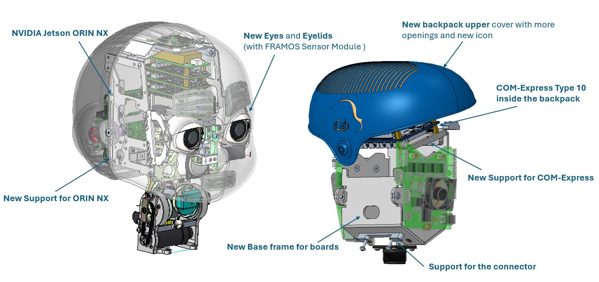
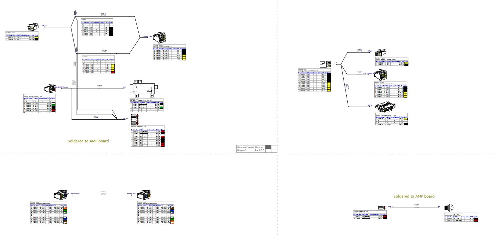
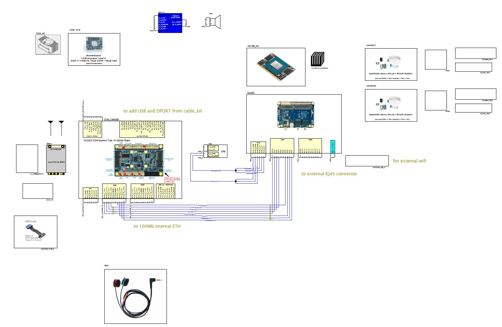

# KIT_009 iCub Head with 4K Cameras

## Upgrade Kit

This upgrade kit is meant to update the head with high resolution cameras, bigger FOV lenses, more reliable eyes' tilt mechanism and new computational units.

  

| | |
| :---: | :---: |
| IIT alias (used as ordering reference) | KIT_009 |
| Applicable to | iCub >= 2.x |
| Available onboard | – |

|  #  |     Cod    |   Alias  |  Rev | UM |  Qta  |  Description |
|   :---: |   :---: |   :---: |   :---: |   :---: |   :---: |   :---: |
| 1 |    | MKIT_009 |   | Pieces  |  1  |  |
|  2  | 17018 |		WKIT_009	 |	 	| Pieces	| 1	| iCub2.x, Basler cameras, GPU and COM Express Type 10 (wiring) |
|  3  | 16519 |		EKIT_009	 |	 	| Pieces	| 1	| iCub2.x, Basler cameras, GPU and COM Express Type 10 (electronics) |

## Content material  MKIT_009

  

Alias | Descrizione | Codice | Rev. | Qtà
-- | -- | -- | -- | --
V2_5-6--_-_ISO7045_CZ | screw – M2.5 x  6 – UNI7687 , DIN7985A , ISO7045 – SS A2 –    pozidriv cross recessed pan head | 2414 |   | 4
V2-5--_-_ISO7045_CZ | screw – M 2 x 5 – UNI7687 , DIN7985A , ISO7045 – SS A2 –    pozidriv cross recessed pan head | 2429 |   | 5
V2-6--_-_ISO7045_CZ | screw – M 2 x 6  – UNI7687 , DIN7985A , ISO7045 – SS A2 –    pozidriv cross recessed pan head | 2439 |   | 2
V3-8--_-_U5931_GC | screw – M 3 x 8  – UNI5931 , DIN912  , ISO4762 – SS A2 –   hexagon socket cap head - fully threaded | 2467 |   | 2
V3-8--_-_U5933_C | screw – M 3 x 8 – UNI5933 , DIN7991  , ISO10642 – SS A2 – hexagon   socket countersunk head | 2468 |   | 1
D1_6--_-_I4032 | Hexagonal nut - M1.6 - stainless steel A2 - DIN934, ISO4032, UNI5588 | 2522 |   | 4
V2_5-6--_-_ISO7046-1_CH | screw – M2.5 x 6  – UNI7688 , DIN965A  , ISO7046 – SS A2 –   phillips cross recessed flat head | 2583 |   | 10
R1-6--_-_U6592 | Washer - flat regular type - M1.8 (1.7x4x0.3) - SS A2 140HV - DIN125 A,   ISO7089, UNI 6592 | 2590 |   | 2
V1_6-4--_-_I1207_C | screw – M1.6 x 4  – UNI6107 , DIN84A  , ISO1207 – SS A2 –   slotted cheese head | 2593 |   | 8
V2-4--_-_ISO7046-1_CH | screw – M 2 x 4  – UNI7688 , DIN965A  , ISO7046 – SS A2 –   phillips cross recessed flat head | 2707 |   | 3
G2-3--_-_U5923_G | Set screw, hex socket, M2,0 x 3,0, stainless steel A2, DIN913, ISO4026,   UNI5923 | 4305 |   | 10
HELICOIL_M2-5_L2D | HELICOIL Plus M2.5x5mm , stainless steel A2 | 4884 |   | 4
STANDOFF-HEX-MF-2_5-10_PTFE | Standoff Hex PTFE M/F M2.5 L=10 | 5990 |   | 6
B3-6--_-_U9200_A | SNAP RIVET UNI 9200-A 3X6 | 6730 |   | 4
PEM_SMPS_M25 | PEM self-clinging nut - SMPS M2.5 THK MIN 0.64 | 10527 |   | 40
S1-4--_-_I2338_B | Dowel pin Ø1.0 x 4 stainless steel A2, DIN7, ISO2338B, VSM12771, UNI1707 | 11950 |   | 4
ICUB3_020_P_121 | V2 tilt gearbox output shaft | 12332 |   | 2
S2-5--_-_I2338_B | Dowel pin 2.0 (h8) x 5 stainless steel A2, DIN7, ISO2338B, UNI1707 | 12652 |   | 2
IC_002_G_011 | Box for speaker PUI-Audio AS04004PO-2-R assy | 12928 |   | 1
IC_002_P_012 | Grid for speaker | 12930 |   | 1
IC_002_P_016 | Standard head eyes tilt frame | 12932 |   | 1
IC_011_G_002 | head tilt and motor lips frame assembly | 12934 | A1 | 1
IGUS_JFM-0507-03 | Iglide J Flange bushing D5x3 | 14068 |   | 2
PEM_SO-M4-10 | PEM Thru-Holes Standoff M4x10 (Steel) | 14069 |   | 2
KONTRON_34099-0000-99-0_R2_1 | COMe mini Active Uni Cooler (w/o HSP) | 15626 |   | 1
M2x06-6LOBE-ISO14583-A2-70 | M2x 6 , ISO14583, 6LOBE socket pan head machine screw, fully threaded,   A2-70 | 15853 |   | 4
M2x08-6LOBE-ISO14583-A2-70 | M2x 8 , ISO14583, 6LOBE socket pan head machine screw, fully threaded,   A2-70 | 15854 |   | 4
M4x16-6LOBE-ISO14581-A2-70 | M4x16 , ISO14581, 6LOBE socket countersunk flat head screw, f. threaded,   A2-70 | 15862 |   | 2
M2_5x06-6LOBE-ISO14581-A2-70 | M2.5x 6 , ISO14581, 6LOBE socket countersunk flat head screw, f.   threaded, A2-70 | 15931 |   | 6
M2_5x04-6LOBE-ISO14583-A2-70 | M2.5x 4 , ISO14583, 6LOBE socket pan head machine screw, fully threaded,   A2-70 | 15991 |   | 8
M2_5x05-6LOBE-ISO14583-A2-70 | M2.5x 5 , ISO14583, 6LOBE socket pan head machine screw, fully threaded,   A2-70 | 15992 |   | 16
M2_5x10-6LOBE-ISO14583-A2-70 | M2.5x10 , ISO14583, 6LOBE socket pan head machine screw, fully threaded,   A2-70 | 15995 |   | 8
M3x08-6LOBE-ISO14583-A2-70 | M3x 8 , ISO14583, 6LOBE socket pan head machine screw, fully threaded,   A2-70 | 16024 |   | 2
STANDOFF_MF_M2_5-8_BRASS | Standoff - hexagonal - Brass - MF - M2.5 x 8 | 16068 |   | 4
ECUB_004_R_002 | Fan and heatsink for board ADVANTECH_SOM-7583C7-S8A1 | 16500 |   | 1
RS_196-5457 | Metric Nitrile 70 ShA O-Rings Ø int. 2.6mm, Ø ext. 5.4mm 1.4mm | 16512 |   | 8
STANDOFF_MF_M2_5-5_BRASS | Standoff - hexagonal - Brass - MF - M2.5 x 5 | 16517 |   | 8
IC_031_G_005 | icub, Head main Chassis | 16520 |   | 1
IC_031_G_006 | icub, rear support for head chassis | 16521 |   | 1
IC_031_G_007 | icub, Connetch support for head | 16522 |   | 1
IC_031_P_020 | icub, head , adapter for head covers | 16523 |   | 2
IC_031_P_028 | icub, head, Support for wiFi module | 16524 |   | 3
IC_032_G_004 | EXPRESSIVE HEAD MAIN FRAME ASSY | 16525 |   | 1
IC_032_G_010 | icub, head frame boards assembly | 16526 |   | 1
IC_032_G_011 | Neuromoprphic eye | 16527 |   | 1
IC_032_G_012 | V2 eye CCD group | 16528 |   | 1
IC_032_G_013 | eye pan motor-gerabov assembly | 16529 |   | 1
IC_032_G_014 | eyes and speaker assembly | 16530 |   | 1
IC_032_G_015 | eye support main group | 16531 |   | 1
IC_032_G_016 | Neuromoprphic eye | 16532 |   | 1
IC_032_G_017 | eye pan motor-gerabov assembly | 16533 |   | 1
IC_032_G_018 | V2 eye CCD group | 16534 |   | 1
IC_032_G_019 | eyelid bushing and gear group | 16535 |   | 1
IC_032_G_020 | eye bulb assembly with helicoil | 16536 |   | 2
IC_032_G_025 | icub, RFE electronic board Support | 16537 |   | 1
IC_032_P_010 | Eyelid reinforcement | 16538 |   | 1
IC_032_P_011 | eyes pan gearbox motor base | 16539 |   | 2
IC_032_P_012 | V2 eye tilt motor gearbox | 16540 |   | 2
IC_032_P_013 | Eye CCD mounting plate | 16541 |   | 2
IC_032_P_015 | lens holder | 16542 |   | 2
IC_032_P_016 | Inner eye | 16543 |   | 2
IC_032_P_017 | External ball eye | 16544 |   | 2
IC_032_P_018 | eyelid upper | 16545 |   | 1

## Content material  WKIT_009

|  Cod  | BOM |  Alias | Rev |  Qta | Descrizione      |
|:-----:|:---:|:--------------:|:---:|--------:|:------------------:|
| 10132 |     | 10132                       |     |  20,000 | Housing, Microfit, 2 contacts, 1   row, male, p.3mm, Straight, w to w, lock, key, 5A                 |
| 10879 |     | 10879                       |     |  20,000 | Crimp terminal, Pico-Lock,   female contacts, AWG24-28, 3A                                           |
| 11146 |     | MOLEX_504051-0401           |     |  10,000 | Housing, Pico-Lock, 4 contacts,   1 row, female, p.1.5mm, Straight, w to w / w to b, lock, nokey, 3A |
| 12070 |     | 12070                       |     |  0,1500 | FTP-LAN cable, Small Diameter   AWG28, CAT6                                                          |
| 16288 |     | AMPHENOL-FCI_10073599-006LF |     |  20,000 | Housing, MiniTek, 6 contacts, 2   row, female, p.2mm, Straight, w to w / w to b, nolock, nokey, 2A   |
| 328   |     | 328                         |     |  10,700 | PVC insulated cable, 1 pole,   0.25mmq, AWG23, 500V, black                                           |
| 4155  |     | 4155                        |     |  10,700 | PVC insulated cable, 1 pole,   0.25mmq, AWG23, 500V, yellow                                          |
| 4158  |     | 4158                        |     |  0,2000 | PVC insulated cable, 1 pole,   0.5mmq, AWG20, 500V, yellow                                           |
| 4411  |     | 4411                        |     |  0,2000 | PVC insulated cable, 1 pole,   0.5mmq, AWG20, 500V, black                                            |
| 502   |     | 502                         |     |  40,000 | Crimp terminal, Microfit, female   contacts, AWG20-24                                                |
| 510   |     | 510                         |     |  10,000 | Housing, Varilok, 2 contacts, 1   rows, p.5.08mm, Straight, w to w, lock, key, 8.5A                  |
| 5280  |     | SWITCHCRAFT-35RASMT4BHNTRX  |     |  10,000 | PCB connector, jack stereo, 5   contact, female, w to b, 90° nolock, nokey, diam 3.5mm, SMD          |
| 66    |     | 66                          |     |  0,1500 | Teflon insulated cable, 1 pole,   AWG26, 600V, white, UL E20042                                      |
| 68    |     | 68                          |     |  10,050 | Teflon insulated cable, 1 pole,   AWG26, 600V, black, UL E20042                                      |
| 69    |     | 69                          |     |  0,1500 | Teflon insulated cable, 1 pole,   AWG26, 600V, green, UL E20042                                      |
| 70    |     | 70                          |     |  0,2000 | Teflon insulated cable, 1 pole,   AWG26, 600V, yellow, UL E20042                                     |
| 7141  |     | 7141                        |     | 330,000 | Crimp terminal, FCI MiniTek,   female contact, AWG26-30                                              |
| 7142  |     | amphenol-fci_10073599-008LF |     |  10,000 | Housing, MiniTek, 8 contacts, 2   row, female, p.2mm, Straight, w to w / w to b, nolock, nokey, 2A   |
| 7143  |     | AMPHENOL-FCI_10073599-010LF |     |  20,000 | Housing, MiniTek, 10 contacts, 2   row, female, p.2mm, Straight, w to w / w to b, nolock, nokey, 2A  |
| 72    |     | 72                          |     |  0,6550 | Teflon insulated cable, 1 pole,   AWG26, 600V, red, UL E20042                                        |

| 🔘 Click to download the PDF |
| :---: |
|  |

## Content material  EKIT_009 
|  Pieces |     Alias    |    REV    |  Description       |  Cod. Wgst |
|   :---: |    :-----------:      |     :---: |   :---:   |   :---:   |
| 1 |PUIAUDIO_AS04004PO-2-R_SPKR|      |   Miniature speaker, 4R, 82dBA,200Hz, 3W,          | 12035 |
| 1 | 13463 |      | HMC mini PCIE to M.2 KEY E adapter | 13463 |
| 2 | 13570 | | Flexible WIFI Antenna 2.4-5GHz, 34.90*9mm, 200mm cable, MHF4 connector | 13570 |
| 1 | CONNECTTECH_CCG020 | | Carrier Board for COM-Express Type10, Connecttech CCG020 | 15301 |
| 1 | KONTRON_34099-0000-99-0_R2_1 | | COMe mini Active Uni Cooler (w/o HSP) | 15626 |
| 1 | CKG035 | | CableKit for Carrier Board COM-Express Type10, CCG020 | 15785 |
| 1 | ADVANTECH_SOM-7583C7-S8A1 | | COM-Express Type10, Advantech SOM i7-1185G7E 16GB DDR4, 64GB SSD | 16252 |
| 1 | 16433 | | Intel AX210, Mini PCI-e WiFi 6E, 2x2 AC + BT 5.2, M.2 2230 key E |   16433   |
| 2 | BASLER_2000036061 | | M12 Lens, Focus 2.1mm, Aperture 1.8 FOV 170 degree with IR cut filter, 1/3 | 16483 |
| 1 | 16487 | | NVIDIA JETSON XAVIER NX, 69.6mm x 45mm 260-pin SO-DIMM connector, 8 GB LPDDR4, 16GB eMMC | 16487 |
| 1 | 16488 | | NVIDIA Jetson Xavier NX Aluminum Heatsink with 36mm Fan for  with Long Cable | 16488 |
| 1 | CONNECTTECH_NGX014 | | Quark Carrier board for NVIDIA® Jetson Nano™ and Xavier NX Module, 5V input | 16518 |
| 2 | 16547 | | Camera Kit for NVIDIA Xavier NX or Jetson Nano, daA4200-30mci, M13B0618W, adapter board and 200mm flat cable |   16547   |

Draft Logic schematic

| 🔘 Click to download the PDF |
| :---: |
|  |

## Assembly instruction

### Assembly sequence
This upgrade kit is a radical change in the head. For the assembly sequence, refer to the repository  https://github.com/icub-tech-iit/cad-mechanics-public

## Kinematics

Due to mechanical design constraints, the kinematics of the upgraded head underwent slight changes. While the DH table is the same as the v2 (see: [Head V2 Kinematics](../../icub_kinematics/icub-forward-kinematics/icub-forward-kinematics-head.md)), the end-effector matrix changes to:

$$
\begin{equation}
T_E = 
\begin{bmatrix}
1 & 0 & 0 & 0 \\
0 & 1 & 0 & 0 \\
0 & 0 & 1 & -5.4mm \\
0 & 0 & 0 & 1 \\
\end{bmatrix}
\end{equation}
$$

To use the [gaze controller](https://robotology.github.io/robotology-documentation/doc/html/group__iKinGazeCtrl.html), it is required the instantiation of `head_version` `"v2.10"`, available since the distro release [2022.11.0](../../sw_versioning_table/2022.11.0.md).

## Software instructions

This UKIT includes also an additional [NVIDIA Jetson Xavier NX](https://www.nvidia.com/en-us/autonomous-machines/embedded-systems/jetson-xavier-nx/) mounted on the top of the head, for handling the [Basler 4K cameras](https://docs.baslerweb.com/cameras) and performing image processing on the onboard GPU.
The NVIDIA Jetson has to be configured following [the flash procedure](../../icub_operating_systems/icubos/jetpack.md).

If the image has been [installed from scratch](../../icub_operating_systems/icubos/jetpack.md#flash-a-new-image-from-scratch), an initial configuration is also required, which consists in:

- Set the `icub` as `host` and `icub-head-cam` as `hostname`
- [Configure the network bridge and wifi](https://github.com/icub-tech-iit/setups-os-configuration/tree/master/system-files/iCubOS/ubuntu_20.04_bridge)

For using the images provided by the new Basler camera over the YARP network, it is needed to compile and install [`yarp-device-pylon`](https://github.com/robotology/yarp-device-pylon#2-how-to-use-basler-pylon-cameras-as-a-yarp-device).
