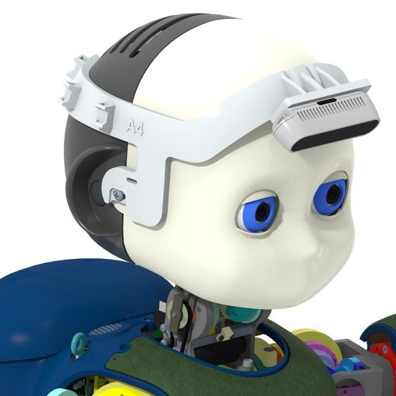

# KIT_008 iCub RealSense holder

## Upgrade Kit

This upgrade kit is meant to improve iCub's 3D perception and grasping capabilities by adding a RealSense camera plugged on the head, in addition to the other eye cameras. 

-
  

|       |       	          |
|   :--- |    :-----------           |
|    IIT alias (used as ordering reference)| KIT_008  |
|    Applicable to|iCub 2.7 | 
|Available onboard |no, optional|

|  #  |     Cod    |   Alias  |  Rev | UM |  Qta  |  Description |
|   :---: |   :---: |   :---: |   :---: |   :---: |   :---: |   :---: |
| 1 |  15363  | MKIT_008  |   | Pieces  |  1  |iCub 2.7, head, RealSense holder |
|  2  |	   XXXXX  |		WKIT_008	 |	 	| Pieces	| 1	| iCub 2.7, head, RealSense holder (wiring parts) |

## Content material  MKIT_008

|  Pieces |     Alias        | Rev.|  Description       |  Cod. Wgst |
|   :---: |    :-----------: |:---:|     :------------: |   :---:   |
|    1   |	IG_027_P_002  | A3 |iCub Head, RealSense setup, holder | 	15362 |
|    2   |	V3-8--_-_U5933_C  |   | screw – M 3 x 8 – UNI5933 , DIN7991  , ISO10642 – SS A2 – hexagon socket countersunk head  | 2468 |
|     2  | V4-16--_-_ISO7045_CZ|   | screw - M4 x 16 - UNI7687 , DIN7985A , ISO7045 - SS A2 - pozidriv cross recessed pan head |11963|

## Content material  WKIT_004 

|  Pieces |     Alias    |    REV    |  Description       |  Cod. Wgst |
|   :---: |    :-----------:      |     :---: |   :---:   |   :---:   |
|   1     |    XXXXXX 	 |      	 | XXXXXX |XXXX |

!!! note "note"
    [link to harness schematics](XXX) 

## Historical review:
This upgrade kit has been developed together DIC team as an optional plug-in support to improve iCub perception and facilitate it in grasping tasks iCub. For reference, see also the page [design holder realsense](https://github.com/icub-tech-iit/design-holder-realsense).
The holder has been designed to be compatible with the two following RealSense models:

|     Alias        |  Description       |  Cod. Wgst |
|    :-----------: |     :------------: |   :---:   |
|	INTEL_REALSENSE_D415   |Intel Realsense D415, range from 0.3 to 10m, FOV 70 de | 	13038 |
|	INTEL_REALSENSE_D435i | 	Intel Realsense D435i with IMU, range from 0.2 to 10m, FOV 90 de i  | 14567 |

## Assembly instruction.

First of all, it must be said that the electronic part of the upper arm covers is already supplied, that is, the MTB4 cards and the hexagon shape (skin) are mounted, glued and connected together.
Before starting assembly, check the orientation of the covers. 

-
  

**Assembly sequence** : 

*Perform the assembly sequence as shown in the image, keep in mind that the sequence is the same for both upper arms (Right and left)* 

- First step push the cover (RC_IIT_017_P_023) inwards so as to align the attachment holes, both positions (TOP and BOTTOM), as can be seen in the image.
-
  

- Second and third step, fix the cover using the respective screws as shown in the image. This applies to both positions TOP and BOTTOM.

-
  

- Fourth step, close the covers of the upper arm by pushing the Lover cover inwards in order to align the attachment holes. After that fix the covers with the respective lives as shown in the pictures.  This applies to both positions TOP and BOTTOM.

-
  

-
  

