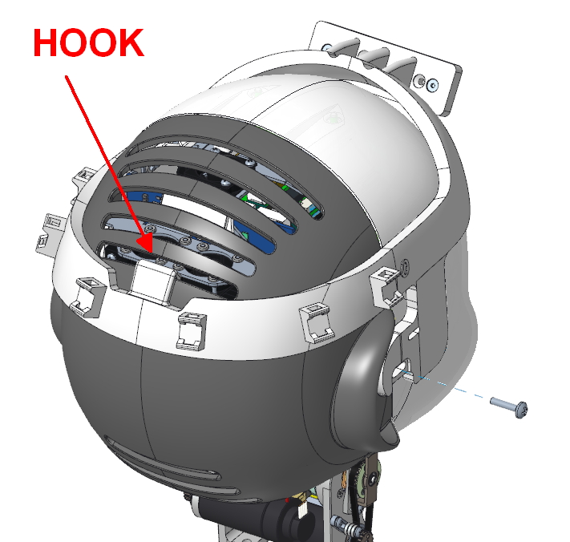

# KIT_008 iCub RealSense holder

## Upgrade Kit

This upgrade kit is meant to improve iCub's 3D perception and grasping capabilities by adding a RealSense camera plugged on the head, in addition to the other eye cameras. 

  

|       |       	          |
|   :--- |    :-----------           |
|    IIT alias (used as ordering reference)| KIT_008  |
|    Applicable to|iCub 2.7 | 
|Available onboard |no, optional|

|  #  |     Cod    |   Alias  |  Rev | UM |  Qta  |  Description |
|   :---: |   :---: |   :---: |   :---: |   :---: |   :---: |   :---: |
| 1 |  15363  | MKIT_008  |   | Pieces  |  1  |iCub 2.7, head, RealSense holder |
|  2 |	  15389  |		EKIT_008	 |	 	| Pieces	| 1	| iCub 2.7, head, RealSense holder (electronic parts) |
|  3  |	  15393  |		WKIT_008	 |	 	| Pieces	| 1	| iCub 2.7, head, RealSense holder (wiring parts) |

## Content material  MKIT_008

|  Pieces |     Alias        | Rev.|  Description       |  Cod. Wgst |
|   :---: |    :-----------: |:---:|     :------------: |   :---:   |
|    1   |	IG_027_P_002  | A3 |iCub Head, RealSense setup, holder | 	15362 |
|    2   |	V3-8--_-_U5933_C  |   | screw – M 3 x 8 – UNI5933 , DIN7991  , ISO10642 – SS A2 – hexagon socket countersunk head  | 2468 |
|     2  | V4-16--_-_ISO7045_CZ|   | screw - M4 x 16 - UNI7687 , DIN7985A , ISO7045 - SS A2 - pozidriv cross recessed pan head |11963|

## Content material  EKIT_008

|  Pieces |     Alias        | Rev.|  Description       |  Cod. Wgst |
|   :---: |    :-----------: |:---:|     :------------: |   :---:   |
|    1   |	INTEL_REALSENSE_D435i  |  |Intel Realsense D435i with IMU, range from 0.2 to 10m, FOV 90 de | 14567 |

!!! note "note"
    [Logic schematics](https://github.com/icub-tech-iit/electronics-wiring-public/tree/master/icub-upgrade-kits/kit_008/15389%20-%20iCub2.5%20Head%20RealSense%20upgrade%20kit%20(electronic%20parts)) 

## Content material  WKIT_008 

|  Pieces |     Alias    |    REV    |  Description       |  Cod. Wgst |
|   :---: |    :-----------:      |     :---: |   :---:   |   :---:   |
|   1     |    15365 	 |      	 | USB Shielded I/O Cable Assembly, Type C/M to C/M, USB 3.1 GEN4, 3.0m Length, Black | 15365 |
|   6     |    531       |           |  Cable tie, 100x2.5mm, nylon, black | 531 | 

!!! note "note"
    [Harness schematics](https://github.com/icub-tech-iit/electronics-wiring-public/tree/master/icub-upgrade-kits/kit_008/15393%20-%20iCub2.5%20Head%20RealSense%20upgrade%20kit%20(wiring%20parts)) 

## Historical review
This upgrade kit has been developed together with the [HSP@IIT](https://www.iit.it/web/humanoid-sensing-and-perception) research line as an optional plug-in support to improve iCub perception and facilitate it in grasping tasks iCub. For reference, see also the page [design holder realsense](https://github.com/icub-tech-iit/design-holder-realsense).

  

The holder has been designed to be compatible with the two following RealSense models:

|     Alias        |  Description       |  Cod. Wgst |
|    :-----------: |     :------------: |   :---:   |
|	INTEL_REALSENSE_D415   |Intel Realsense D415, range from 0.3 to 10m, FOV 70 de | 	13038 |
|	INTEL_REALSENSE_D435i | 	Intel Realsense D435i with IMU, range from 0.2 to 10m, FOV 90 de i  | 14567 |

## Assembly instruction

The RealSense holder can be mounted on the top of iCub head by replacing two side screws fixing the face cover, and in the kit are included and USB Type-C cable, screws and cable ties. The kit does NOT include the RealSense. It is recommended to replace the short cable included in the RealSense retail package with the longer one provided with the upgrade kit.

  

**Assembly sequence**

*Perform the assembly sequence as shown in the following images.*

- First step, remove the two screws V4-12--_-_U5933_C from the side of the face cover as can be seen in the image. Set them aside, just in case you want to successively unmount the RealSense holder.

  

- Second step, fix the holder IG_027_P_002 with the respective screws V4-16--_-_ISO7045_CZ as shown in the image, and fix the hook to the backward cover air vents.

  

- Third step, fix the chosen RealSense model to the holder usign the screws V3-8--_-_U5933_C. At this point is possible to plug the USB Type-C cable cod. 15365 and use the cable ties cod. 531 to fix it around the head.

  

  

## Print the RealSense Holder yourself
Find the STL and STEP files of the holder's variants stored within this [repository](assets/realsense_holder.zip). 

## Calibration of the RealSense Holder
The software tool used to estimate the extrinsic parameters of the RealSense camera when mounted with the holder with respect to the robot known frames is [`realsense-holder-calibration`](https://github.com/robotology/realsense-holder-calibration).

Find therein the relative documentation.
