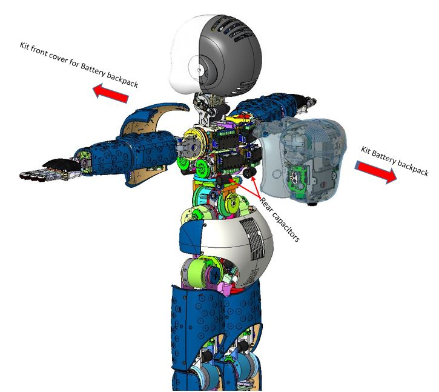
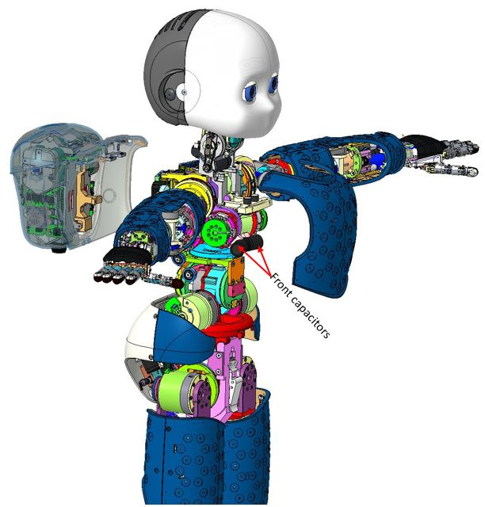
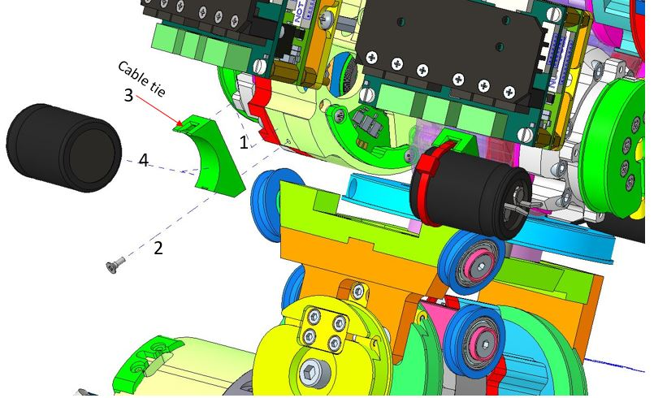

# Update of capacitor support (front and rear) iCub2.5 with battery backpack

## Content material

## Content material

|  Pieces |     Alias    	        |          Description                        |  Cod. Wgst |
|   :---: |    :-----------:      |     :---:                                   |   :---:   |
|    4   | RC_TLR_003_P_060_00    |CAPACITOR HOLDING PLATE                      | 2035 |
|    4   | V2-5--_-_ISO7046-1_CH   |CROSS RECESSED SCREW ISO7046-1 M2X5 H        |2430|
|    4   |Cable tie               |    Cable tie, 100x2.5mm, nylon, black        |531|

## Assembly instruction

Make sure the 4 capacitors (front and back) are accessible (has a view). For the removal and subsequent reassembly of the parts that obstruct (backpack unit), refer to the specific manual . 

  

  

     
**Assembly sequence** : 
*Perform the assembly sequence as indicated in the image, keep in mind that the sequence is the same for all 4 support (Front and rear).* 

  

    

