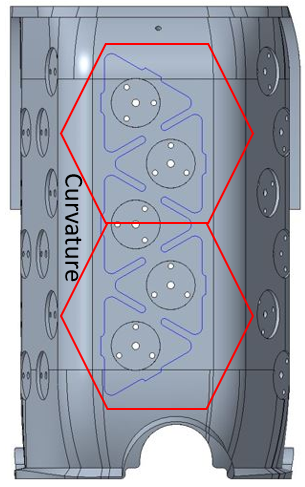
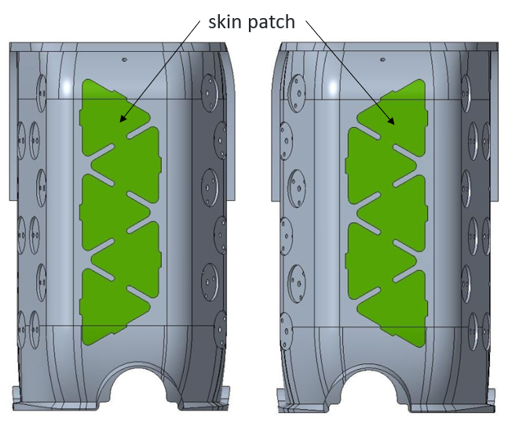
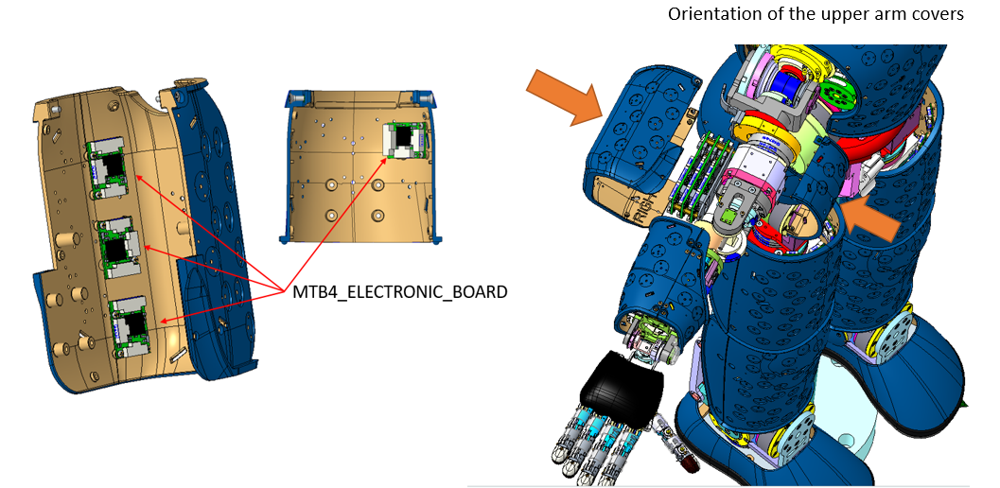

# KIT_004 iCub upper arm covers preventing skin breakage

## Upgrade Kit

!!! warning
    The 3D taxels points are not yet available for both `left_arm` and `right_arm` limbs of iCub robots mounting this UKit (iCub HW version 2.7). For this reason, `skinManager` may not work as expected. This information will be added in the near future. Instead, the 2D positions of the new patches have been defined such that `iCubSkinGui` can work just fine.

|       |       	          |
|   :--- |    :-----------           |
|    IIT alias (used as ordering reference)| KIT_004  |
|    Applicable to|iCub | 
|Available onboard |since iCub SN 043 (August 2020)|

|  #  |     Cod    |   Alias  |  Rev | UM |  Qta  |  Description |
|   :---: |   :---: |   :---: |   :---: |   :---: |   :---: |   :---: |
| 1 |  14589  | MKIT_004  |   | Pieces  |  1  | iCub, Upper arms, fix skin breaking |
|  2  |	   14767  |		WKIT_004	 |	 	| Pieces	| 1	| iCub 2, Upperarms, fix skin breaking (wiring parts) |
|  3  |	   14768  |		EKIT_004	 |	 	| Pieces	| 1	| iCub 2, Upperarms, fix skin breaking (electronics) |

## Content material  MKIT_004

|  Pieces |     Alias    |  Description       |  Cod. Wgst |
|   :---: |    :-----------:      |     :---: |   :---:   |
|    1   |RC_IIT_017_P_023  | Right UA UPPER COVER iCub2.5 | 5253 |
|    1   |RC_IIT_017_P_022  | Left  UA UPPER COVER iCub2.5 | 5252 |
| 4 | V2-8--_-_ISO7045_CZ|CROSS RECESSED SCREW ISO7045 M2X8 Z       |2444|
| 2  |V2-6--_-_ISO7045_CZ |CROSS RECESSED SCREW ISO7045 M2X6 Z  |2439|
| 2 |V2-6--_-_ISO7046-1_CH |CROSS RECESSED SCREW ISO7046-1 M2X6 H |2440|
|4 |V3-10--_-_ISO7046-1_CH |CROSS RECESSED SCREW ISO7046-1 M3X10 H |3461|

## Content material  WKIT_004 

|  Pieces |     Alias    |    REV    |  Description       |  Cod. Wgst |
|   :---: |    :-----------:      |     :---: |   :---:   |   :---:   |
|   1     |    10301  	 |      	 | iCub 2.5, subassembly - Right Upperarm Skin Harness, wiring materials |10301 |
|   1     |    10273 	 |     	 | 	iCub 2.5, subassembly - Left Upperarm Skin Harness, wiring materials |10273 |

!!! note "note"
    [link to harness schematics](https://github.com/icub-tech-iit/electronics-wiring-public/tree/master/icub-upgrade-kits/kit_004/14767%20-%20iCub%20Upperarms%20fix%20skin%20breaking%20(wiring%20parts)) 

## Content material  EKIT_004 
|  Pieces |     Alias    |    REV    |  Description       |  Cod. Wgst |
|   :---: |    :-----------:      |     :---: |   :---:   |   :---:   |
|  1 |   13475     |        | iCubSkin 2.5, Right Upper Arm Skin, RUGGED Electronic boards   |    13475  |
|  1 |   13476     |        | 	iCubSkin 2.5, Left Upper Arm Skin, RUGGED Electronic boards  |    13476  |

!!! note "note"
    [link to logic schematics](https://github.com/icub-tech-iit/electronics-wiring-public/tree/master/icub-upgrade-kits/kit_004/14768%20-%20iCub%20Upperarms%20fix%20skin%20breaking%20(electronics))

## Historical review:
In previous revisions of the covers, the mini cards were organized in the shape of hexagons. This largely caused the skin patch PCB to flex and break, because the patches took the high curvature of the cover (see image).

  

To solve this problem, we reduced the number of PCBs by arranging a strip with 5 PCBs (skin patch) on the flat surface of the cover. (see image)

  

## Assembly instruction.

First of all, it must be said that the electronic part of the upper arm covers is already supplied, that is, the MTB4 cards and the hexagon shape (skin) are mounted, glued and connected together.
Before starting assembly, check the orientation of the covers. 

  

**Assembly sequence** : 

*Perform the assembly sequence as shown in the image, keep in mind that the sequence is the same for both upper arms (Right and left)* 

- First step push the cover (RC_IIT_017_P_023) inwards so as to align the attachment holes, both positions (TOP and BOTTOM), as can be seen in the image.
-
  

- Second and third step, fix the cover using the respective screws as shown in the image. This applies to both positions TOP and BOTTOM.

  

- Fourth step, close the covers of the upper arm by pushing the Lover cover inwards in order to align the attachment holes. After that fix the covers with the respective lives as shown in the pictures.  This applies to both positions TOP and BOTTOM.

  

  

